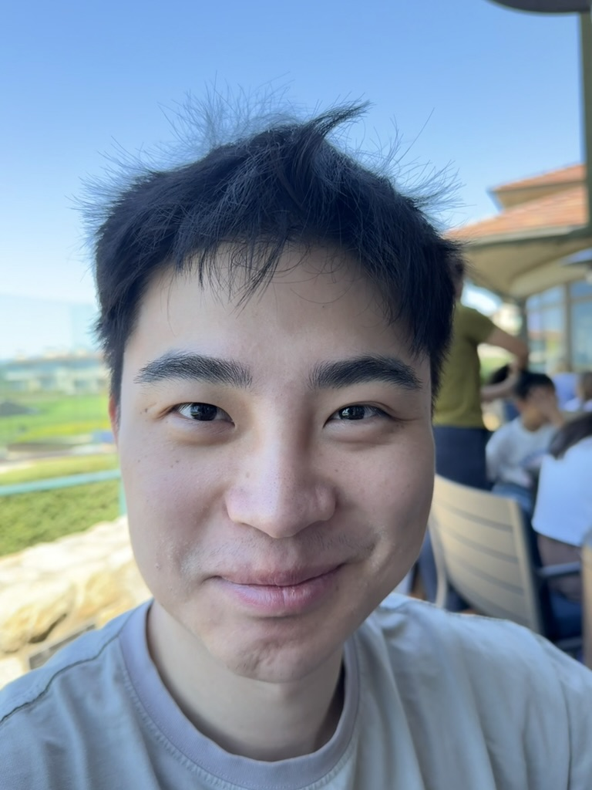
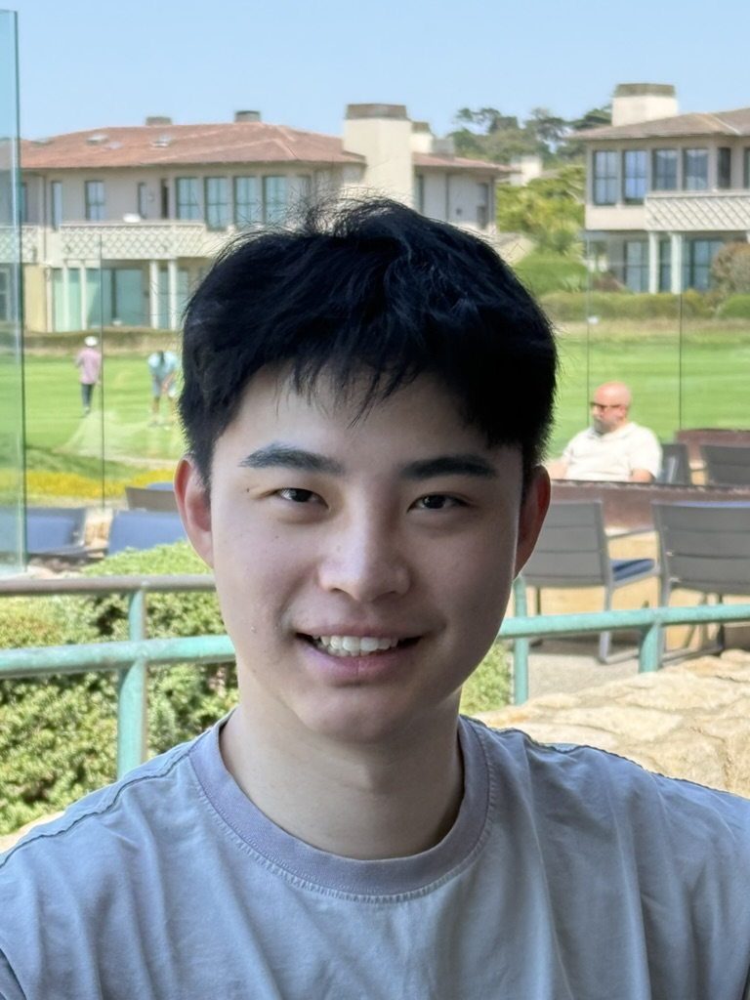
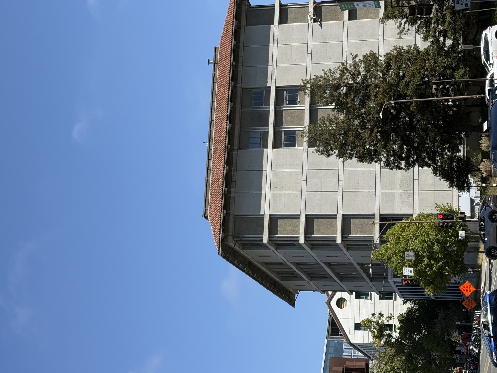
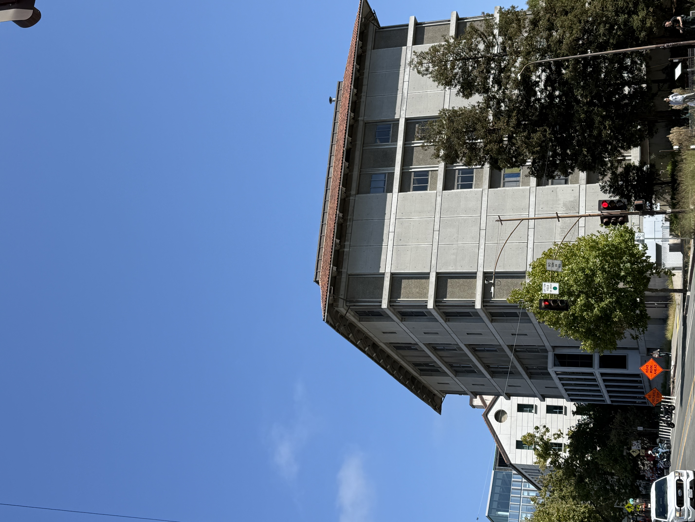

## Part 1: Selfie: The Wrong Way vs. The Right Way

  

    
    
Wide-angle lens (24mm)

  

  

    
    
Telephoto lens (104mm)

  

{% include infocard.html title="Why does the second portrait look better?" content="The second portrait looks better because taking a step back and using a longer focal length reduces <strong>perspective distortion</strong>. When taken at close range with a wide-angle lens, the parts of the face close to the lens, such as the nose, appear unusually large, while the rest appear smaller. By moving backwards and zooming in, the distance of the camera to the subject increases, reducing this distortion and making the facial proportions look more natural." %}

## Part 2: Architectural Perspective Compression

  

    
    
<em>Telephoto lens (67 mm)</em>

  

  

    
    
<em>Wide-angle lens (24 mm)</em>

  

{% include infocard.html title="Why first one looks compressed?" content="The <strong>perspective effect</strong> depends on the <em>camera’s physical position relative to the subject</em>, not the lens itself. However, <strong>focal length indirectly affects perspective</strong> because it influences how far the photographer stands from the subject.

A <strong>telephoto lens</strong> (e.g., 67 mm) typically reduces the angle difference between foreground and background objects. This makes distant elements appear closer together.

In contrast, a <strong>wide-angle lens</strong> (e.g., 24 mm) increases the angular separation between near and far objects. This exaggerates depth and enhances the <strong>sense of perspective</strong> and space in the scene." %}

## Part 3: The Dolly Zoom

  

