# Part 1: Fun with Filters

## Part 1.1: Convolutions from Scratch!

First, let's recap what a convolution is. Implement it with four for loops, then two for loops.

Click to expand code

<pre><code class="language-python">import numpy as np

def conv2d_four_loops(image, kernel):
    H, W = image.shape
    kH, kW = kernel.shape
    pad_h, pad_w = kH // 2, kW // 2
    
    # zero padding
    padded = np.pad(image, ((pad_h, pad_h), (pad_w, pad_w)), mode='constant')
    output = np.zeros_like(image)
    
    # 4 for loops
    for y in range(H):
        for x in range(W):
            val = 0
            for i in range(kH):
                for j in range(kW):
                    val += padded[y+i, x+j] * kernel[i, j]
            output[y, x] = val
    return output

def conv2d_two_loops(image, kernel):
    H, W = image.shape
    kH, kW = kernel.shape
    pad_h, pad_w = kH // 2, kW // 2
    
    padded = np.pad(image, ((pad_h, pad_h), (pad_w, pad_w)), mode='constant')
    output = np.zeros_like(image)
    
    for y in range(H):
        for x in range(W):
            region = padded[y:y+kH, x:x+kW]
            output[y, x] = np.sum(region * kernel)
    return output
</code></pre>

{% include infocard.html title="Compare it with a built-in convolution function scipy.signal.convolve2d" content="In this experiment, we first manually implemented the 2D convolution function using two approaches: one with four nested for-loops and another with two nested for-loops, both employing zero padding to handle boundaries.

In comparison, scipy.signal.convolve2d relies on highly optimized algorithms at the backend (such as FFT acceleration). It not only runs faster but also supports multiple boundary conditions (e.g., fill, wrap, symm) and modes (full, same, valid).

Therefore, our implementation is more intuitive and closer to the mathematical definition, but it falls short of the SciPy function in terms of functionality and performance." %}

Write out a 9x9 box filter, and convolve the picture with the box filter. Do it with the finite difference operators Dx and Dy.

Click to expand code

<pre><code class="language-python"># 9x9 box filter
box9 = np.ones((9,9)) / 81.0
smoothed = conv2d_two_loops(img, box9)

# Finite difference operators
Dx = np.array([[1, -1]])
Dy = np.array([[1], [-1]])
grad_x = conv2d_two_loops(img, Dx)
grad_y = conv2d_two_loops(img, Dy)
</code></pre>

  <a href="figures/1.1.png" data-lightbox="filters" data-title="Box Filter and Gradients">
    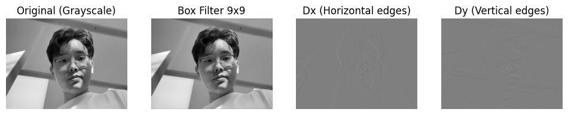
  </a>
  

    Box Filter and Gradients
  

## Part 1.2: Finite Difference Operator

  The partial derivatives of the image are computed by convolving with finite difference operators 
  \( D_x \) and \( D_y \). The gradient magnitude is then calculated as 
  \( \sqrt{D_x^2 + D_y^2} \). To highlight edges, the gradient magnitude image is binarized 
  using a manually chosen threshold to suppress noise while retaining real edges.

<a href="figures/1.2-1.png" data-lightbox="gradients" data-title="Edge Detection with Dx, Dy, and Gradient Magnitude Thresholding">
  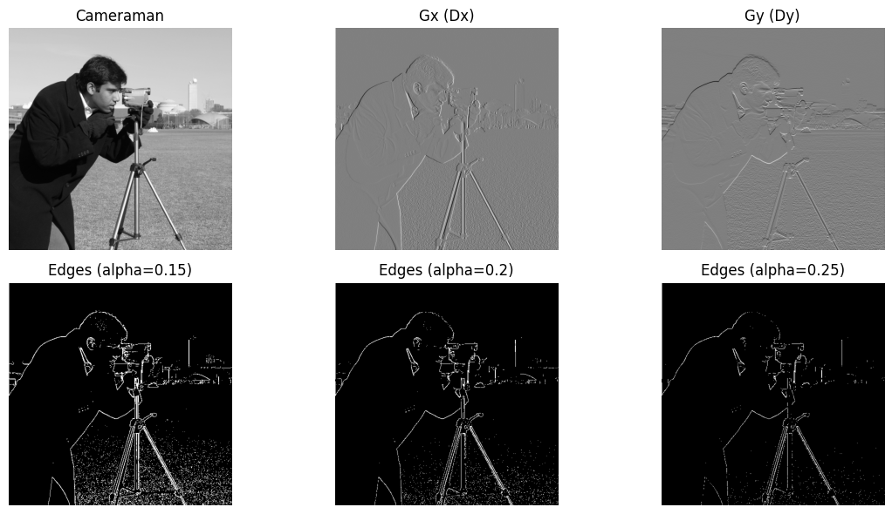
</a>

  Partial derivatives and edge maps with different threshold values

<h3>Bells & Whistles</h3>

  Compute the gradient orientations from the partial derivatives \( D_x \) and \( D_y \) as:
  \[
  \theta = \arctan\left( \frac{D_y}{D_x} \right)
  \]
  Visualize the orientations using the HSV color space, where hue represents direction. This provides a perceptual understanding of edge orientations across the image.

  <a href="figures/1.2-2.png" data-lightbox="orientation" data-title="Gradient Orientation Visualized in HSV Color Space">
    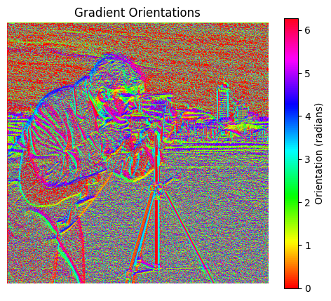
  </a>
  

    Gradient orientation map visualized using HSV color space
  

## Part 1.3: Derivative of Gaussian (DoG) Filter

  To reduce noise in the gradient computation, we smooth the image with a Gaussian filter \( G \) before computing the derivatives. This process suppresses high-frequency noise:
  \[
  \text{Smoothed } D_x = G * D_x, \quad \text{Smoothed } D_y = G * D_y
  \]
  Alternatively, we can precompute the derivative of Gaussian (DoG) filters by convolving \( G \) with \( D_x \) and \( D_y \), and then apply them directly to the image in a single convolution step.

<a href="figures/1.3-1.png" data-lightbox="dog" data-title="DoG Filtering vs Finite Difference">
  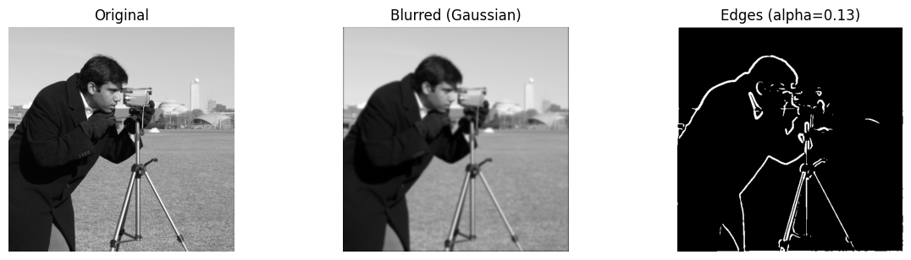
</a>

  Derivative of Gaussian filtering result. Compared to raw finite difference, DoG reduces noise and produces smoother, thicker edges.



<h3>Bells & Whistles</h3>

  <a href="figures/1.3-2.png" data-lightbox="orientation" data-title="Gradient Orientation Visualized in HSV Color Space">
    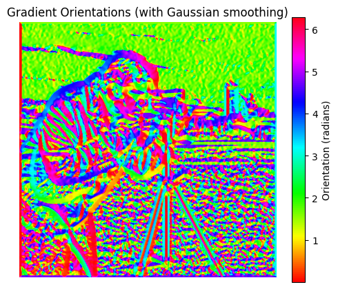
  </a>
  

    Gradient orientation map visualized using HSV color space
  

# Part 2: Fun with Frequencies!

## Part 2.1: Image "Sharpening"

  Unsharp masking is a classic image sharpening technique. The idea is to subtract the low-frequency content from the image to extract high-frequency details, then add those back to enhance perceived sharpness:
  \[
  \text{Sharpened} = I + \alpha (I - G * I)
  \]
  where \( I \) is the original image, \( G \) is a Gaussian blur, and \( \alpha \) controls the sharpening strength. This can be implemented as a single convolution called the <em>unsharp mask filter</em>.

<!-- Taj Mahal Image -->

  <a href="figures/2.1-1.png" data-lightbox="sharpen" data-title="Taj Mahal: Original vs Blurred vs Sharpened">
    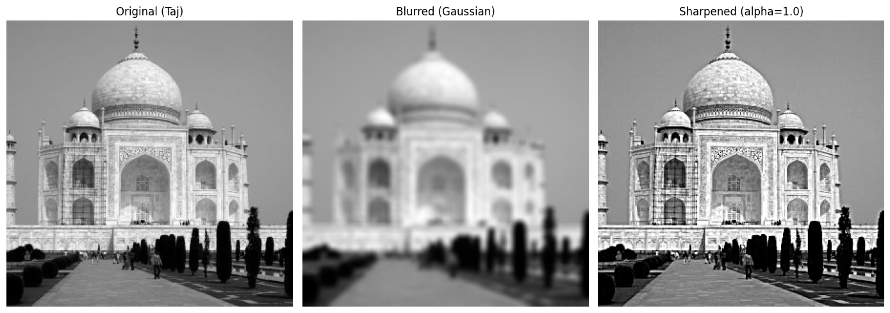
  </a>
  

    Sharpening result on Taj Mahal
  

<!-- Brooklyn Bridge Image -->

  <a href="figures/2.1-2.png" data-lightbox="sharpen" data-title="Brooklyn Bridge: Original vs Blurred vs Sharpened">
    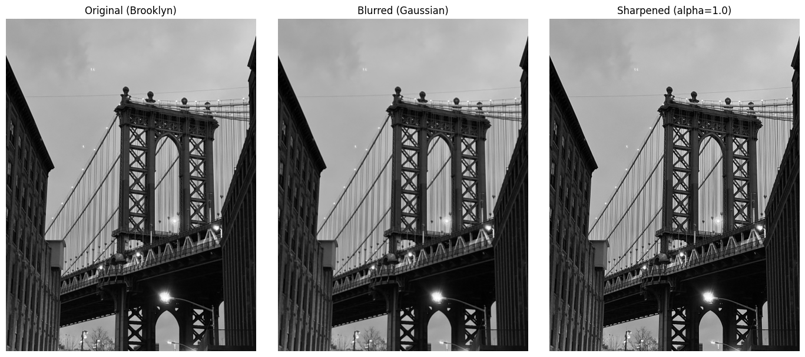
  </a>
  

    Sharpening result on Brooklyn Bridge
  

<!-- Observations -->
{% include infocard.html title="Observations: Sharpening Effects" content=" 1. <strong>Taj Mahal</strong>  
 • The sharpened image clearly enhances the architectural details on the domes and walls compared to the blurred version.  
 • Compared to the original, the sharpened image shows stronger contrast along the edges, which makes it appear sharper.  
 • However, some fine textures (e.g., in the sky and small decorative patterns) look slightly artificial due to the halo effect introduced by sharpening.

2. <strong>Brooklyn Bridge</strong>  
 • The sharpened version restores the crispness of the bridge cables and metal structure that were lost in the blurred image.  
 • When compared to the original sharp image, the sharpened version recovers much of the edge definition but does not fully match the original clarity.  
 • There are minor artifacts around high-contrast areas (e.g., the bridge cables against the sky), which is a typical limitation of unsharp masking.
" %}

## Part 2.2: Hybrid Images

(1) Hybrid images are static images that appear differently depending on the viewing distance, based on the work by Oliva, Torralba, and Schyns (SIGGRAPH 2006).
The key idea is to combine the <strong>low-frequency</strong> component of one image with the <strong>high-frequency</strong> component of another.

This effect works because at close distances, humans perceive high frequencies more strongly (e.g., fine details dominate),
while at a distance, high frequencies disappear, and low-frequency shapes take over perception.

Mathematically:
<ul>
  <li><strong>Low-pass image</strong>: \( I_{\text{low}} = G_\sigma * I \)</li>
  <li><strong>High-pass image</strong>: \( I_{\text{high}} = I - G_\sigma * I \)</li>
  <li><strong>Hybrid image</strong>: \( I_{\text{hybrid}} = I_{\text{low}}^{(1)} + I_{\text{high}}^{(2)} \)</li>
</ul>
Where \( G_\sigma \) is a Gaussian kernel with standard deviation \( \sigma \), controlling the cutoff frequency.

  <a href="figures/2.2-1.png" data-lightbox="hybrid" data-title="Hybrid Image: Cat + Human">
    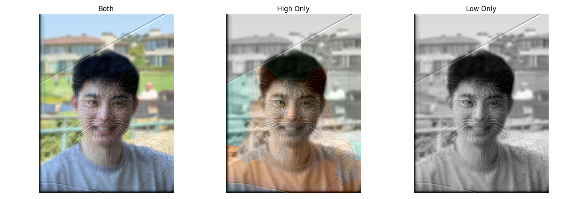
  </a>
  

    Hybrid image: Looks like cat up close, People from afar
  

(2) To better understand the hybrid image process, we analyze it in the frequency domain. 
For each input image, we visualize the log-magnitude of its Fourier transform. 
We also show the filtered results and the final hybrid image. 
This allows us to see how low-frequency and high-frequency information are separated and combined.

<pre><code class="language-python">def compute_fft(img, title, ax):
    if img.shape[-1] == 4:
        img = img[..., :3]
    gray = rgb2gray(img)
    f = np.fft.fft2(gray)
    fshift = np.fft.fftshift(f)
    magnitude_spectrum = np.log(np.abs(fshift) + 1e-8)
    ax.imshow(magnitude_spectrum, cmap='gray')
    ax.set_title(title)
    ax.axis('off')
</code></pre>

<!-- Hybrid frequency visualization -->

  <a href="figures/2.2-2.png" data-lightbox="freq" data-title="Fourier Analysis: Inputs, Filtered Images, and Hybrid">
    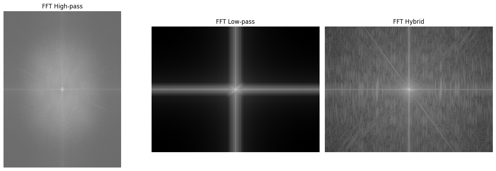
  </a>
  

    Frequency analysis of hybrid images: log-magnitude spectra of input images, filtered components, and final hybrid image
  

(3) In this step, we experiment with creating 2–3 additional hybrid images. 
These can include changes in expression, morphing between different objects, or simulating changes over time. 
For each case, we show the input images and the resulting hybrid image.

Example 1:
<!-- Example 1 -->

  

    

      <a href="figures/me_2.jpg" data-lightbox="hybrid-extra" data-title="Input Image">
        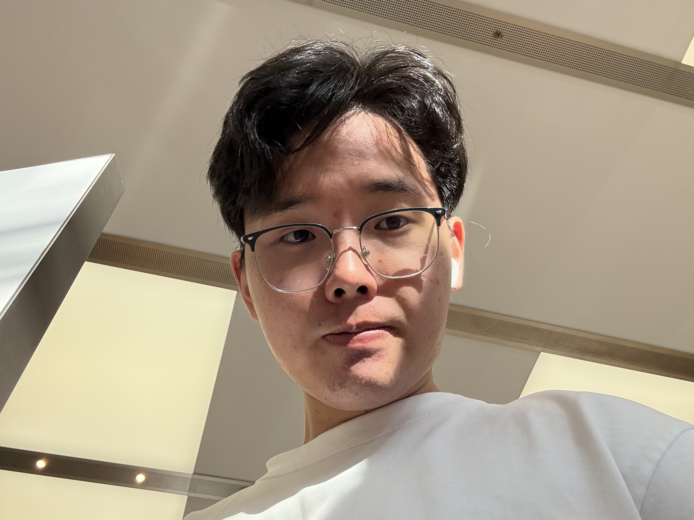
      </a>
      
Input

    

    

      <a href="figures/nutmeg.jpg" data-lightbox="hybrid-extra" data-title="Input Image: nutmeg">
        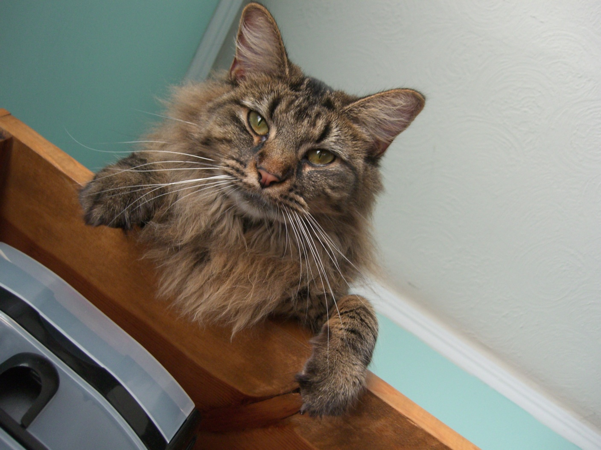
      </a>
      
Input

    

  

  <a href="figures/2.2-3-1.png" data-lightbox="hybrid-extra" data-title="Hybrid Example 1: Change of Expression">
    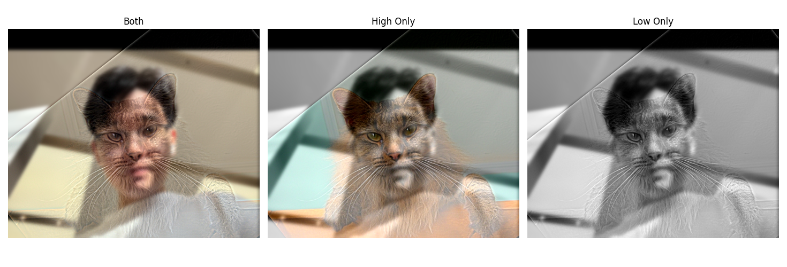
  </a>
  

    Hybrid Example 1: Change of Expression
  

Example 2:
<!-- Example 2 -->

  

    

      <a href="figures/me_3.jpg" data-lightbox="hybrid-extra" data-title="Input Image: me_3">
        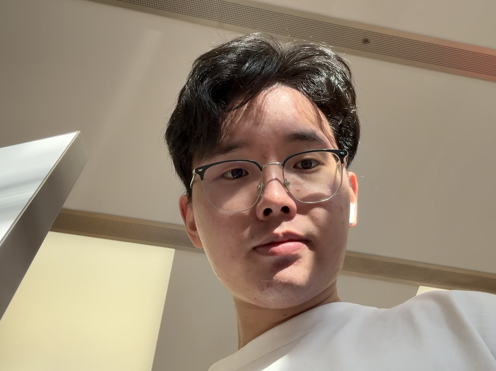
      </a>
      
Input

    

    

      
      
Input

    

  

  <a href="figures/2.2-3-2.png" data-lightbox="hybrid-extra" data-title="Hybrid Example 2: Morph between Different Objects">
    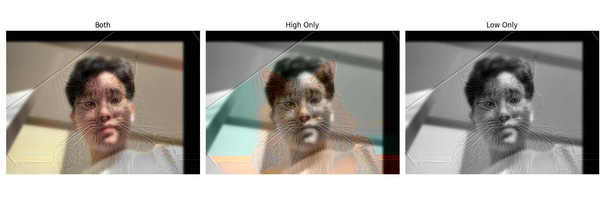
  </a>
  

    Hybrid Example 2: Morph between Different Objects
  

<h3>Bells & Whistles</h3>
{% include infocard.html title="Does it work better to use color for the high-frequency component, the low-frequency component, or both?" content="• <strong>Both</strong>: Although visually rich, the combined color from both images creates interference, making the hybrid image overly saturated and harder to interpret, especially at medium distances.  

• <strong>Low Only</strong>: The distant perception (human face) is preserved with natural colors, but the close-up texture of the cat appears less compelling and washed out due to the grayscale high-frequency layer.  

• <strong>High Only</strong>: The texture of the cat remains vivid and detailed when viewed up close, and the low-frequency grayscale background avoids visual clutter. This version produces the clearest perceptual separation between the two images.
" %}

Click to expand code

<pre><code class="language-python">
def hybrid_image(im_high, im_low, sigma_high, sigma_low, color_mode='both'):
    """
    Generate a hybrid image by combining high-frequency and low-frequency components.
    
    Supports different color modes for frequency components:
    - 'both':    Both high-frequency and low-frequency components remain in color.
    - 'high_only': High-frequency remains in color, low-frequency is converted to grayscale.
    - 'low_only':  Low-frequency remains in color, high-frequency is converted to grayscale.

    Bells & Whistles (CS180 Extra / CS280A Required):
    This color_mode option allows experimentation with how color affects perception of hybrid images.
    """
    if color_mode == 'high_only':
        # Convert low-frequency image to grayscale
        im_low_gray = rgb2gray(im_low)
        im_low_f = gaussian_filter(im_low_gray, sigma=sigma_low)
        # Repeat grayscale across RGB channels
        im_low_f = np.stack([im_low_f] * 3, axis=-1)

        # High-frequency component (in color)
        high_f = im_high - gaussian_filter(im_high, sigma=sigma_high)

    elif color_mode == 'low_only':
        # Convert high-frequency image to grayscale
        im_high_gray = rgb2gray(im_high)
        im_high_f = im_high_gray - gaussian_filter(im_high_gray, sigma=sigma_high)
        # Repeat grayscale across RGB channels
        high_f = np.stack([im_high_f] * 3, axis=-1)

        # Low-frequency component (in color)
        im_low_f = gaussian_filter(im_low, sigma=sigma_low)

    else:  # color_mode == 'both'
        # Apply filtering to each RGB channel independently
        im_low_f = np.zeros_like(im_low)
        high_f = np.zeros_like(im_high)
        for c in range(3):
            im_low_f[..., c] = gaussian_filter(im_low[..., c], sigma=sigma_low)
            high_f[..., c] = im_high[..., c] - gaussian_filter(im_high[..., c], sigma=sigma_high)

    # Combine and clip to valid range
    hybrid = np.clip(im_low_f + high_f, 0, 1)
    return hybrid
</code></pre>

## Part 2.3: Gaussian and Laplacian Stacks

The goal of this step is to implement <strong>Gaussian</strong> and <strong>Laplacian</strong> stacks, which are similar to pyramids but without downsampling.
Each level of the stack has the same resolution as the original image. 
The Gaussian stack is built by applying Gaussian filters repeatedly without subsampling:
\[
G_{i+1} = G_\sigma * G_i
\]
The Laplacian stack is then computed as the difference between successive Gaussian levels:
\[
L_i = G_i - G_{i+1}, \quad L_N = G_N
\]
Finally, the original image can be reconstructed by summing all levels of the Laplacian stack.

<!-- Visualization Result -->

  <a href="figures/2.3.png" data-lightbox="stack" data-title="Gaussian and Laplacian Stacks Visualization (Oraple)">
    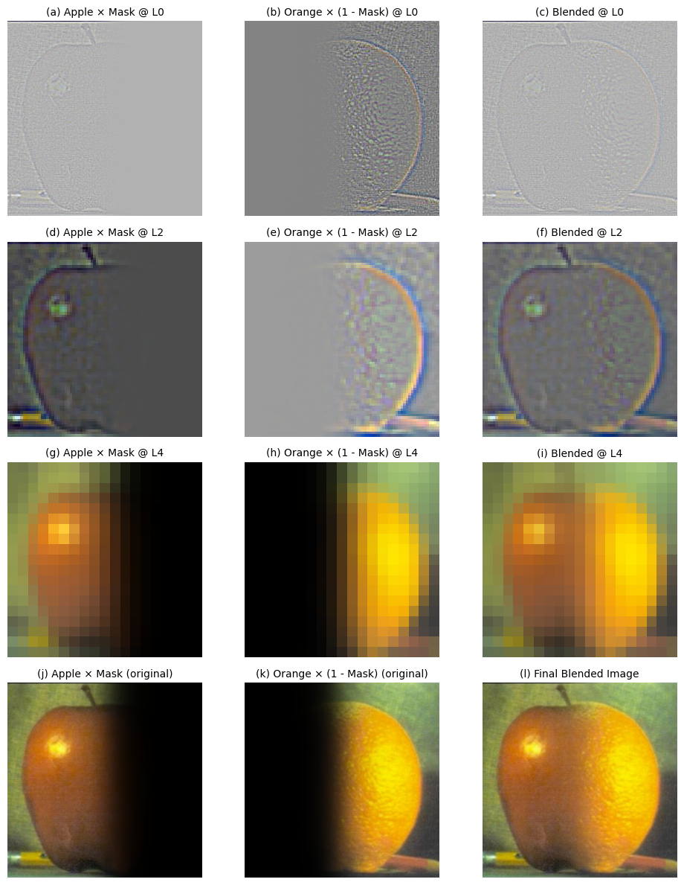
  </a>
  

    Visualization of Gaussian and Laplacian stacks applied to the Oraple (following Burt & Adelson, 1983).
  

Click to expand code

<pre><code class="language-python">def gaussian_stack(img, levels, sigma=2):
    """
    Build a Gaussian stack (no downsampling).
    Each level is the same size, just more blurred.
    """
    g_stack = [img.astype(np.float32)]
    for _ in range(1, levels):
        img = cv2.GaussianBlur(img, (5, 5), sigma)
        g_stack.append(img.astype(np.float32))
    return g_stack

def laplacian_stack(g_stack):
    """
    Build a Laplacian stack from a Gaussian stack.
    """
    l_stack = []
    for i in range(len(g_stack) - 1):
        lap = g_stack[i] - g_stack[i + 1]
        l_stack.append(lap)
    l_stack.append(g_stack[-1])  # last level = coarsest Gaussian
    return l_stack

def reconstruct_from_laplacian(l_stack):
    """
    Reconstruct image from Laplacian stack.
    Since there's no downsampling, simply add back levels.
    """
    img = l_stack[-1].copy()
    for i in reversed(range(len(l_stack) - 1)):
        img = img + l_stack[i]

    # normalize to [0,1] to avoid black output
    img_min, img_max = img.min(), img.max()
    if img_max > img_min:
        img = (img - img_min) / (img_max - img_min)
    else:
        img = np.zeros_like(img)
    return img
</code></pre>

## Part 2.4: Multiresolution Blending (a.k.a. the Oraple!)

In this part, we apply <strong>multiresolution blending</strong> (Burt & Adelson, 1983) to seamlessly combine two images. 
We use Gaussian and Laplacian stacks for the input images, and also create a Gaussian stack for the mask to ensure smooth transitions. 
The mask can be a vertical/horizontal seam (step function) or an irregular shape for creative blending. 

(1) blending with a vertical mask

<!-- Regular Mask Result -->

  <a href="figures/2.4-1.png" data-lightbox="blend" data-title="Oraple with Vertical Mask (Apple + Orange)">
    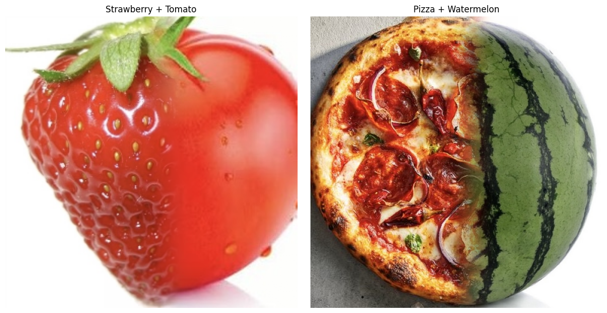
  </a>
  

    Result with a vertical seam mask
  

(2) blending with an irregular mask for more natural transitions
and 

<!-- Irregular Mask Result -->

  <a href="figures/2.4-2.png" data-lightbox="blend" data-title="Blending with Irregular Mask">
    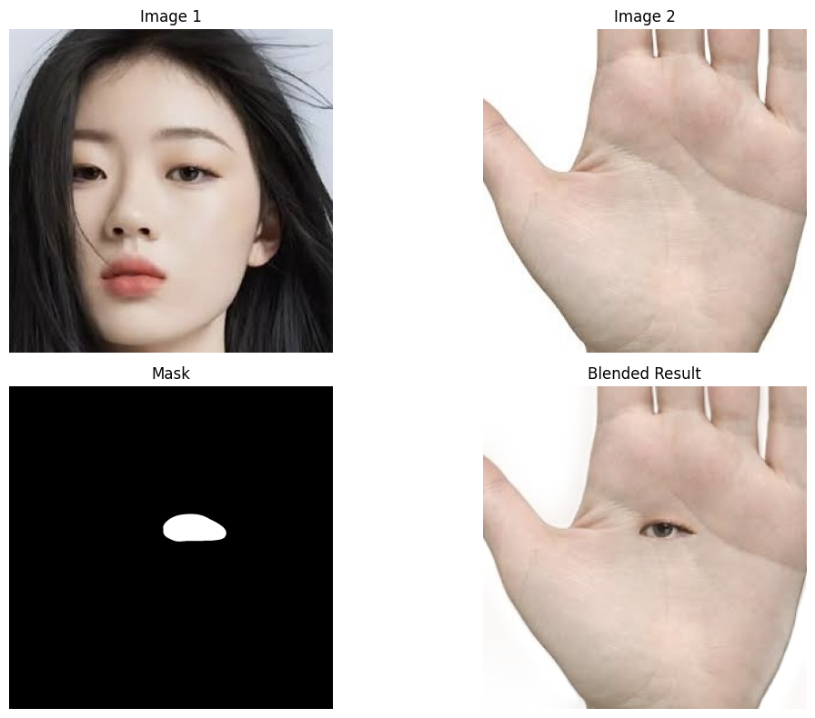
  </a>
  

    Result with an irregular mask, producing smoother creative blending.
  

(3) a visualization of the entire process, showing how Laplacian stacks and Gaussian masks combine across scales to produce the final result

<!-- Process Visualization -->

  <a href="figures/2.4-4.png" data-lightbox="blend" data-title="Blending Process Visualization (similar to Figure 10 in Burt & Adelson)">
    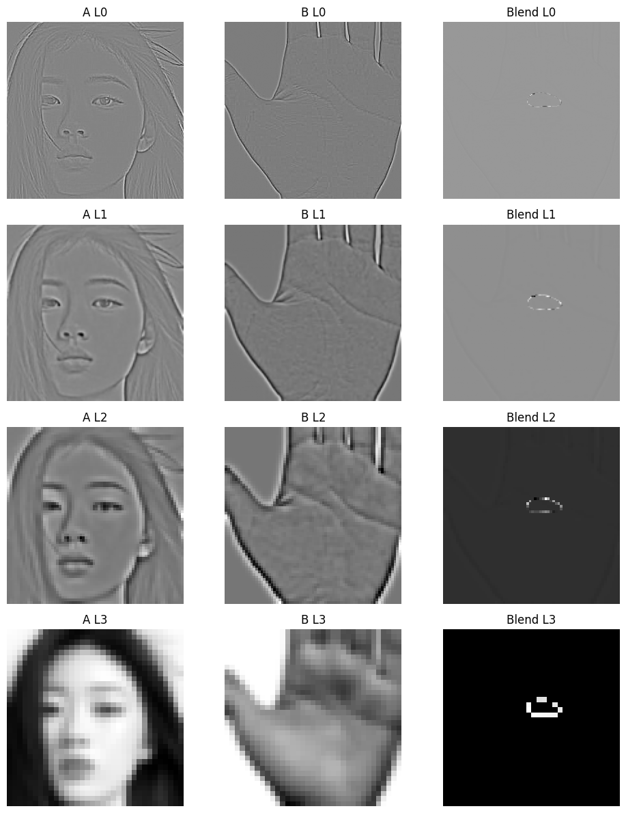
  </a>
  

    Visualization of the blending process using Laplacian stacks and Gaussian mask (similar to Figure 10 in the paper).
  

<h3>Bells & Whistles</h3>  

I extend the blending to color images by performing multiresolution blending channel by channel, enhancing perceptual quality.

<pre><code class="language-python">
def multires_blend_color(img1, img2, mask, levels=5):
    """
    Perform multiresolution blending on each color channel separately.
    """
    blended_channels = []

    # --- Bells & Whistles: Blend each color channel separately with pyramid fusion ---
    for c in range(3):
        g1 = gaussian_stack(img1[:, :, c], levels)
        g2 = gaussian_stack(img2[:, :, c], levels)
        gm = gaussian_stack(mask[:, :, c], levels)

        l1 = laplacian_stack(g1)
        l2 = laplacian_stack(g2)

        blended_stack = []
        for i in range(levels):
            blended = gm[i] * l1[i] + (1 - gm[i]) * l2[i]
            blended_stack.append(blended)

        blended_channel = reconstruct_from_laplacian(blended_stack)
        blended_channels.append(blended_channel)

    # Combine channels
    blended_img = np.stack(blended_channels, axis=2)
    blended_img = np.clip(blended_img, 0, 1)
    return blended_img
</code></pre>

