# Part A: Image Warping and Mosaicing

## Part A.1: Shoot the Pictures

To begin our journey into image mosaicing, the first step was capturing the right images—not just any snapshots, but a carefully curated set of photographs taken under geometric constraints.

The goal was to collect multiple photos of the same scene such that their relationship could be modeled by a projective transformation. In simple terms, this meant rotating the camera about a fixed point (the center of projection) to mimic a cylindrical or planar panorama—consistent with the pinhole camera geometry.

Key photographic considerations:

- **Minimize lens distortion**: Avoid fisheye or strong barrel distortion to keep straight lines straight for accurate alignment.  
- **Maximize temporal consistency**: Shoot in quick succession to maintain lighting consistency and reduce moving objects (unless intentional).  
- **Ensure sufficient overlap**: Target ≥50% field-of-view overlap between neighbors to support robust feature matching.  
- **Focal length discipline**: Keep zoom fixed when possible; I also captured a variant with changed zoom to observe registration effects.

Below are two image sets I captured (three photos per set, displayed in one row each):

<!-- Set 1 — Valley Life Sciences Building Entrance -->
<p style="text-align: center; font-size: 0.95em; margin: 8px 0 4px;">Set 1 — Valley Life Sciences Building Entrance</p>
<div style="max-width: 1100px; margin: 10px auto;">
  <div style="display:flex; justify-content:center; gap:20px; flex-wrap:nowrap;">
    <div style="width: calc((100% - 40px)/3);">
      <a href="figures/set1_left.jpeg" data-lightbox="set1" data-title="Set 1 — Left">
        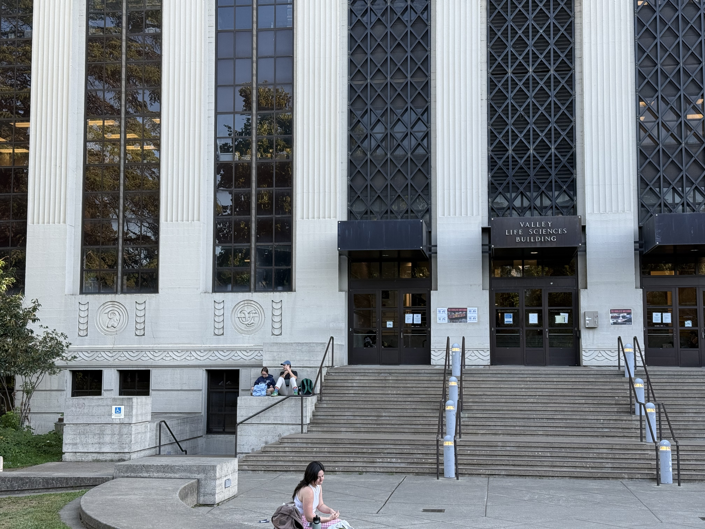
      </a>
      <p style="font-size:0.8em; margin-top:4px; text-align:center;">Left</p>
    </div>
    <div style="width: calc((100% - 40px)/3);">
      <a href="figures/set1_middle.jpeg" data-lightbox="set1" data-title="Set 1 — Middle">
        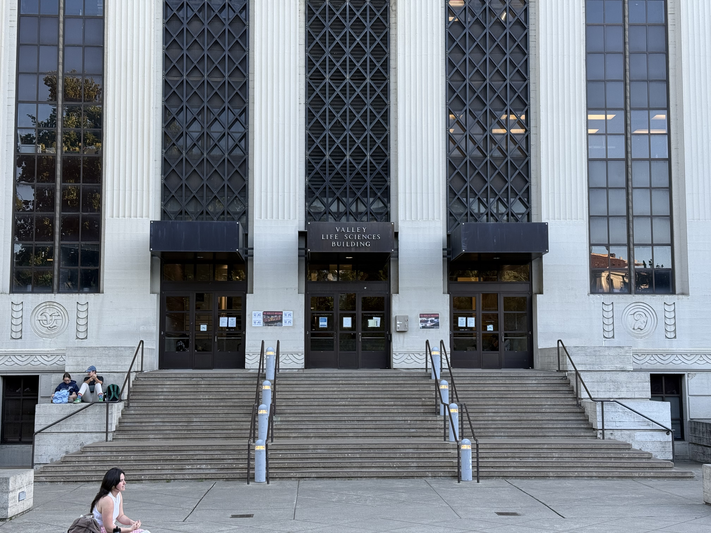
      </a>
      <p style="font-size:0.8em; margin-top:4px; text-align:center;">Middle</p>
    </div>
    <div style="width: calc((100% - 40px)/3);">
      <a href="figures/set1_right.jpeg" data-lightbox="set1" data-title="Set 1 — Right">
        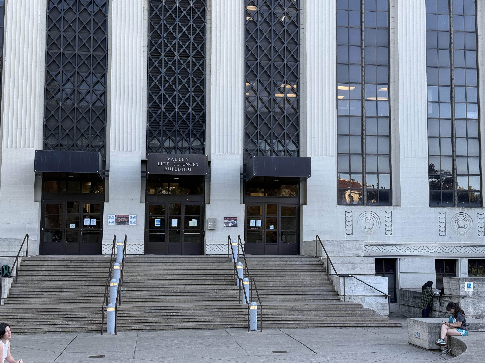
      </a>
      <p style="font-size:0.8em; margin-top:4px; text-align:center;">Right</p>
    </div>
  </div>
</div>

<!-- Set 2 — Natural Scene Beside the Building -->
<p style="text-align: center; font-size: 0.95em; margin: 14px 0 4px;">Set 2 — Natural Scene Beside the Building</p>
<div style="max-width: 1100px; margin: 10px auto;">
  <div style="display:flex; justify-content:center; gap:20px; flex-wrap:nowrap;">
    <div style="width: calc((100% - 40px)/3);">
      <a href="figures/set2_left.jpeg" data-lightbox="set2" data-title="Set 2 — Left">
        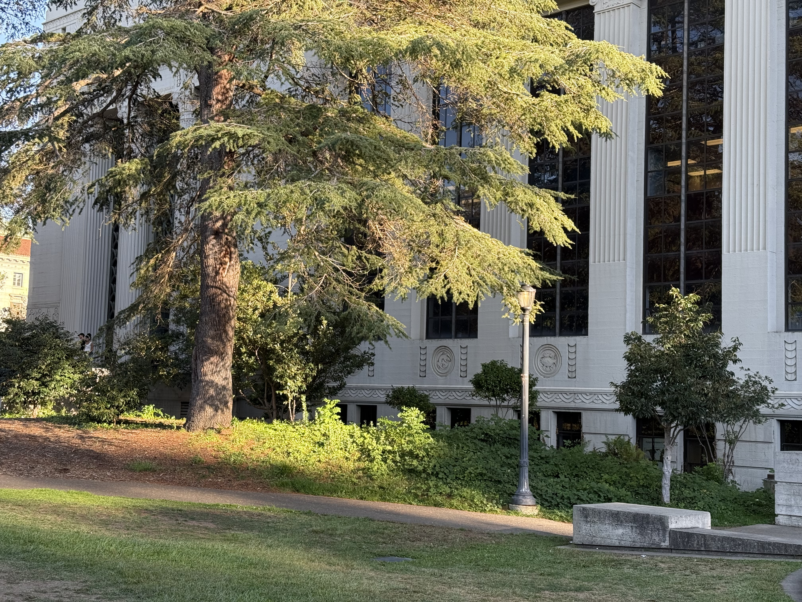
      </a>
      <p style="font-size:0.8em; margin-top:4px; text-align:center;">Left</p>
    </div>
    <div style="width: calc((100% - 40px)/3);">
      <a href="figures/set2_middle.jpeg" data-lightbox="set2" data-title="Set 2 — Middle">
        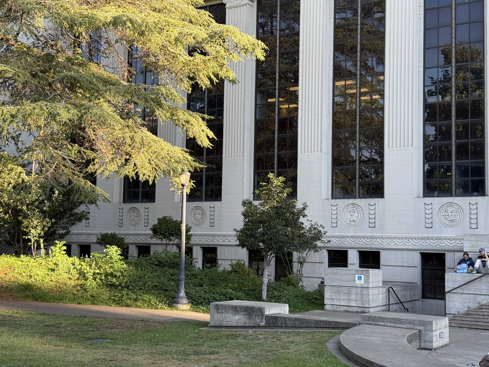
      </a>
      <p style="font-size:0.8em; margin-top:4px; text-align:center;">Middle</p>
    </div>
    <div style="width: calc((100% - 40px)/3);">
      <a href="figures/set2_right.jpeg" data-lightbox="set2" data-title="Set 2 — Right">
        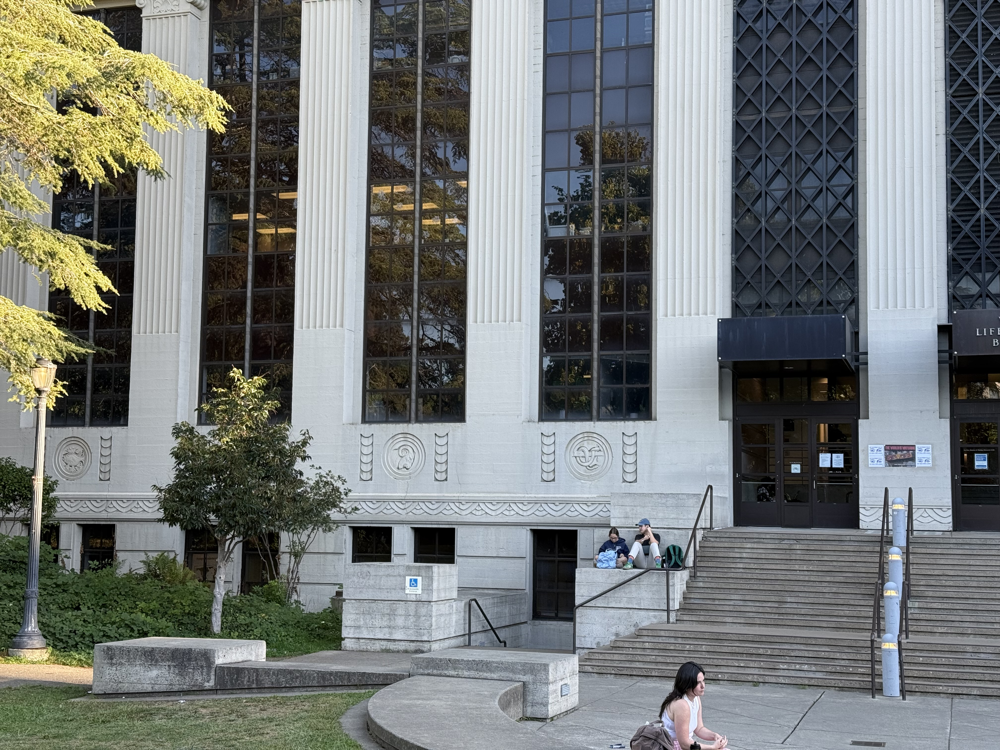
      </a>
      <p style="font-size:0.8em; margin-top:4px; text-align:center;">Right</p>
    </div>
  </div>
</div>


## Part A.2: Recover Homographies

<p>
Once the photographs are captured, the next challenge is to <strong>understand the geometric relationship</strong> between them. Since the images are taken from a fixed center of projection, the transformation between any two images can be modeled using a <strong>homography</strong> — a 3×3 matrix that maps points from one image plane to another under projective geometry.
</p>

<p>
In this part of the project, I implemented a system to compute the homography matrix \( H \) from point correspondences between image pairs. The transformation satisfies:
</p>

<p>\[
\mathbf{p'} = \mathbf{H}\,\mathbf{p}
\]</p>

<p>
Here, \( \mathbf{p} \) and \( \mathbf{p'} \) represent the homogeneous coordinates of corresponding points in the two images, and \( H \) is the 3×3 homography matrix with <strong>8 degrees of freedom</strong> (the bottom-right entry is typically set to 1 as a scale factor).
</p>

<p>
To recover \( H \), I constructed a linear system from the correspondences and solved it via <strong>least squares</strong>. While four correspondences suffice theoretically, using more than eight improves stability in the presence of noise.
</p>

### Choosing Point Correspondences

Picking reliable point pairs is essential — even slight pixel misalignments can degrade the final transformation quality. To assist with this, I used an excellent [point selection tool](https://cal-cs180.github.io/fa23/hw/proj3/tool.html), which allows clicking and exporting matched points across images. Here are some alternative tools: online tools: [pixspy](https://pixspy.com), or any image editing software that displays cursor coordinates (e.g., GIMP, Photoshop).

> **Good correspondences should be:**
>
> * Visually distinct and clearly identifiable in both images
> * Well-distributed across the scene
> * Preferably located on **planar surfaces** for better geometric consistency


### Homography Estimation code implementation

To estimate ( H ), I implemented the following function:

<details markdown="1">
<summary>Click to expand code: <p style="display:inline;margin:0;"><code>computeH(im1_pts, im2_pts)</code></p></summary>
<div class="highlight code-wrapper" markdown="1">

```python
def _normalize_points(pts):
    """
    pts: (n,2) pixel coords
    returns: T (3x3), normalized points (n,2)
    """
    pts = np.asarray(pts, dtype=np.float64)
    mean = pts.mean(axis=0)
    pts_c = pts - mean
    rms = np.sqrt((pts_c**2).sum(axis=1).mean())
    scale = np.sqrt(2.0) / (rms + 1e-12)

    T = np.array([[scale, 0,     -scale*mean[0]],
                  [0,     scale, -scale*mean[1]],
                  [0,     0,      1           ]], dtype=np.float64)
    pts_h = np.c_[pts, np.ones(len(pts))]
    pts_n = (T @ pts_h.T).T[:, :2]
    return T, pts_n

def computeH(im1_pts, im2_pts):
    """
    Estimate homography H such that p2 ~ H p1 (homogeneous).
    im1_pts: (n,2) on image1 (source)
    im2_pts: (n,2) on image2 (target)
    """
    im1_pts = np.asarray(im1_pts, dtype=np.float64)
    im2_pts = np.asarray(im2_pts, dtype=np.float64)
    assert im1_pts.shape == im2_pts.shape and im1_pts.shape[0] >= 4

    # Hartley normalization
    T1, p1 = _normalize_points(im1_pts)
    T2, p2 = _normalize_points(im2_pts)

    n = p1.shape[0]
    A = np.zeros((2*n, 8), dtype=np.float64)
    b = np.zeros((2*n,), dtype=np.float64)

    x, y   = p1[:,0], p1[:,1]
    xp, yp = p2[:,0], p2[:,1]

    # Two equations per correspondence; unknowns h=[h11,h12,h13,h21,h22,h23,h31,h32]^T, with h33=1
    A[0::2, 0:3] = np.stack([x, y, np.ones(n)], axis=1)
    A[1::2, 3:6] = np.stack([x, y, np.ones(n)], axis=1)
    A[0::2, 6]   = -x * xp
    A[0::2, 7]   = -y * xp
    A[1::2, 6]   = -x * yp
    A[1::2, 7]   = -y * yp
    b[0::2] = xp
    b[1::2] = yp

    h, *_ = np.linalg.lstsq(A, b, rcond=None)
    Hn = np.array([[h[0], h[1], h[2]],
                   [h[3], h[4], h[5]],
                   [h[6], h[7], 1.0]], dtype=np.float64)

    # Denormalize and scale to H[2,2]=1
    H = np.linalg.inv(T2) @ Hn @ T1
    H /= (H[2,2] + 1e-12)
    return H
```
</div>
</details>

### Deriving the Linear System
<p>
We estimate a homography \( \mathbf{H} \) that maps \( \mathbf{p} = (x, y, 1)^{\mathrm{T}} \) to \( \mathbf{p}' = (x', y', 1)^{\mathrm{T}} \) up to scale:
</p>

<p>\[
\mathbf{p}' \sim \mathbf{H}\,\mathbf{p}
\]</p>

<p>
We flatten \( H \) (with \( h_{33} = 1 \)) into a vector:
</p>

<p>\[
\mathbf{h} = [h_{11},\, h_{12},\, h_{13},\, h_{21},\, h_{22},\, h_{23},\, h_{31},\, h_{32}]^{\mathsf{T}}
\]</p>

<p>
From each pair \( (x, y) \rightarrow (x', y') \), we get two equations:
</p>

<p>\[
\begin{aligned}
x\,h_{11} + y\,h_{12} + h_{13} - x\,x'\,h_{31} - y\,x'\,h_{32} &= x' \\
x\,h_{21} + y\,h_{22} + h_{23} - x\,y'\,h_{31} - y\,y'\,h_{32} &= y'
\end{aligned}
\]</p>

<p>
Stacking \( n \) such correspondences yields a linear system \( \mathbf{A}\mathbf{h} = \mathbf{b} \), which we solve using least squares. The final matrix is reconstructed as:
</p>

<p>\[
\hat{\mathbf{H}} =
\begin{bmatrix}
h_{11} & h_{12} & h_{13} \\
h_{21} & h_{22} & h_{23} \\
h_{31} & h_{32} & 1
\end{bmatrix}, \quad
\mathbf{H} = \dfrac{\hat{\mathbf{H}}}{\hat{h}_{33}}
\]</p>

<p>
To improve numerical stability, I applied <strong>Hartley normalization</strong>:
</p>

<p>\[
\mathbf{H} = \mathbf{T}_2^{-1}\, \hat{\mathbf{H}}\, \mathbf{T}_1
\]</p>

<p>
followed by rescaling such that \( H_{33} = 1 \).
</p>

### Recovered Homography Matrices

Below are the recovered homography matrices for two image sets:

#### **Set 1**

1.1 Left to Middle:
<p>\[
H_{\text{left}\rightarrow\text{mid}} =
\begin{bmatrix}
1.203417 & -0.024166 & -1363.916587 \\
0.096247 & 1.126186  & -237.225299 \\
0.000051 & -0.000001 & 1.000000
\end{bmatrix}
\]</p>

> **Reprojection Error**:  
> Mean = 4.786 px Median = 4.690 px 95th Percentile = 7.388 px Max = 7.588 px

1.2 Right to Middle:
<p>\[
H_{\text{right}\rightarrow\text{mid}} =
\begin{bmatrix}
0.905570 & 0.015482  & 565.393327 \\
-0.049749 & 0.961444 & 55.545288 \\
-0.000023 & -0.000000 & 1.000000
\end{bmatrix}
\]</p>

> **Reprojection Error**:  
> Mean = 2.231 px Median = 2.314 px 95th Percentile = 3.726 px Max = 4.030 px

#### **Set 2**

2.1 Left to Middle
<p>\[
H_{\text{left}\rightarrow\text{mid}} =
\begin{bmatrix}
1.210265 & -0.019259 & -1448.564227 \\
0.092926 & 1.131922  & -271.795201 \\
0.000053 & -0.000002 & 1.000000
\end{bmatrix}
\]</p>

> **Reprojection Error**:  
> Mean = 3.285 px Median = 3.020 px 95th Percentile = 5.987 px Max = 7.228 px

2.2 Right to Middle
<p>\[
H_{\text{right}\rightarrow\text{mid}} =
\begin{bmatrix}
0.806212 & 0.022760  & 1340.242012 \\
-0.088222 & 0.939449 & 52.004332 \\
-0.000049 & 0.000002 & 1.000000
\end{bmatrix}
\]</p>

> **Reprojection Error**:  
> Mean = 4.229 px Median = 3.543 px 95th Percentile = 8.598 px Max = 9.822 px


### Visualization of Correspondences

To validate the accuracy of point selection and computed homographies, I visualized the correspondences as follows:

<!-- Responsive two-up rows for each set -->
<p style="text-align:center; font-size:0.95em; margin:10px 0 6px;">Set 1 — Matches</p>
<div style="max-width: 1100px; margin: 6px auto;">
  <div style="display:flex; justify-content:center; gap:20px; flex-wrap:nowrap;">
    <div style="width: calc((100% - 20px)/2);">
      <a href="figures/set1_matches_left_mid.png" data-lightbox="s1" data-title="Set 1 — Left↔Middle Matches">
        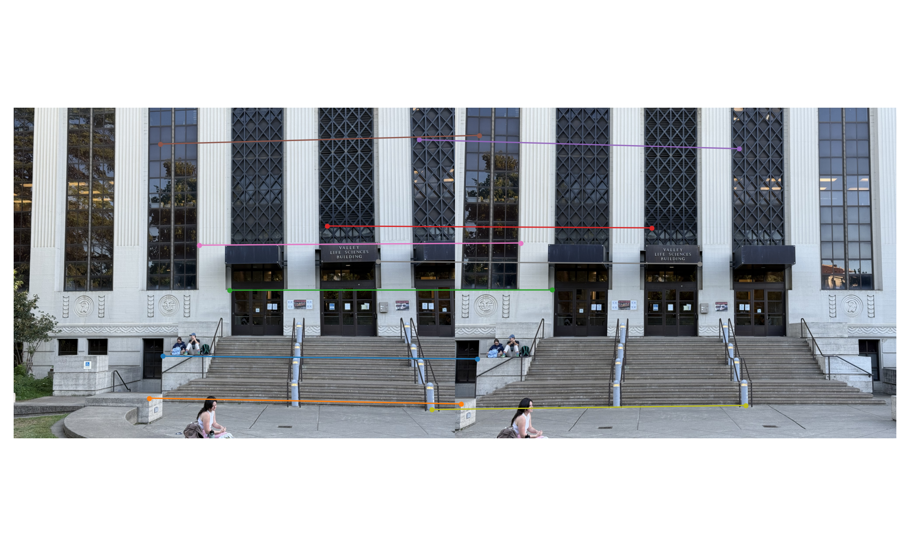
      </a>
      <p style="font-size:0.8em; margin-top:4px;">Left ↔ Middle</p>
    </div>
    <div style="width: calc((100% - 20px)/2);">
      <a href="figures/set1_matches_right_mid.png" data-lightbox="s1" data-title="Set 1 — Right↔Middle Matches">
        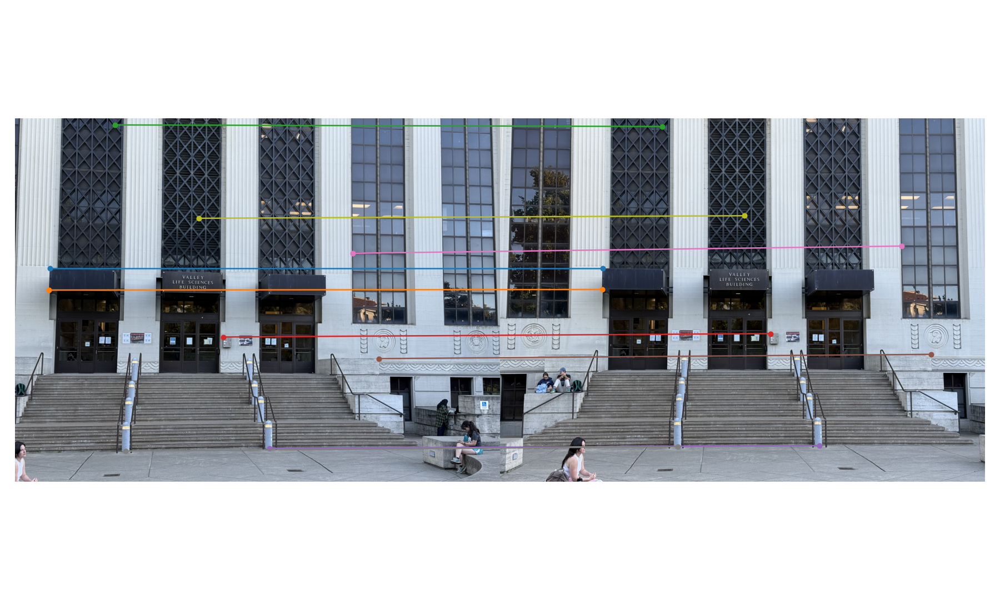
      </a>
      <p style="font-size:0.8em; margin-top:4px;">Right ↔ Middle</p>
    </div>
  </div>
</div>

<p style="text-align:center; font-size:0.95em; margin:16px 0 6px;">Set 2 — Matches</p>
<div style="max-width: 1100px; margin: 6px auto;">
  <div style="display:flex; justify-content:center; gap:20px; flex-wrap:nowrap;">
    <div style="width: calc((100% - 20px)/2);">
      <a href="figures/set2_matches_left_mid.png" data-lightbox="s2" data-title="Set 2 — Left↔Middle Matches">
        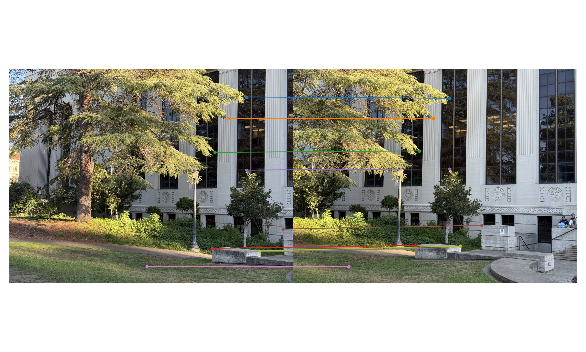
      </a>
      <p style="font-size:0.8em; margin-top:4px;">Left ↔ Middle</p>
    </div>
    <div style="width: calc((100% - 20px)/2);">
      <a href="figures/set2_matches_right_mid.png" data-lightbox="s2" data-title="Set 2 — Right↔Middle Matches">
        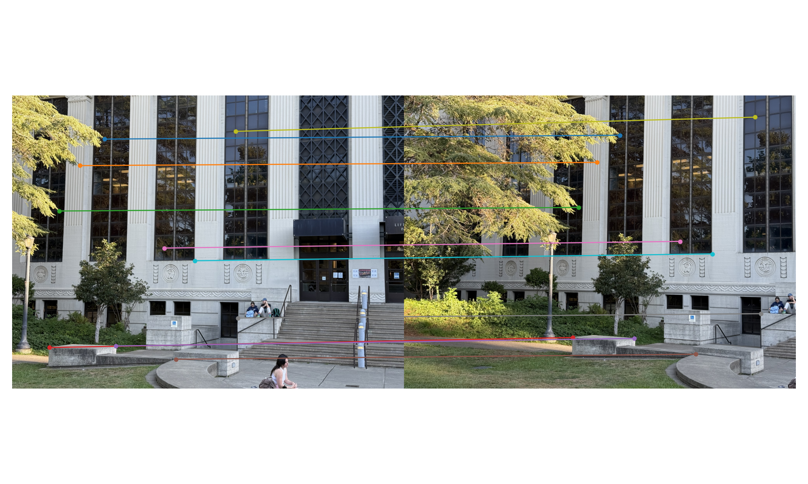
      </a>
      <p style="font-size:0.8em; margin-top:4px;">Right ↔ Middle</p>
    </div>
  </div>
</div>


## Part A.3: Warp the Images

<p>
With homographies estimated from point correspondences, the next step in the image mosaicing pipeline is to <strong>warp each image into a common reference frame</strong>. This geometric transformation allows the images to be properly aligned and eventually stitched together.
</p>

<p>
To achieve this, I implemented two versions of <strong>image warping</strong>, both based on the idea of <strong>inverse warping</strong>—a method that maps each pixel in the output image back to a location in the source image. This approach avoids the common issue of holes or missing pixels in the warped result.
</p>

### Two Interpolation Methods

I implemented two classic interpolation techniques from scratch to compare their performance and visual quality:

1. Nearest Neighbor Interpolation

    <p>
    The simplest approach: for every destination pixel, we map its coordinates back to the source image, then <strong>round to the nearest pixel</strong> and copy its value. While computationally fast, this method often produces <strong>jagged edges and aliasing artifacts</strong>.
    </p>

2. Bilinear Interpolation

    <p>
    A more refined technique: instead of rounding, we compute a <strong>weighted average of the four surrounding pixels</strong> in the source image. This leads to <strong>smoother transitions</strong> and more natural-looking results, at the cost of slightly higher computation.
    </p>

### Implementation

<p>The following functions were implemented to perform image warping using each interpolation method:</p>

#### Nearest Neighbor Interpolation

<details markdown="1">
<summary>Click to expand code: <p style="display:inline;margin:0;"><code>warpImageNearestNeighbor(im, H)</code></p></summary>
<div class="highlight code-wrapper" markdown="1">

```python
def transform_points(H, pts):
    """pts: (n,2) in xy (x=col, y=row). return warped (n,2)."""
    pts = np.asarray(pts, dtype=np.float64)
    pts_h = np.c_[pts, np.ones(len(pts))]
    wp = (H @ pts_h.T).T
    wp = wp[:, :2] / wp[:, 2:3]
    return wp

def compute_output_bbox(im_shape, H):
    h, w = im_shape[:2]
    corners = np.array([[0,0],[w-1,0],[w-1,h-1],[0,h-1]], dtype=np.float64)
    wc = transform_points(H, corners)
    xmin = np.floor(wc[:,0].min()).astype(int)
    xmax = np.ceil( wc[:,0].max()).astype(int)
    ymin = np.floor(wc[:,1].min()).astype(int)
    ymax = np.ceil( wc[:,1].max()).astype(int)
    return xmin, xmax, ymin, ymax

def make_target_grid(xmin, xmax, ymin, ymax):
    xs = np.arange(xmin, xmax+1)
    ys = np.arange(ymin, ymax+1)
    X, Y = np.meshgrid(xs, ys)
    H_out, W_out = len(ys), len(xs)
    return X, Y, H_out, W_out

def _inverse_map_grid(H_inv, X, Y):
    ones = np.ones_like(X)
    tgt = np.stack([X, Y, ones], axis=-1)              # (H_out, W_out, 3)
    src = tgt @ H_inv.T                                # (..,3)
    src_xy = src[..., :2] / np.clip(src[..., 2:3], 1e-12, None)
    return src_xy[...,0], src_xy[...,1]                # x, y

def warpImageNearestNeighbor(im, H):
    h, w = im.shape[:2]
    xmin, xmax, ymin, ymax = compute_output_bbox(im.shape, H)
    X, Y, H_out, W_out = make_target_grid(xmin, xmax, ymin, ymax)

    H_inv = np.linalg.inv(H)
    xs, ys = _inverse_map_grid(H_inv, X, Y)

    xi = np.rint(xs).astype(int)
    yi = np.rint(ys).astype(int)

    valid = (xi>=0)&(xi<w)&(yi>=0)&(yi<h)
    warped = np.zeros((H_out, W_out, 3), dtype=im.dtype)
    alpha  = np.zeros((H_out, W_out), dtype=np.uint8)

    warped[valid] = im[yi[valid], xi[valid]]
    alpha[valid]  = 1

    return warped, alpha, (xmin, ymin)
```
</div>
</details>

#### Bilinear Interpolation

<details markdown="1">
<summary>Click to expand code: <p style="display:inline;margin:0;"><code>warpImageBilinear(im, H)</code></p></summary>
<div class="highlight code-wrapper" markdown="1">

```python
def warpImageBilinear(im, H):
# The common functions are in the warpImageNearestNeighbor func.
    h, w = im.shape[:2]
    xmin, xmax, ymin, ymax = compute_output_bbox(im.shape, H)
    X, Y, H_out, W_out = make_target_grid(xmin, xmax, ymin, ymax)

    H_inv = np.linalg.inv(H)
    xs, ys = _inverse_map_grid(H_inv, X, Y)

    x0 = np.floor(xs).astype(int);  x1 = x0 + 1
    y0 = np.floor(ys).astype(int);  y1 = y0 + 1

    a  = xs - x0  # [0,1)
    b  = ys - y0

    valid = (x0>=0)&(x1<w)&(y0>=0)&(y1<h)
    warped = np.zeros((H_out, W_out, 3), dtype=np.float64)
    alpha  = np.zeros((H_out, W_out), dtype=np.uint8)

    for c in range(3):
        I00 = np.zeros_like(xs, dtype=np.float64); I10 = I00.copy()
        I01 = I00.copy(); I11 = I00.copy()

        I00[valid] = im[y0[valid], x0[valid], c]
        I10[valid] = im[y0[valid], x1[valid], c]
        I01[valid] = im[y1[valid], x0[valid], c]
        I11[valid] = im[y1[valid], x1[valid], c]

        warped[...,c] = (1-a)*(1-b)*I00 + a*(1-b)*I10 + (1-a)*b*I01 + a*b*I11

    alpha[valid] = 1
    warped = np.clip(warped, 0, 255).astype(np.uint8)
    return warped, alpha, (xmin, ymin)
```
</div>
</details>

#### Corner Picker for Homography & Rectification

<details markdown="1">
<summary>Click to expand code: <p style="display:inline;margin:0;"><code>pick_four_corners(img_path)</code></p></summary>
<div class="highlight code-wrapper" markdown="1">

```python
def pick_four_corners(img_path, title="Click TL → TR → BR → BL, then Enter"):
    """
    Interactively pick four corners on an image using matplotlib.ginput.
    Order: Top-Left, Top-Right, Bottom-Right, Bottom-Left.
    Returns: (4,2) float array in (x,y).
    """
    img_bgr = cv2.imread(img_path)
    if img_bgr is None:
        raise FileNotFoundError(img_path)
    img_rgb = cv2.cvtColor(img_bgr, cv2.COLOR_BGR2RGB)

    plt.figure(figsize=(7,5))
    plt.imshow(img_rgb)
    plt.title(title)
    pts = plt.ginput(4, timeout=0)  # pick 4 points, press Enter to finish
    plt.close()

    pts = np.array(pts, dtype=float)
    if pts.shape != (4,2):
        raise RuntimeError(f"Expected 4 points, got {pts.shape}")
    return pts

# %matplotlib qt # Open when popup interaction is required
src_pts = pick_four_corners("your_figure_path")
# %matplotlib inline # Cut back when the interaction is complete
```
</div>
</details>

### Applying Homographies: Image Rectification

<p>
To evaluate the visual difference between the two interpolation schemes, I applied both methods to rectify two images using manually chosen homographies:
</p>

<div style="text-align:center;">
  <a href="figures/checkerboard.png" data-lightbox="rectify" data-title="Checkerboard — Left: source • Middle: Nearest • Right: Bilinear">
    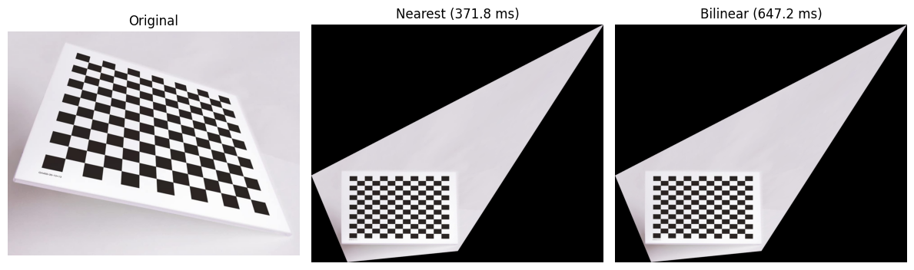
  </a>
  <p style="font-size:0.9em;margin-top:6px;">Checkerboard</p>
</div>

<div style="text-align:center;">
  <a href="figures/jane_eyre.png" data-lightbox="rectify" data-title="Book Cover — Left: source • Middle: Nearest • Right: Bilinear">
    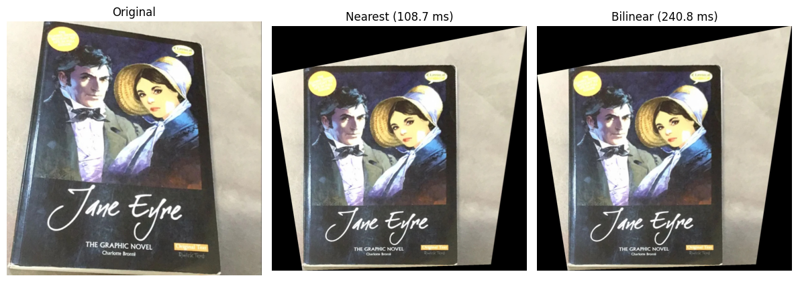
  </a>
  <p style="font-size:0.9em;margin-top:6px;">Jane Eyre</p>
</div>


### Results & Comparisons

1. Checkerboard Rectification

    <ul>
    <li><strong>Nearest</strong>: ~371 ms</li>
    <li><strong>Bilinear</strong>: ~647 ms</li>
    </ul>

    <p>
    Nearest neighbor produces crisp but <strong>visibly jagged edges</strong> and “blocky” diagonals. Bilinear removes stair-stepping and yields <strong>smoother squares and borders</strong>.
    </p>

2. Book Cover (Jane Eyre)

    <ul>
    <li><strong>Nearest</strong>: ~108 ms</li>
    <li><strong>Bilinear</strong>: ~240 ms</li>
    </ul>

    <p>
    The nearest result shows aliasing on text strokes and high-contrast edges. Bilinear interpolation significantly improves <strong>readability</strong> and <strong>edge smoothness</strong>, with mild softening.
    </p>

#### Trade-offs

<ul>
  <li>Nearest neighbor is roughly <strong>2× faster</strong> and useful for quick debugging or previews, but it <strong>amplifies aliasing</strong> under strong foreshortening or down-sampling.</li>
  <li>Bilinear is moderately slower yet consistently delivers <strong>higher-quality results</strong>, especially for text and oblique edges. It is the better choice for final rectification and mosaicing.</li>
</ul>

<p>
In both cases:
</p>
<ul>
  <li><strong>Inverse warping</strong> avoids holes</li>
  <li><strong>Bounding-box prediction</strong> ensures full coverage</li>
  <li><strong>Alpha masks</strong> cleanly handle undefined pixels</li>
</ul>

<p>
Overall, the homography and warping pipeline work as expected: planar regions (checkerboard, book cover) are rectified to true rectangles, with bilinear sampling producing clearly better visual quality.
</p>


## Part A.4: Blend the Images into a Mosaic

<p>
After aligning each photograph through geometric warping, the final step is to <strong>blend them into a single, seamless mosaic</strong>. This process transforms a collection of individually warped images into one continuous panoramic view—removing visible seams and ensuring smooth transitions across overlapping regions.
</p>

<p>
A naive approach would be to simply <strong>overlay</strong> one warped image on top of another. However, this creates <strong>harsh boundaries</strong> in the overlapping areas, which breaks the illusion of continuity. Instead, this part focuses on <strong>smooth image blending</strong>, where each image contributes to the final result via carefully designed weights.
</p>

### Weighted Averaging and Alpha Blending

<p>
One of the simplest and most effective techniques is <strong>weighted averaging</strong> (also called feathering). Each pixel's contribution is controlled by an <strong>alpha map</strong>, which specifies how strongly that image influences each part of the mosaic.
</p>

<ul>
  <li>Pixels <strong>near the center</strong> of each image get higher weight (\(\alpha \approx 1\))</li>
  <li>Pixels <strong>near the edges</strong> fade toward zero (\(\alpha \approx 0\))</li>
  <li>Overlapping areas are blended smoothly across images.</li>
</ul>

<blockquote>
<strong>Tip:</strong> To build such masks, I used a <strong>distance transform</strong> to compute pixelwise distances from the nearest invalid pixel, producing a natural falloff from the center.
</blockquote>

### One-Shot vs. Incremental Mosaicing

<p>There are two common paradigms for blending:</p>

1. <strong>Incremental blending</strong> — build the mosaic step-by-step, adding one image at a time.  
2. <strong>One-shot blending</strong> — warp all images into a shared coordinate system (usually the middle image's projection), then blend them together in one pass.

<p>
For one-shot blending, predicting the <strong>final canvas size</strong> is essential. I did this by transforming all corner points of each image into the reference frame, then computing the union of their bounding boxes.
</p>

### Advanced Blending with Pyramids

<p>
Feathering works well, but when image intensities differ across exposures or edges misalign slightly, it can still produce faint seams. To solve this, I implemented <strong>multi-resolution blending</strong> using <strong>Laplacian pyramids</strong>. This approach:
</p>

<ul>
  <li>Blends low-frequency content (like lighting or color gradients) smoothly,</li>
  <li>Preserves high-frequency details (like edges and textures),</li>
  <li>Avoids ghosting and sharp transitions in overlapping zones.</li>
</ul>

<p>Even a <strong>two-level pyramid</strong> can make a large difference in visual quality.</p>

### Planar Mosaicing — Procedure

<p>The following outlines my step-by-step process for planar image mosaicing, using the middle image as the reference frame:</p>

#### 1) Choose Reference & Homographies

<ul>
  <li>Set the <strong>middle image</strong> as the reference plane (identity transform).</li>
  <li>Load the homographies \( H_{\text{left}\to\text{mid}},\; H_{\text{right}\to\text{mid}} \) computed in Part A.2.</li>
  <li>All warps are defined <strong>source → reference</strong> (internally use \( H^{-1} \) for inverse mapping).</li>
</ul>

#### 2) Predict the Global Canvas

<ul>
  <li>Transform the four corners of each image using their respective homographies.</li>
  <li>Compute the <strong>global bounding box</strong> by taking min/max over all transformed corners:
    <p>\[
    [x_{\min},\, x_{\max}] \times [y_{\min},\, y_{\max}]
    \]</p>
  </li>
  <li>Determine output canvas size:
    <p>\[
    W = x_{\max} - x_{\min} + 1,\quad H = y_{\max} - y_{\min} + 1
    \]</p>
  </li>
  <li>Store the offset \( (o_x, o_y) = (-x_{\min}, -y_{\min}) \) to place each warped image correctly.</li>
</ul>

<details markdown="1">
  <summary>Click to expand code: <p style="display:inline;margin:0;"><code>_global_bbox_and_offsets</code></p></summary>
<div class="highlight code-wrapper" markdown="1">

```python
def _corners(w, h):
    return np.array([[0,0],[w-1,0],[w-1,h-1],[0,h-1]], dtype=np.float64)

def _global_bbox_and_offsets(mid_img, left_img=None, right_img=None, H_l2m=None, H_r2m=None):
    """Predict final canvas (in middle's projection) and return its size + middle offset."""
    mh, mw = mid_img.shape[:2]
    pts = transform_points(np.eye(3), _corners(mw, mh))  # middle itself
    if (left_img is not None) and (H_l2m is not None):
        lh, lw = left_img.shape[:2]
        pts = np.vstack([pts, transform_points(H_l2m, _corners(lw, lh))])
    if (right_img is not None) and (H_r2m is not None):
        rh, rw = right_img.shape[:2]
        pts = np.vstack([pts, transform_points(H_r2m, _corners(rw, rh))])
    xmin = int(np.floor(pts[:,0].min())); xmax = int(np.ceil(pts[:,0].max()))
    ymin = int(np.floor(pts[:,1].min())); ymax = int(np.ceil(pts[:,1].max()))
    W = xmax - xmin + 1; H = ymax - ymin + 1
    off_mid = (-xmin, -ymin)  # place middle at this offset on the big canvas
    return (W, H), off_mid
```
</div>
</details>

#### 3) Inverse Warp the Side Images

<ul>
  <li>Use <strong>bilinear inverse warping</strong> (from A.3) to warp left and right images into the reference frame.</li>
  <li>Output includes:
    <ul>
      <li>Warped image patch <code>wS</code></li>
      <li>Binary alpha mask <code>aS</code></li>
      <li>Top-left corner in reference space (for canvas placement)</li>
    </ul>
  </li>
</ul>

#### 4) Feathering Weights

<ul>
  <li>Use a <strong>distance transform</strong> on each alpha mask to compute smooth weights:
    <ul>
      <li>Center pixels get high weights,</li>
      <li>Border pixels taper to 0.</li>
    </ul>
  </li>
</ul>

<details markdown="1">
  <summary>Click to expand code: <p style="display:inline;margin:0;"><code>_feather_from_alpha</code></p></summary>
<div class="highlight code-wrapper" markdown="1">

```python
def _feather_from_alpha(alpha):
    """alpha∈{0,1} -> 0..1 weight using distance transform (center high, edge low)."""
    src = (alpha.astype(np.uint8) * 255)
    dist = cv2.distanceTransform(src, cv2.DIST_L2, 3)
    if dist.max() > 0:
        dist = dist / dist.max()
    return dist
```
</div>
</details>

#### 5) Weighted Blending

<ul>
  <li>Initialize accumulators:
    <ul>
      <li><code>num</code> (H×W×3): numerator (weighted pixel values)</li>
      <li><code>den</code> (H×W): denominator (sum of weights)</li>
    </ul>
  </li>
  <li>Blend the middle and warped images using:
    <p>\[
    \text{num} \;{+}{=}\; \sum_i w_i \cdot I_i, \qquad \text{den} \;{+}{=}\; \sum_i w_i
    \]</p>
  </li>
  <li>Final mosaic:
    <p>\[
    \text{Mosaic} = \dfrac{\text{num}}{\text{den} + \varepsilon}
    \]</p>
    where \( \varepsilon \) is a small constant to avoid division by zero.
  </li>
</ul>

<details markdown="1">
  <summary>Click to expand code: <p style="display:inline;margin:0;"><code>_accumulate / mosaic_two / mosaic_three</code></p></summary>
<div class="highlight code-wrapper" markdown="1">

```python
def _accumulate(num, den, patch, weight, x0, y0):
    h, w = patch.shape[:2]
    num[y0:y0+h, x0:x0+w] += weight[...,None] * patch.astype(np.float64)
    den[y0:y0+h, x0:x0+w] += weight

def mosaic_two(mid_path, side_path, H_side2mid_path, out_path, show=False):
    """Blend (side -> middle) using feathered averaging; save to out_path."""
    os.makedirs(os.path.dirname(out_path) or ".", exist_ok=True)
    mid  = cv2.imread(mid_path);  side = cv2.imread(side_path)
    Hs   = np.load(H_side2mid_path)

    (W,H), (ox_mid, oy_mid) = _global_bbox_and_offsets(mid, side, None, H_l2m=Hs)
    # warp side into middle projection
    wS, aS, (xminS, yminS) = warpImageBilinear(side, Hs)
    gxS, gyS = xminS + ox_mid, yminS + oy_mid

    # init accumulators
    num = np.zeros((H, W, 3), np.float64); den = np.zeros((H, W), np.float64)

    # middle (unwarped) + feather
    aM = np.ones((mid.shape[0], mid.shape[1]), np.uint8)
    wM = _feather_from_alpha(aM)
    _accumulate(num, den, mid, wM, ox_mid, oy_mid)

    # side feather
    wS_ = _feather_from_alpha(aS)
    _accumulate(num, den, wS, wS_, gxS, gyS)

    out = (num / np.clip(den[...,None], 1e-6, None)).astype(np.uint8)
    cv2.imwrite(out_path, out)
    if show:
        plt.figure(figsize=(12,4))
        plt.imshow(cv2.cvtColor(out, cv2.COLOR_BGR2RGB)); plt.axis('off'); plt.title(os.path.basename(out_path))
        plt.show()
    print("Saved:", out_path)
    return out

def mosaic_three(mid_path, left_path, right_path, H_left2mid_path, H_right2mid_path, out_path, show=False):
    """Blend (left & right -> middle) using feathered averaging; save to out_path."""
    os.makedirs(os.path.dirname(out_path) or ".", exist_ok=True)
    mid   = cv2.imread(mid_path)
    left  = cv2.imread(left_path)
    right = cv2.imread(right_path)
    Hl = np.load(H_left2mid_path); Hr = np.load(H_right2mid_path)

    (W,H), (ox_mid, oy_mid) = _global_bbox_and_offsets(mid, left, right, H_l2m=Hl, H_r2m=Hr)

    # warp sides
    wL, aL, (xminL, yminL) = warpImageBilinear(left, Hl)
    wR, aR, (xminR, yminR) = warpImageBilinear(right, Hr)
    gxL, gyL = xminL + ox_mid, yminL + oy_mid
    gxR, gyR = xminR + ox_mid, yminR + oy_mid

    num = np.zeros((H, W, 3), np.float64); den = np.zeros((H, W), np.float64)

    aM = np.ones((mid.shape[0], mid.shape[1]), np.uint8)
    wM = _feather_from_alpha(aM)
    _accumulate(num, den, mid, wM, ox_mid, oy_mid)

    wL_ = _feather_from_alpha(aL)
    _accumulate(num, den, wL, wL_, gxL, gyL)

    wR_ = _feather_from_alpha(aR)
    _accumulate(num, den, wR, wR_, gxR, gyR)

    out = (num / np.clip(den[...,None], 1e-6, None)).astype(np.uint8)
    cv2.imwrite(out_path, out)
    if show:
        plt.figure(figsize=(12,4))
        plt.imshow(cv2.cvtColor(out, cv2.COLOR_BGR2RGB)); plt.axis('off'); plt.title(os.path.basename(out_path))
        plt.show()
    print("Saved:", out_path)
    return out
```
</div>
</details>

#### 6) Output and Visualization

<ul>
  <li>The final mosaic is written to disk.</li>
  <li>Optional steps include visual inspection and auto-cropping of black borders for a cleaner result.</li>
</ul>

### Visual Results

<p>Below are results from two sets of images, each visualized at two blending stages:</p>

<!-- Set 1 — Planar Mosaicing (one row, three images) -->
<p style="text-align:center; font-size:0.95em; margin:8px 0 4px;">Set 1 — Planar Mosaicing</p>
<div style="max-width:1100px; margin:10px auto; overflow-x:auto;">
  <div style="display:flex; justify-content:center; gap:20px; flex-wrap:nowrap; min-width:940px;">
    <div style="width: calc((100% - 40px)/3); min-width:300px;">
      <a href="figures/plane_set1_mosaic_left_middle.png" data-lightbox="set1-mosaic" data-title="Set 1 — Left + Middle">
        
      </a>
      <p style="font-size:0.8em; margin-top:4px; text-align:center;">Left + Middle</p>
    </div>
    <div style="width: calc((100% - 40px)/3); min-width:300px;">
      <a href="figures/plane_set1_mosaic_middle_right.png" data-lightbox="set1-mosaic" data-title="Set 1 — Middle + Right">
        
      </a>
      <p style="font-size:0.8em; margin-top:4px; text-align:center;">Middle + Right</p>
    </div>
    <div style="width: calc((100% - 40px)/3); min-width:300px;">
      <a href="figures/plane_set1_mosaic_LMR.png" data-lightbox="set1-mosaic" data-title="Set 1 — Full Mosaic (L+M+R)">
        
      </a>
      <p style="font-size:0.8em; margin-top:4px; text-align:center;">Full Mosaic (L+M+R)</p>
    </div>
  </div>
</div>

<!-- Set 2 — Planar Mosaicing (one row, three images) -->
<p style="text-align:center; font-size:0.95em; margin:14px 0 4px;">Set 2 — Planar Mosaicing</p>
<div style="max-width:1100px; margin:10px auto; overflow-x:auto;">
  <div style="display:flex; justify-content:center; gap:20px; flex-wrap:nowrap; min-width:940px;">
    <div style="width: calc((100% - 40px)/3); min-width:300px;">
      <a href="figures/plane_set2_mosaic_left_middle.png" data-lightbox="set2-mosaic" data-title="Set 2 — Left + Middle">
        
      </a>
      <p style="font-size:0.8em; margin-top:4px; text-align:center;">Left + Middle</p>
    </div>
    <div style="width: calc((100% - 40px)/3); min-width:300px;">
      <a href="figures/plane_set2_mosaic_middle_right.png" data-lightbox="set2-mosaic" data-title="Set 2 — Middle + Right">
        
      </a>
      <p style="font-size:0.8em; margin-top:4px; text-align:center;">Middle + Right</p>
    </div>
    <div style="width: calc((100% - 40px)/3); min-width:300px;">
      <a href="figures/plane_set2_mosaic_LMR.png" data-lightbox="set2-mosaic" data-title="Set 2 — Full Mosaic (L+M+R)">
        
      </a>
      <p style="font-size:0.8em; margin-top:4px; text-align:center;">Full Mosaic (L+M+R)</p>
    </div>
  </div>
</div>




## Part A.5: Cylindrical Projection

<p>
When panoramas are captured by <strong>pure yaw</strong> about a fixed center, projecting each view onto a <strong>cylinder</strong> (radius = focal length \(f\)) reduces stretching near the periphery and keeps vertical lines straight. Instead of stitching on a plane, we <strong>map every image to cylindrical coordinates</strong> and do alignment/blending there; the cylinder is then “unrolled” to a 2D canvas \((u,v)\).
</p>

### Principle

<p>
For pure horizontal rotation about a shared center, a cylinder of radius \(f\) better matches pinhole geometry: vertical lines remain straight while horizontal directions bend smoothly, mitigating the extreme-field distortions of planar projection.
</p>

#### Forward & Inverse Mappings

<p>
Let the image principal point be \((c_x, c_y)\). For a pixel \((x, y)\), define:
</p>

<ul>
  <li>
    <p>Forward (image \( \rightarrow \) cylinder):</p>
  </li>
</ul>


<p>\[
\begin{aligned}
x' &= x - c_x, y' = y - c_y, \theta = \arctan\!\left(\frac{x'}{f}\right), r = \sqrt{(x')^{2} + f^{2}}, h = \frac{y'}{r}
\end{aligned}
\]</p>

<p>\[
\begin{aligned}
u = f\,\theta + u_0, v = \mathrm{v\_sign}\,\cdot f\,h + v_0
\end{aligned}
\]</p>

<ul>
  <li>
    <p>Inverse mapping (cylinder \(\rightarrow\) image):</p>
  </li>
</ul>

<p>\[
\begin{aligned}
\theta &= \frac{u - u_0}{f}, 
h = \frac{v - v_0}{\mathrm{v\_sign}\,f},
x' = f \tan\theta, 
r = \sqrt{(x')^{2} + f^{2}}, 
y' = h\,r \\
\end{aligned}
\]</p>

<p>\[
\begin{aligned}
x &= x' + c_x, y = y' + c_y
\end{aligned}
\]</p>

<p>
During resampling we use the <em>inverse mapping</em> to avoid holes: each destination pixel \((U,V)\) on the cylinder is mapped back to a subpixel \((x,y)\) in the original image and sampled (bilinear) directly from the source.
</p>


### Cylindrical Mosaicing — Procedure

<p>The following outlines my step-by-step process for cylindrical mosaicing, where all images are first mapped to a cylinder (radius \(f\)), aligned/blended in \((u,v)\), and finally unrolled to a 2D canvas.</p>

#### 1) Project Correspondences to the Cylinder

<ul>
  <li>Map A.2 correspondences \((x,y)\) to \((u,v)\) using <code>xy_to_uv_cyl</code>, so that alignment is performed directly in the cylindrical domain.</li>
</ul>

#### 2) Estimate Alignment Transforms (on Cylinder)

<ul>
  <li>On \((u,v)\), estimate the side→middle homography \(T\) (often close to a translation) with <code>computeH</code>:
    <p>\[
    T = \texttt{computeH}(\text{side_uv},\ \text{mid_uv})
    \]</p>
  </li>
</ul>


#### 3) Predict the Global Cylindrical Canvas

<ul>
  <li>Project the four corners of each image to \((u,v)\) with the cylindrical mapping.</li>
  <li>Apply \(T\) to the side views’ corners (still in \((u,v)\)).</li>
  <li>Compute the global bounding box over all transformed corners:
    <p>\[
    [u_{\min},\, u_{\max}] \times [v_{\min},\, v_{\max}]
    \]</p>
  </li>
  <li>Allocate accumulators <code>num</code> (H×W×3) and <code>den</code> (H×W) on this canvas.</li>
</ul>


#### 4) Single-Resample Inverse Sampling (from Originals)

<ul>
  <li>Use inverse mapping so each cylinder pixel \((U,V)\) samples a subpixel \((x,y)\) in the original image (avoids holes).</li>
</ul>

<p>
For each global \( (U,V) \):<br>
<ul>
  <li><strong>middle:</strong> \( (x_m, y_m) = \mathrm{uv\_to\_xy\_cyl}(U, V, f, c_x, c_y) \) &rarr; bilinear sample from the <em>original</em> middle image;<br></li>
  <li><strong>side:</strong> \( (\tilde{u}, \tilde{v}) = T^{-1}(U, V) \), then \( (x_s, y_s) = \mathrm{uv\_to\_xy\_cyl}(\tilde{u}, \tilde{v}, f, c_x, c_y) \) &rarr; sample from the <em>original</em> side image.</li>
</ul>
</p>

<p>This performs only one resampling pass to avoid cascading blur.</p>


#### 5) Feathered Blending

<ul>
  <li>Build weights \(w_i\) from valid masks (e.g., distance transform) and accumulate:</li>
</ul>

<p>\[
\text{num} \;{+}{=}\; \sum_i w_i \cdot I_i, \qquad
\text{den} \;{+}{=}\; \sum_i w_i
\]</p>

<p>\[
\text{Mosaic} \;=\; \dfrac{\text{num}}{\text{den} + \varepsilon}
\]</p>


<details markdown="1">
  <summary>Click to expand code: <p style="display:inline;margin:0;"><code>code for Cylindrical Mosaicing</code></p></summary>
<div class="highlight code-wrapper" markdown="1">

```python
import numpy as np
import cv2

def _principal_point(shape):
    """Return image principal point (cx, cy) in pixels."""
    h, w = shape[:2]
    cx = (w - 1) * 0.5
    cy = (h - 1) * 0.5
    return cx, cy

def xy_to_uv_cyl(x, y, f, cx, cy, u0=0.0, v0=0.0, v_sign=-1):
    """
    Forward cylindrical projection: image (x,y) -> cylinder (u,v).
    - f: focal length (pixels). Larger f -> flatter.
    - (cx,cy): principal point.
    - (u0,v0): optional shift on the unfolded cylinder.
    - v_sign: flip vertical (+1/-1) to match plotting convention.
    """
    x_ = x - cx
    y_ = y - cy
    theta = np.arctan2(x_, f)            # horizontal angle
    r     = np.sqrt(x_ * x_ + f * f)     # ray length in x–z
    h     = y_ / r                        # normalized height on cylinder
    u = f * theta + u0
    v = v_sign * f * h + v0
    return u, v

def uv_to_xy_cyl(u, v, f, cx, cy, u0=0.0, v0=0.0, v_sign=-1):
    """
    Inverse cylindrical projection: cylinder (u,v) -> image (x,y).
    Returns continuous coordinates for bilinear sampling.
    """
    theta = (u - u0) / f
    h     = (v - v0) / (v_sign * f)
    x_ = f * np.tan(theta)
    r  = np.sqrt(x_ * x_ + f * f)
    y_ = h * r
    x  = x_ + cx
    y  = y_ + cy
    return x, y

def cyl_transform_points_xy_to_uv(pts_xy, im_shape, f):
    """Batch project (x,y) points to (u,v) on the cylinder."""
    cx, cy = _principal_point(im_shape)
    pts_xy = np.asarray(pts_xy, float)
    u, v = xy_to_uv_cyl(pts_xy[:,0], pts_xy[:,1], f, cx, cy)
    return np.column_stack([u, v])

def compute_cyl_alignment_T(side_pts_xy, mid_pts_xy, side_shape, mid_shape, f, computeH_fn):
    """
    Map A.2 correspondences into cylindrical coords and estimate
    homography T: side_cyl -> mid_cyl using your computeH.
    """
    side_uv = cyl_transform_points_xy_to_uv(side_pts_xy, side_shape, f)
    mid_uv  = cyl_transform_points_xy_to_uv(mid_pts_xy,  mid_shape,  f)
    T = computeH_fn(side_uv, mid_uv)  # 3x3 homography on (u,v)
    return T

def _corners(w, h):
    """Return image corner coordinates (x,y)."""
    return np.array([[0,0],[w-1,0],[w-1,h-1],[0,h-1]], dtype=float)

def cylindrical_bbox_in_global(im_shape, T=None, f=1000.0):
    """
    Project image corners to cylindrical coords; optionally warp by T
    (to global cylinder frame) and return integer bbox [xmin,xmax]×[ymin,ymax].
    """
    h, w = im_shape[:2]
    cx, cy = _principal_point(im_shape)
    corners = _corners(w, h)
    u, v = xy_to_uv_cyl(corners[:,0], corners[:,1], f, cx, cy)
    pts_uv = np.column_stack([u, v])

    if T is not None:
        pts_uv_h = np.c_[pts_uv, np.ones(len(pts_uv))]
        wp = (T @ pts_uv_h.T).T
        pts_uv = wp[:, :2] / wp[:, 2:3]

    xmin = int(np.floor(pts_uv[:,0].min()))
    xmax = int(np.ceil (pts_uv[:,0].max()))
    ymin = int(np.floor(pts_uv[:,1].min()))
    ymax = int(np.ceil (pts_uv[:,1].max()))
    return xmin, xmax, ymin, ymax

def _feather_from_rect(h, w):
    """Feather weight for a full h×w rectangle (center high, edges low)."""
    mask = np.ones((h, w), np.uint8)*255
    dist = cv2.distanceTransform(mask, cv2.DIST_L2, 3)
    if dist.max() > 0:
        dist = dist / dist.max()
    return dist

def _bilinear_sample_from_xy(im, xs, ys):
    """
    Bilinear sampling from image at continuous xs,ys.
    Returns sampled RGB and a boolean valid mask.
    """
    h, w = im.shape[:2]
    x0 = np.floor(xs).astype(int); x1 = x0 + 1
    y0 = np.floor(ys).astype(int); y1 = y0 + 1
    a  = xs - x0
    b  = ys - y0

    valid = (x0>=0)&(x1<w)&(y0>=0)&(y1<h)
    out = np.zeros(xs.shape + (3,), dtype=np.float64)

    for c in range(3):
        I00 = np.zeros_like(xs); I10 = np.zeros_like(xs)
        I01 = np.zeros_like(xs); I11 = np.zeros_like(xs)
        I00[valid] = im[y0[valid], x0[valid], c]
        I10[valid] = im[y0[valid], x1[valid], c]
        I01[valid] = im[y1[valid], x0[valid], c]
        I11[valid] = im[y1[valid], x1[valid], c]
        out[...,c] = (1-a)*(1-b)*I00 + a*(1-b)*I10 + (1-a)*b*I01 + a*b*I11

    out = np.clip(out, 0, 255).astype(np.uint8)
    return out, valid

def mosaic_cylindrical_two(
    mid_path, side_path,
    mid_pts_xy, side_pts_xy,
    f, computeH_fn,
    out_path
):
    """Cylindrical mosaic of two images: warp side onto mid, then blend."""
    mid  = cv2.imread(mid_path)
    side = cv2.imread(side_path)
    assert mid is not None and side is not None

    # 1) Alignment T in cylindrical domain (side -> mid)
    T = compute_cyl_alignment_T(side_pts_xy, mid_pts_xy, side.shape, mid.shape, f, computeH_fn)

    # 2) Global cylindrical canvas bbox
    xmin_m, xmax_m, ymin_m, ymax_m = cylindrical_bbox_in_global(mid.shape,  T=None, f=f)
    xmin_s, xmax_s, ymin_s, ymax_s = cylindrical_bbox_in_global(side.shape, T=T,   f=f)
    xmin = min(xmin_m, xmin_s); xmax = max(xmax_m, xmax_s)
    ymin = min(ymin_m, ymin_s); ymax = max(ymax_m, ymax_s)

    # 3) Build global (u,v) grid (v from top to bottom)
    W = xmax - xmin + 1
    H = ymax - ymin + 1
    u_grid = np.arange(xmin, xmax+1)
    v_grid = np.arange(ymax, ymin-1, -1)
    U, V = np.meshgrid(u_grid, v_grid)

    # 4) Accumulators for weighted blending
    num = np.zeros((H, W, 3), np.float64)
    den = np.zeros((H, W), np.float64)

    # ---- accumulate mid (reference) ----
    cx_m, cy_m = _principal_point(mid.shape)
    Xm, Ym = uv_to_xy_cyl(U, V, f, cx_m, cy_m)
    mid_smpl, valid_m = _bilinear_sample_from_xy(mid, Xm, Ym)
    w_mid = np.zeros((H, W), np.float64); w_mid[valid_m] = 1.0
    num += w_mid[...,None] * mid_smpl; den += w_mid

    # ---- accumulate side (apply T^{-1} first) ----
    cx_s, cy_s = _principal_point(side.shape)
    UV1 = np.stack([U, V, np.ones_like(U)], axis=-1)
    T_inv = np.linalg.inv(T)
    uv_side = UV1 @ T_inv.T
    us = uv_side[...,0] / uv_side[...,2]
    vs = uv_side[...,1] / uv_side[...,2]
    Xs, Ys = uv_to_xy_cyl(us, vs, f, cx_s, cy_s)
    side_smpl, valid_s = _bilinear_sample_from_xy(side, Xs, Ys)
    w_side = np.zeros((H, W), np.float64); w_side[valid_s] = 1.0
    num += w_side[...,None] * side_smpl; den += w_side

    out = (num / np.clip(den[...,None], 1e-6, None)).astype(np.uint8)
    cv2.imwrite(out_path, out)
    print("Saved (cyl two):", out_path)
    return out, T, (xmin, ymin, W, H)

def mosaic_cylindrical_three(
    mid_path, left_path, right_path,
    mid_for_left_xy, left_xy,
    mid_for_right_xy, right_xy,
    f, computeH_fn,
    out_path
):
    """Cylindrical mosaic of three images: left+mid+right with blending."""
    mid   = cv2.imread(mid_path)
    left  = cv2.imread(left_path)
    right = cv2.imread(right_path)
    assert mid is not None and left is not None and right is not None

    # Align left/right to mid in cylindrical domain
    Tl = compute_cyl_alignment_T(left_xy,  mid_for_left_xy,  left.shape,  mid.shape, f, computeH_fn)
    Tr = compute_cyl_alignment_T(right_xy, mid_for_right_xy, right.shape, mid.shape, f, computeH_fn)

    # Global canvas bbox
    xmin_m, xmax_m, ymin_m, ymax_m = cylindrical_bbox_in_global(mid.shape,  T=None, f=f)
    xmin_l, xmax_l, ymin_l, ymax_l = cylindrical_bbox_in_global(left.shape, T=Tl,  f=f)
    xmin_r, xmax_r, ymin_r, ymax_r = cylindrical_bbox_in_global(right.shape, T=Tr,  f=f)
    xmin = min(xmin_m, xmin_l, xmin_r); xmax = max(xmax_m, xmax_l, xmax_r)
    ymin = min(ymin_m, ymin_l, ymin_r); ymax = max(ymax_m, ymax_l, ymax_r)

    # Global grid
    W = xmax - xmin + 1; H = ymax - ymin + 1
    u_grid = np.arange(xmin, xmax+1)
    v_grid = np.arange(ymax, ymin-1, -1)
    U, V = np.meshgrid(u_grid, v_grid)

    num = np.zeros((H, W, 3), np.float64)
    den = np.zeros((H, W), np.float64)

    # Reference (mid)
    cx_m, cy_m = _principal_point(mid.shape)
    Xm, Ym = uv_to_xy_cyl(U, V, f, cx_m, cy_m)
    mid_smpl, valid_m = _bilinear_sample_from_xy(mid, Xm, Ym)
    w_mid = np.zeros((H, W), np.float64); w_mid[valid_m] = 1.0
    num += w_mid[...,None] * mid_smpl; den += w_mid

    # Helper: accumulate one image with its T
    def _accumulate(im, T_img, f, U, V, num, den):
        cx, cy = _principal_point(im.shape)
        Tinv = np.linalg.inv(T_img)
        UV1 = np.stack([U, V, np.ones_like(U)], axis=-1)
        uv_loc = UV1 @ Tinv.T
        u = uv_loc[...,0] / uv_loc[...,2]
        v = uv_loc[...,1] / uv_loc[...,2]
        X, Y = uv_to_xy_cyl(u, v, f, cx, cy)
        smpl, valid = _bilinear_sample_from_xy(im, X, Y)
        w = np.zeros(U.shape, np.float64); w[valid] = 1.0
        num += w[...,None] * smpl; den += w
        return num, den

    num, den = _accumulate(left,  Tl, f, U, V, num, den)
    num, den = _accumulate(right, Tr, f, U, V, num, den)

    out = (num / np.clip(den[...,None], 1e-6, None)).astype(np.uint8)
    cv2.imwrite(out_path, out)
    print("Saved (cyl three):", out_path)
    return out, (Tl, Tr), (xmin, ymin, W, H)
```
</div>
</details>

### Visual Results

Two datasets, each shown with three outputs (Left+Middle, Middle+Right, Left+Middle+Right), all aligned and blended in the cylindrical domain:

<!-- Results — Set 1 (one row, three images) -->
<p style="text-align:center; font-size:0.95em; margin:8px 0 4px;">Set 1 — Cylindrical Mosaicing</p>
<div style="max-width:1100px; margin:10px auto; overflow-x:auto;">
  <div style="display:flex; justify-content:center; gap:20px; flex-wrap:nowrap; min-width:940px;">
    <div style="width: calc((100% - 40px)/3); min-width:300px;">
      <a href="figures/plane_set1_mosaic_left_middle.png" data-lightbox="set1-cyl" data-title="Set 1 — Left + Middle">
        
      </a>
      <p style="font-size:0.8em; margin-top:4px; text-align:center;">Left + Middle</p>
    </div>
    <div style="width: calc((100% - 40px)/3); min-width:300px;">
      <a href="figures/plane_set1_mosaic_middle_right.png" data-lightbox="set1-cyl" data-title="Set 1 — Middle + Right">
        
      </a>
      <p style="font-size:0.8em; margin-top:4px; text-align:center;">Middle + Right</p>
    </div>
    <div style="width: calc((100% - 40px)/3); min-width:300px;">
      <a href="figures/plane_set1_mosaic_LMR.png" data-lightbox="set1-cyl" data-title="Set 1 — Full Mosaic (L+M+R)">
        
      </a>
      <p style="font-size:0.8em; margin-top:4px; text-align:center;">Full Mosaic (L+M+R)</p>
    </div>
  </div>
</div>

<!-- Results — Set 2 (one row, three images) -->
<p style="text-align:center; font-size:0.95em; margin:14px 0 4px;">Set 2 — Cylindrical Mosaicing</p>
<div style="max-width:1100px; margin:10px auto; overflow-x:auto;">
  <div style="display:flex; justify-content:center; gap:20px; flex-wrap:nowrap; min-width:940px;">
    <div style="width: calc((100% - 40px)/3); min-width:300px;">
      <a href="figures/plane_set2_mosaic_left_middle.png" data-lightbox="set2-cyl" data-title="Set 2 — Left + Middle">
        
      </a>
      <p style="font-size:0.8em; margin-top:4px; text-align:center;">Left + Middle</p>
    </div>
    <div style="width: calc((100% - 40px)/3); min-width:300px;">
      <a href="figures/plane_set2_mosaic_middle_right.png" data-lightbox="set2-cyl" data-title="Set 2 — Middle + Right">
        
      </a>
      <p style="font-size:0.8em; margin-top:4px; text-align:center;">Middle + Right</p>
    </div>
    <div style="width: calc((100% - 40px)/3); min-width:300px;">
      <a href="figures/plane_set2_mosaic_LMR.png" data-lightbox="set2-cyl" data-title="Set 2 — Full Mosaic (L+M+R)">
        
      </a>
      <p style="font-size:0.8em; margin-top:4px; text-align:center;">Full Mosaic (L+M+R)</p>
    </div>
  </div>
</div>


# Part B: Feature Matching for Autostitching
