# Part 0: Camera Calibration and 3D Scanning

In **Part 0** I build the complete data pipeline that later NeRF parts will rely on:

- **Part 0.1 – Intrinsics calibration.**  
  Capture checkerboard / marker-board images and recover the camera intrinsic matrix \( K \) and distortion coefficients using OpenCV’s calibration routine.

- **Part 0.2 – Pose estimation for each frame.**  
  For every training image, detect the calibration board, estimate the camera pose with `solvePnP`, and convert the result from world-to-camera to **camera-to-world (c2w)** coordinates.

- **Part 0.3 – Dataset construction.**  
  Undistort all images, keep only frames where calibration is reliable, and save the train / val / test splits and camera poses into `out/dataset.npz`.

- **Part 0.4 – 3D visualization in Viser.**  
  Load all c2w poses into Viser, draw the camera frustums and a subset of rays / samples, and visually verify that the cameras form a reasonable orbit around the object.

## Part 0.1: Camera Intrinsics Calibration

I first collected several images of the calibration board from different viewpoints and distances.  
Using OpenCV’s calibration API (`cv2.calibrateCamera`), I solved for:

- the **intrinsic matrix** \( K \) (focal lengths and principal point), and  
- the **distortion coefficients** for the lens.

The resulting `calib.json` stores:

- the intrinsic matrix \( K \)  
- the distortion parameters  
- the original image resolution

This calibration file is later reused for both the **Lego** dataset and my **own captured object** experiments, ensuring consistent intrinsics across all parts.

## Part 0.2: Per-image Pose Estimation

For each frame in the video / image sequence:

1. Detect the calibration pattern (checkerboard or marker board) on the board.
2. Form the 2D–3D correspondences between image corners and known board coordinates.
3. Call OpenCV’s `solvePnP` to estimate the **world-to-camera** pose (rotation + translation).
4. **Invert the transform** to obtain the **camera-to-world matrix c2w** used by NeRF and Viser.

I then saved all **c2w** matrices into `out/poses.npz`, together with an index of which frames are kept for training / validation.


## Part 0.3: Dataset Construction

With intrinsics and poses fixed, I built the NeRF dataset as follows:

- **Undistort frames.**  
  For each RGB frame, I apply `cv2.undistort` using the recovered distortion parameters so that all rays follow the ideal pinhole model.

- **Filter frames.**  
  I keep a subset of frames with:
  - good board visibility,
  - reasonable sharpness (remove extremely blurry images),
  - diverse viewpoints (remove redundant nearby views).

- **Split into train / val / test.**  
  The remaining frames are split into training, validation, and test sets, typically using an index-based pattern (e.g., every N-th frame goes to val / test).

- **Pack everything into a single `.npz` file.**  
  Finally, I pack all data into `out/dataset.npz`, which contains:
  - `images_train`, `images_val`, `images_test`  
  - `c2ws_train`, `c2ws_val`, `c2ws_test`  
  - the focal length / intrinsics needed for ray sampling

This `dataset.npz` is what later parts (ray sampling and NeRF training) load directly, so that the training code does **not** need to redo calibration or pose estimation.

<p style="text-align: center; font-size: 0.95em; margin: 8px 0 12px;">
  Viser Camera Frustums
</p>

<div style="max-width:1100px; margin: 0 auto;">
  <div style="display:flex; justify-content:center; gap:20px; flex-wrap:nowrap;">

    <!-- Left Image -->
    <div style="width: calc((100% - 20px)/2);">
      <a href="figures/0.4-1.png" data-lightbox="part0-viser" data-title="Part 0.4 — Viser camera frustums (View 1)">
        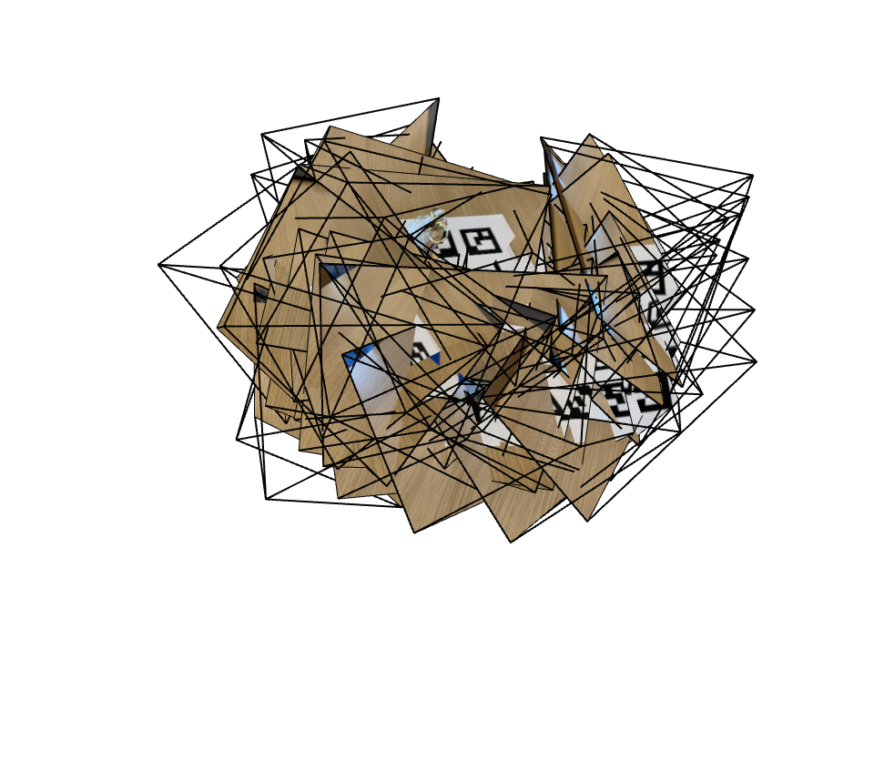
      </a>
      <p style="font-size:0.85em; margin-top:4px; text-align:center;">View 1 — Top/Side Angle</p>
    </div>

    <!-- Right Image -->
    <div style="width: calc((100% - 20px)/2);">
      <a href="figures/0.4-2.png" data-lightbox="part0-viser" data-title="Part 0.4 — Viser camera frustums (View 2)">
        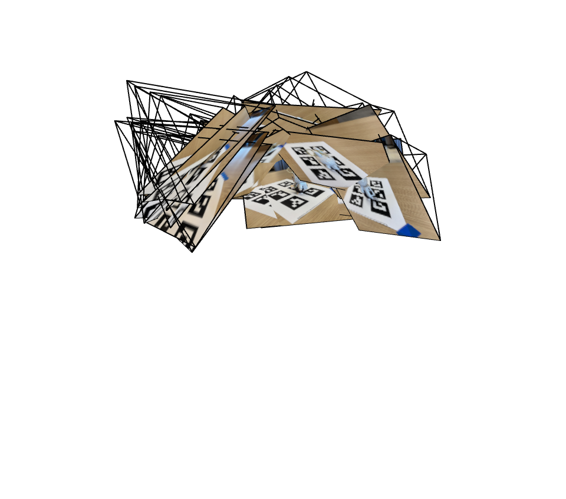
      </a>
      <p style="font-size:0.85em; margin-top:4px; text-align:center;">View 2 — Alternate Perspective</p>
    </div>

  </div>
</div>

## Part 0.4: 3D Visualization in Viser

To sanity-check calibration and poses, I used **Viser** to render the scene in 3D:

- Each camera is visualized as a **frustum**, positioned at its **c2w** pose and pointing along its optical axis.
- The calibration board / object sits near the origin of the world coordinate system.
- By orbiting the Viser scene, I verified that the cameras form a smooth arc around the object, with reasonable heights and orientations (no flipped or wildly drifting poses).


# Part 1: Fit a Neural Field to a 2D Image

In **Part 1** I fit a **2D neural field**: instead of modeling a 3D radiance field, I learn a function that maps pixel coordinates directly to RGB colors. Concretely, I train a neural network

<p>
\[
f_{\theta} : (x, y) \in [0,1]^2 \rightarrow \mathrm{RGB} \in [0,1]^3
\]
</p>

where \( (x, y) \) are continuous image coordinates normalized into the unit square. The function \( f_{\theta} \) is implemented as a multi-layer perceptron (MLP) with **sinusoidal positional encoding** on the inputs.

This part serves as a warm-up for NeRF-style neural fields: we see how a coordinate-based MLP can memorize and reconstruct a single 2D image, and how **positional encoding** and **network capacity** affect reconstruction quality.

## Part 1.1: Model Architecture and Hyperparameters

### Part 1.1.1: Positional Encoding

<p>
For each pixel in the image, I first construct normalized coordinates
\( (x_{\mathrm{norm}}, y_{\mathrm{norm}}) \in [0,1]^2 \) from the image width and height.
</p>

<p>
These coordinates are then passed through a <strong>sinusoidal positional encoding</strong> with maximum frequency \( L \):
</p>

<ul>
  <li>
    <strong>Base features</strong>: the raw 2D coordinates
    \( (x_{\mathrm{norm}}, y_{\mathrm{norm}}) \).
  </li>
  <li>
    <strong>Sin/cos features for each level</strong>:
    for every level \( i = 0, \dots, L-1 \) and for each scalar coordinate
    \( p \in \{ x_{\mathrm{norm}}, y_{\mathrm{norm}} \} \), I append
    \( \sin(2^i \pi p) \) and \( \cos(2^i \pi p) \).
  </li>
  <li>
    <strong>Final feature dimension</strong>:
  </li>
</ul>

<p>
\[
\mathrm{dim} = 2 + 4L.
\]
</p>


For the main experiments, I use:

- Max positional encoding frequency: \( L = 10 \)
- Input feature dimension: \( 2 + 4 \times 10 = 42 \)

So each pixel coordinate is turned into a 42-dimensional vector before being fed into the MLP.

### Part 1.1.2: Neural Field MLP (NeuralField2D)

The **2D neural field** is implemented as a simple fully-connected network:

- **Input**: encoded 2D coordinate (dimension = 42 when \( L = 10 \))
- **Hidden layers**: 3 hidden layers total (depth = 3)
- **Hidden width**: 256 units per hidden layer (width = 256)
- **Nonlinearity**: ReLU activation after each hidden `Linear` layer
- **Output layer**: `Linear` → Sigmoid, mapping to RGB in \([0,1]\)
- **Weight initialization**:
  - Kaiming uniform initialization for all `Linear` layers (suited for ReLU)
  - Biases initialized to 0
- **Architecture note**: there are **no skip connections** (no residual or positional skip).

In code, the base configuration corresponds to:

```python
BASE_PE_L   = 10      # max positional encoding frequency L
BASE_IN_DIM = 2 + 4 * BASE_PE_L  # = 42
BASE_DEPTH  = 3       # number of hidden layers
BASE_WIDTH  = 256     # hidden units per layer
````

### Part 1.1.3: Training Hyperparameters (Base Runs)

For both the **provided fox image** and my **own lion image**, I use the same base training setup:

* **Optimizer**: Adam
* **Learning rate**: ( 1 \times 10^{-3} )
* **Batch size**: 10,000 random pixels per iteration
* **Number of iterations**: 2,000
* **Loss**: mean squared error (MSE) between predicted RGB and ground-truth RGB
* **Metric**: PSNR computed from the training loss at each iteration
- **Image preprocessing**:

  <p>
  If the original image is larger than 256 in either dimension,
  it is <strong>downscaled</strong> so that \( \max(H, W) \le 256 \) using LANCZOS resampling.
  </p>
  <p>
  All experiments in Part 1 use this resized resolution.
  </p>


These choices match the constants used in the code:

```python
BASE_WIDTH    = 256
BASE_DEPTH    = 3
BASE_PE_L     = 10
BASE_LR       = 1e-3
BASE_ITERS    = 2000
BASE_BATCH    = 10_000
BASE_MAX_SIDE = 256
```

## Part 1.2: Experiments on the Provided Image

In this section I apply the 2D neural field to the **provided fox image** using the base configuration:

* Positional encoding: ( L = 10 )
* Depth: 3 hidden layers
* Width: 256 units
* Learning rate: ( 1 \times 10^{-3} )
* Iterations: 2,000
* Batch size: 10,000

### Part 1.2.1: Training Progression

Using the base configuration, I visualize how the neural field gradually fits the fox image.
During training, I save full-image predictions at the following iterations:

<p>
\[
\text{iterations} = 0,\ 50,\ 200,\ 500,\ 1000,\ 2000.
\]
</p>

These snapshots show the progression from random initialization to a nearly perfect reconstruction.

<div style="text-align:center;">
  <a href="figures/1.2-1.png" data-lightbox="part1-fox" data-title="Part 1.2 — Training progression on provided fox image">
    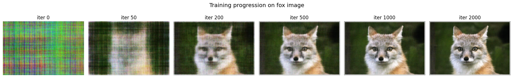
  </a>
  <p style="font-size:0.9em;margin-top:6px;">
    Part 1.2 — Training progression on the provided fox image.
  </p>
</div>

**Observations**

* At **iter 0**, the prediction is essentially random noise.
* By **iter 50–200**, the model captures the **coarse color layout** and large shapes of the fox and background.
* Around **iter 500–1000**, edges sharpen and **mid-frequency details** (ears, tail, contours) emerge.
* By **iter 2000**, the reconstruction is visually very close to the ground-truth fox, including **fur texture** and facial details.

### Part 1.2.2: PSNR Curve

For the same fox run, I record the training PSNR at every iteration and plot **PSNR vs iteration**.

<div style="text-align:center;">
  <a href="figures/1.2-2.png" data-lightbox="part1-fox" data-title="Part 1.2 — PSNR curve on fox image">
    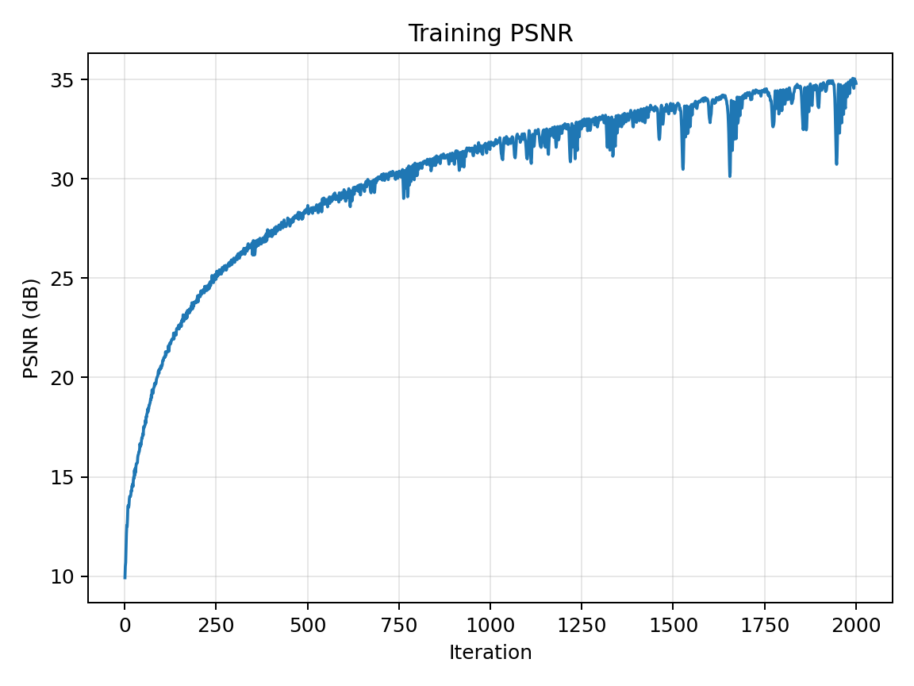
  </a>
  <p style="font-size:0.9em;margin-top:6px;">
    Part 1.2 — Training PSNR on the fox image (L=10, width=256, lr=1e-3).
  </p>
</div>

* The PSNR **rises quickly** during the first few hundred iterations as the network captures global structure.
* Afterwards it **increases more slowly** as the model refines higher-frequency details.
* Finally, it **plateaus at a high PSNR**, consistent with the visually excellent reconstruction seen in the snapshots.

### Part 1.2.3: 2×2 Hyperparameter Grid on fox (PE L × Width)

To study how **positional encoding frequency** and **network width** affect reconstruction quality, I run a **2×2 hyperparameter grid** on the fox image.

* **Positional encoding max frequency ( L )**:

  * ( L = 0 ): no additional sin/cos features (only raw normalized coordinates).
  * ( L = 10 ): high-frequency positional encoding (same as base).
* **Hidden width**:

  * 64 units (smaller capacity).
  * 256 units (larger capacity).

This yields four configurations:

1. ( L = 0 ), width = 64
2. ( L = 0 ), width = 256
3. ( L = 10 ), width = 64
4. ( L = 10 ), width = 256

All other hyperparameters are fixed:

* Depth = 3 hidden layers
* Learning rate = ( 1 \times 10^{-3} )
* Iterations = 2,000
* Batch size = 10,000
* Same image resolution / preprocessing as before

For each setting, I only save the **final image at iter = 2000**.

<div style="text-align:center;">
  <a href="figures/1.2-3.png" data-lightbox="part1-fox-grid" data-title="Part 1.2 — 2×2 grid of fox reconstructions (L × width)">
    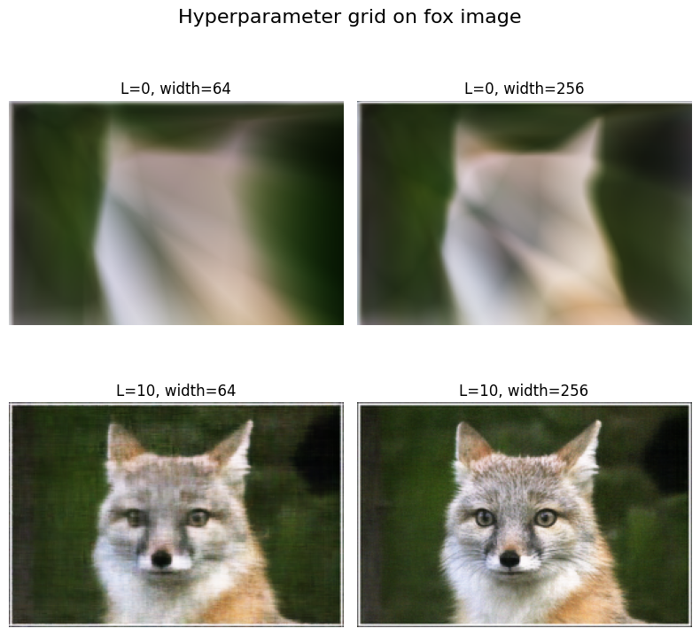
  </a>
  <p style="font-size:0.9em;margin-top:6px;">
    Part 1.2 — 2×2 result grid on the fox image, comparing positional encoding frequency \(L\) and network width.
  </p>
</div>

**Effect of positional encoding ( L )**

* With **( L = 0 )** (no positional encoding), the network cannot represent high-frequency details well:

  * edges are blurry,
  * textures are heavily smoothed.
* With **( L = 10 )**, adding high-frequency Fourier features **dramatically sharpens edges** and recovers detailed textures (fur, facial contours).

**Effect of width**

* For both ( L = 0 ) and ( L = 10 ), increasing width from **64 → 256** improves reconstruction quality.
* The improvement is most visible when **( L = 10 )**: the wider network better exploits the rich positional features and fits more complex patterns.

## Part 1.3: Experiments on My Own Image

Next, I repeat the same procedure on my **own image** of a lion.

The hyperparameters are **exactly the same** as for the fox:

* Positional encoding: ( L = 10 )
* Width = 256, depth = 3
* Learning rate = ( 1 \times 10^{-3} )
* Iterations = 2,000
* Batch size = 10,000
* Same downsampling rule: maximum side length (\le 256)

### Part 1.3.1: Training Progression on lion

As before, I save full-image predictions at:

<p>
\[
\text{iterations} = 0,\ 50,\ 200,\ 500,\ 1000,\ 2000.
\]
</p>

<div style="text-align:center;">
  <a href="figures/1.3-1.png" data-lightbox="part1-lion" data-title="Part 1.3 — Training progression on my own lion image">
    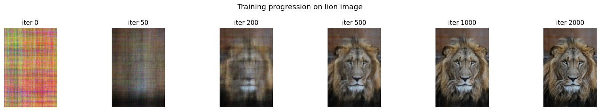
  </a>
  <p style="font-size:0.9em;margin-top:6px;">
    Part 1.3 — Training progression on my own lion image (ground truth + predictions at different iterations).
  </p>
</div>

**Observations**

* The **training dynamics** are very similar to the fox experiment:

  * Early iterations recover **coarse structure** and global color fields.
  * Later iterations refine **fine details** such as the lion’s mane and facial features.
* With the same 3×256 architecture, extremely tiny, high-frequency details may still be slightly smoothed, but overall reconstruction quality is **high after 2000 iterations**.

### Part 1.3.2: PSNR Curve on lion

For the lion experiment, I also log the training PSNR at every iteration and plot **PSNR vs iteration**.

<div style="text-align:center;">
  <a href="figures/1.3-2.png" data-lightbox="part1-lion" data-title="Part 1.3 — PSNR curve on lion image">
    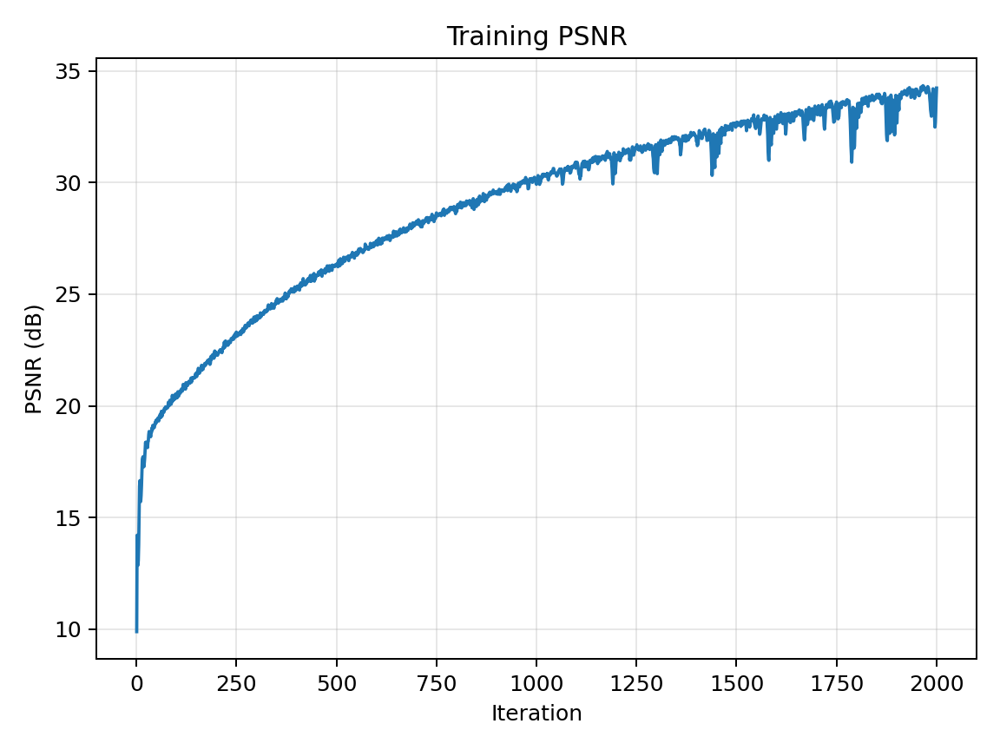
  </a>
  <p style="font-size:0.9em;margin-top:6px;">
    Part 1.3 — Training PSNR on my own lion image (L=10, width=256, lr=1e-3).
  </p>
</div>

The curve shows the same overall shape as the fox experiment:

* **Fast PSNR growth** in the beginning as global structure is learned.
* **Slower improvement** later on as the network refines subtle, high-frequency details.
* A plateau at a high PSNR consistent with the visually good reconstruction.


# Part 2: Fit a Neural Radiance Field from Multi-view Images

In **Part 2** I move from 2D neural fields to a full **Neural Radiance Field (NeRF)**.  
Given multi-view images of the Lego scene with known camera intrinsics and extrinsics, I:

1. Convert pixels to world-space rays (Part 2.1).  
2. Sample points along each ray (Part 2.2).  
3. Pack all rays and colors into a **RaysData** structure (Part 2.3).  
4. Implement a NeRF MLP that predicts density and color (Part 2.4).  
5. Implement volume rendering and train the NeRF, then visualize training and render a spherical Lego video (Part 2.5).

---

## Part 2.1: Rays from Cameras

**Implementation**

<p>
I first implemented a homogeneous transform function
\(\mathrm{transform}(C, x_c)\) that maps points from camera coordinates to world coordinates.
Here \(C\) is the \(4 \times 4\) camera-to-world matrix (**c2w**), and
\(x_c\) is a 3D camera-space point lifted to homogeneous coordinates.
The function multiplies
\[
x_w = C \,[x_c, 1]^\top
\]
and then divides by the homogeneous coordinate to get the 3D world point.
</p>

<p>
Next, I implemented <code>pixel_to_camera(K, uv, s)</code>, which inverts the pinhole projection
using the intrinsic matrix \(K\).
Given a pixel center \((u, v)\) and a depth scale \(s\), it computes the camera-space 3D point:
\[
x_c = s \, K^{-1} [u, v, 1]^\top.
\]
</p>

<p>
Finally, I combined these pieces in <code>pixel_to_ray(K, c2w, uv)</code>:
</p>

<ul>
  <li>
    The <strong>ray origin</strong> is the camera center in world space, i.e., the translation part of
    the **c2w** matrix.
  </li>
  <li>
    To get a <strong>ray direction</strong>, I map the camera-space point \(x_c\) through **c2w**
    and subtract the origin:
    \[
    d = \frac{\mathrm{transform}(C, x_c) - o}
             {\lVert \mathrm{transform}(C, x_c) - o \rVert_2},
    \]
    where \(o\) is the camera origin in world coordinates.
  </li>
</ul>

<p>
This yields one world-space ray \((o, d)\) per pixel center.
</p>

---

## Part 2.2: Sampling Along Rays

**Stratified sampling**

<p>
At each training step I need 3D samples along each selected ray.
For every ray \((o, d)\) I define a near–far range \([t_{\text{near}}, t_{\text{far}}]\).
For the Lego scene, I use \(\text{NEAR} = 2.0\) and \(\text{FAR} = 6.0\), following the handout.
</p>

<p>
I stratify this interval into \(N_{\text{samples}}\) bins:
\[
[t_0, t_1],\ [t_1, t_2],\ \dots,\ [t_{S-1}, t_S],
\]
where \(S = N_{\text{samples}}\).
For each bin \([t_i, t_{i+1}]\), I draw a random sample
\[
t \sim \mathcal{U}(t_i, t_{i+1}),
\]
which yields smoother gradients and helps anti-aliasing.
</p>

<p>
Given a sampled depth value \(t\), the 3D point along the ray is
\[
x(t) = o + t\,d.
\]
</p>

<p>
I wrap this logic in a helper
<code>sample_points_along_rays(rays_o, rays_d, n_samples, near, far, perturb)</code>
which returns:
</p>

<ul>
  <li><code>pts</code>: 3D points of shape \((B, S, 3)\)</li>
  <li><code>t_vals</code>: sampled depth values of shape \((B, S)\)</li>
</ul>

<p>
Here \(B\) is the number of rays in the batch and \(S = N_{\text{samples}}\).
</p>

---

## Part 2.3: RaysData Precomputation

**Implementation**

<p>
To make training efficient, I precompute all rays and pixel colors into a
<code>RaysData</code> object. For each training image index <code>img_idx</code> with height \(H\)
and width \(W\):
</p>

<ul>
  <li>Compute flattened pixel indices in \([0, H \times W)\).</li>
  <li>Convert integer pixel coordinates \((u, v)\) to world-space rays \((o, d)\)
      using <code>pixel_to_ray(K, c2w, uv)</code> from Part 2.1.</li>
  <li>Read the corresponding RGB pixel from the training image (normalized to \([0, 1]\)).</li>
</ul>

<p>
I store four flattened arrays:
</p>

<ul>
  <li><strong>uvs</strong>: pixel coordinates \((u, v)\) for all training pixels</li>
  <li><strong>pixels</strong>: ground-truth RGB colors</li>
  <li><strong>rays_o</strong>: ray origins in world space</li>
  <li><strong>rays_d</strong>: ray directions in world space</li>
</ul>

<p>
The resulting shapes are
\(\mathrm{uvs} \in \mathbb{R}^{N_{\text{pixels}} \times 2}\),
\(\mathrm{pixels} \in \mathbb{R}^{N_{\text{pixels}} \times 3}\),
\(\mathrm{rays\_o} \in \mathbb{R}^{N_{\text{pixels}} \times 3}\),
\(\mathrm{rays\_d} \in \mathbb{R}^{N_{\text{pixels}} \times 3}\),
where
\[
N_{\text{pixels}} = (\#\ \text{images}) \times H \times W.
\]
</p>

<p>
The method <code>RaysData.sample_rays(N_RAYS)</code> works by:
</p>

<ul>
  <li>Sampling random indices in \([0, N_{\text{pixels}})\).</li>
  <li>Returning <code>rays_o[idx]</code>, <code>rays_d[idx]</code>, <code>pixels[idx]</code> as NumPy arrays
      to feed into each training iteration.</li>
</ul>

<p>
The same structure is also used for the ray and sample visualization.
</p>

**Visualization of rays and samples with cameras**

<p>
To satisfy the “Visualization of rays and samples with cameras (≤ 100 rays)” requirement,
I use the precomputed rays and <strong>Viser</strong>:
</p>

<ul>
  <li>Pick one training image (e.g., index 0).</li>
  <li>Randomly sample up to 100 rays from this image.</li>
  <li>
    For each ray, draw a line segment from the camera center in the ray direction,
    then call <code>sample_points_along_rays</code> to sample points along the ray and
    render these as small markers.
  </li>
</ul>

<p style="text-align: center; font-size: 0.95em; margin: 8px 0 12px;">
  Part 2.3 — Camera frustums, rays, and sampled points (three views)
</p>

<div style="max-width:1100px; margin: 0 auto;">
  <div style="display:flex; justify-content:center; gap:20px; flex-wrap:nowrap;">

    <div style="width: calc((100% - 40px)/3);">
      <a href="figures/2.3-1.png" data-lightbox="part2-rays" data-title="Part 2.3 — All Lego cameras and frustums">
        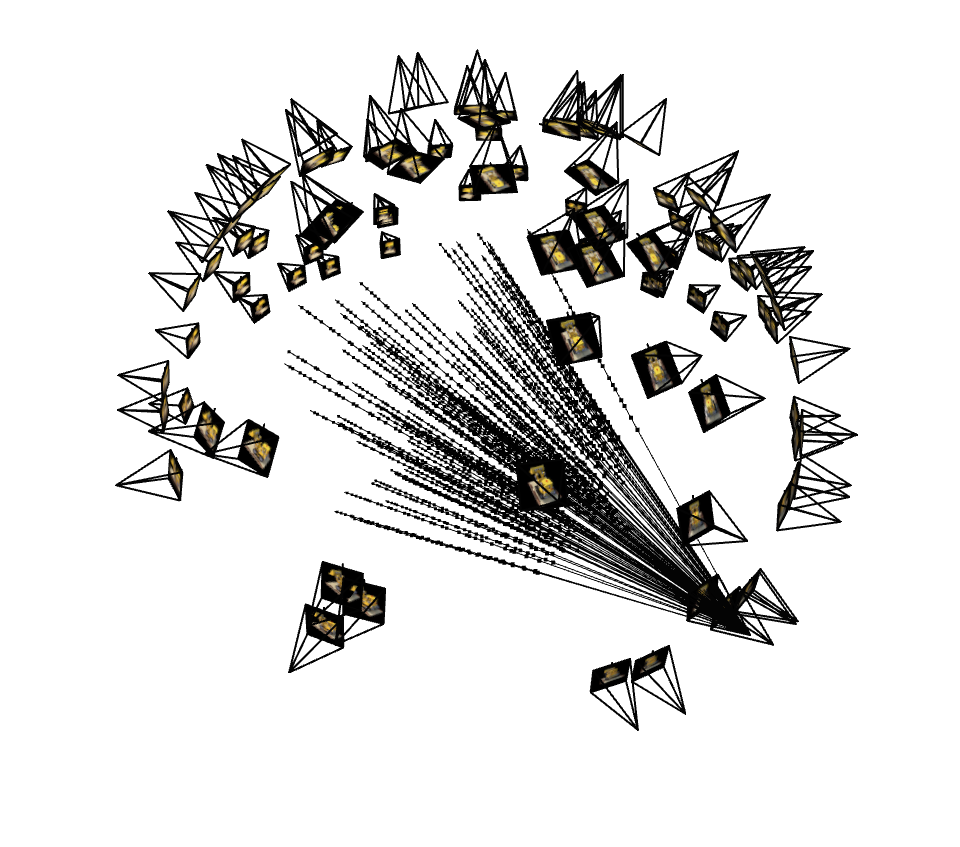
      </a>
      <p style="font-size:0.8em; margin-top:4px; text-align:center;">All Lego camera frustums</p>
    </div>

    <div style="width: calc((100% - 40px)/3);">
      <a href="figures/2.3-2.png" data-lightbox="part2-rays" data-title="Part 2.3 — Selected camera and up to 100 rays">
        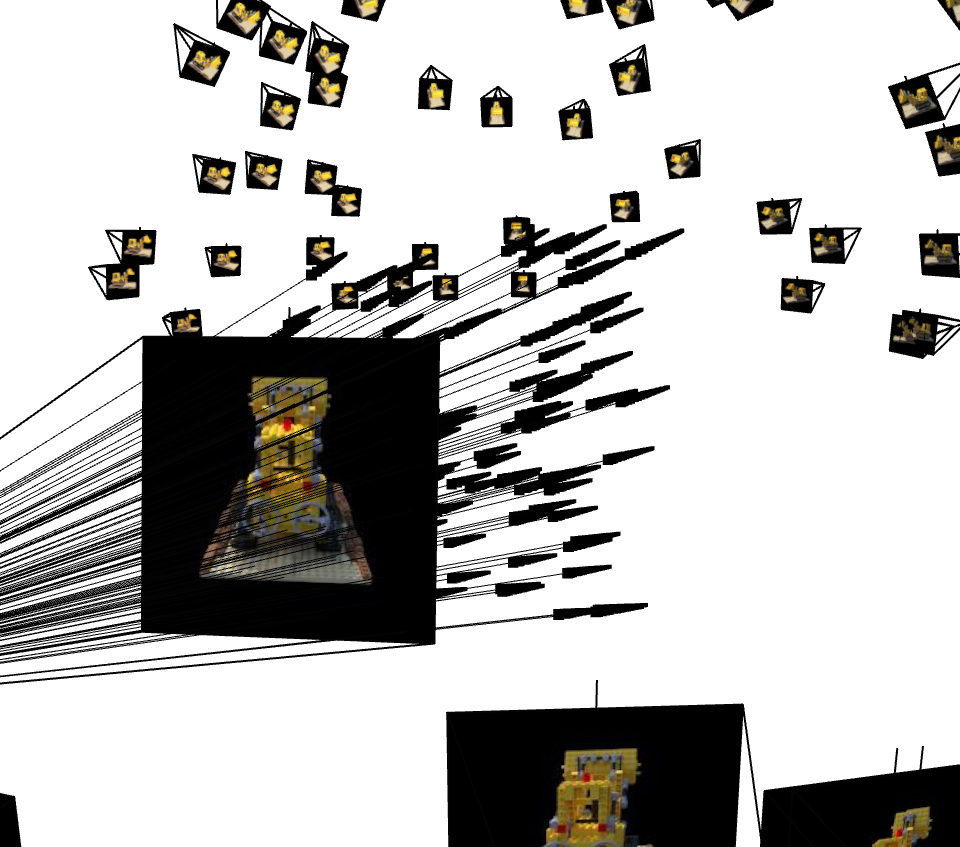
      </a>
      <p style="font-size:0.8em; margin-top:4px; text-align:center;">Selected camera with ≤100 rays</p>
    </div>

    <div style="width: calc((100% - 40px)/3);">
      <a href="figures/2.3-3.png" data-lightbox="part2-rays" data-title="Part 2.3 — Sampled 3D points along rays">
        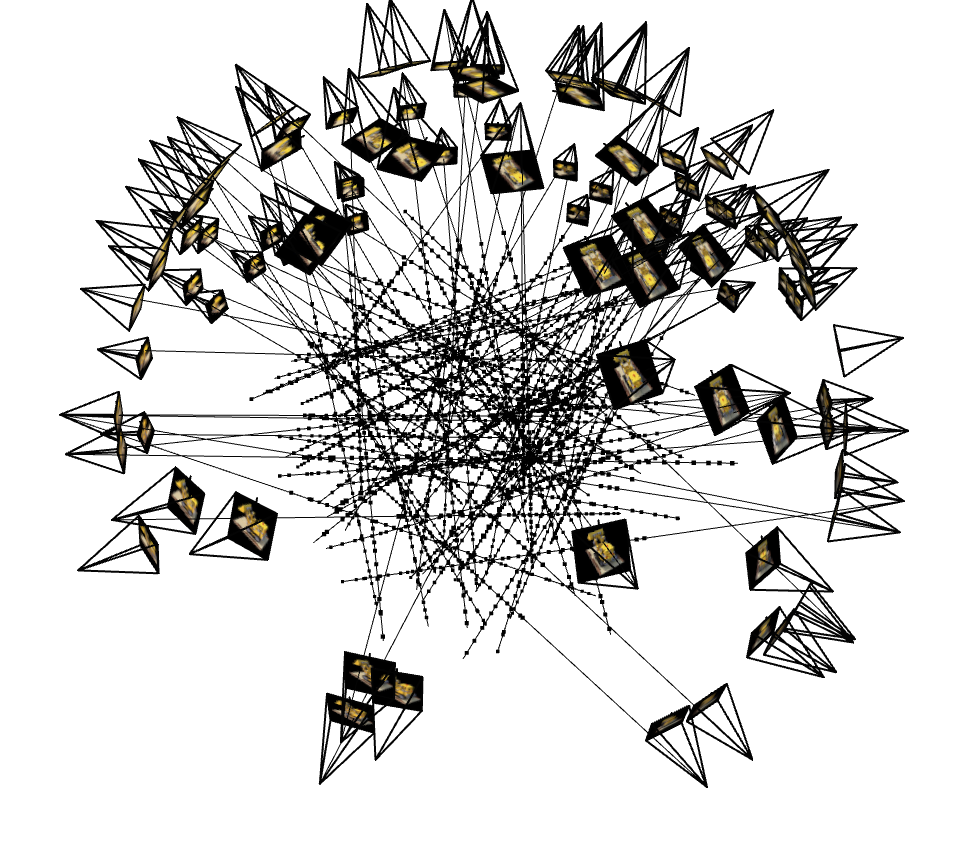
      </a>
      <p style="font-size:0.8em; margin-top:4px; text-align:center;">Sampled 3D points along each ray</p>
    </div>

  </div>
</div>

<p style="text-align:center; font-size:0.9em; margin-top:6px;">
  Visualization of Lego cameras, a subset of rays from one view, and sampled 3D points along each ray.
</p>

---

## Part 2.4: NeRF Network Architecture

**Inputs and positional encodings**

<p>
The NeRF network takes as input 3D positions \(x \in \mathbb{R}^3\) and
view directions \(d \in \mathbb{R}^3\).
Both are mapped to higher-dimensional features using sinusoidal positional encoding.
</p>

<p>
For positions, I use maximum frequency \(L_x = 10\).
For each scalar coordinate \(p \in \{x, y, z\}\) and each frequency level
\(k = 0, \dots, L_x - 1\), I append
\[
\sin(2^k \pi p), \quad \cos(2^k \pi p).
\]
The concatenation of all such terms defines the encoded position \(\gamma_x(x)\).
</p>

<p>
For view directions, I use a smaller maximum frequency \(L_d = 4\)
with the same sinusoidal pattern, giving the encoded direction \(\gamma_d(d)\).
These encodings provide high-frequency basis functions that are crucial for
representing sharp geometry and texture.
</p>

**Network structure**

<p>I follow the standard NeRF design:</p>

<p><strong>Trunk (position-only MLP)</strong></p>
<ul>
  <li>Input: encoded position \(\gamma_x(x)\).</li>
  <li>8 fully-connected layers with width 256 and ReLU activations.</li>
  <li>
    A <strong>skip connection</strong> at layer 4:
    after 4 layers, I concatenate the original \(\gamma_x(x)\) again with
    the intermediate feature, then continue with the remaining 4 layers.
  </li>
</ul>

<p><strong>Density head</strong></p>
<ul>
  <li>
    From the final trunk feature, a single linear layer predicts a scalar density
    \(\sigma(x)\).
  </li>
  <li>
    I apply ReLU on this output to enforce <strong>non-negative densities</strong>.
  </li>
</ul>

<p><strong>Color head</strong></p>
<ul>
  <li>
    Concatenate the trunk feature with the encoded view direction
    \(\gamma_d(d)\).
  </li>
  <li>Pass this through two more linear + ReLU layers.</li>
  <li>
    The final output is a 3D RGB vector passed through Sigmoid to keep colors in \([0, 1]\).
  </li>
</ul>

<p>
In summary:
</p>

<ul>
  <li>Position encoding: \(L_x = 10\)</li>
  <li>Direction encoding: \(L_d = 4\)</li>
  <li>Trunk depth: 8 layers, width 256, ReLU, skip after layer 4</li>
  <li>Density head: Linear + ReLU</li>
  <li>Color head: 2 layers, ReLU + Sigmoid</li>
</ul>

<p>
This architecture is used both for the Lego scene (Part 2.5)
and later for my own object.
</p>

---

## Part 2.5: Volume Rendering and NeRF Training

### Part 2.5.1: Volume Rendering

<p>
I implement the standard NeRF volume rendering in a function
<code>volrend(sigmas, rgbs, step_size)</code>.
Given:
</p>

<ul>
  <li>
    <code>sigmas</code>: densities \(\sigma_i\) for each sampled point along each ray,
    shape \((B, S, 1)\).
  </li>
  <li>
    <code>rgbs</code>: colors \(c_i\) for each sampled point,
    shape \((B, S, 3)\).
  </li>
  <li>
    <code>step_size</code>: distance between adjacent samples \(\Delta t\).
  </li>
</ul>

<p>
For each ray, I compute:
</p>

<ol>
  <li>
    <strong>Alpha values</strong>:
    \[
    \alpha_i = 1 - \exp(-\sigma_i \,\Delta t).
    \]
  </li>
  <li>
    <strong>Transmittance</strong> along the ray:
    \[
    T_i = \prod_{j < i} (1 - \alpha_j).
    \]
    This is implemented using a cumulative product of \((1 - \alpha)\), shifted by one step.
  </li>
  <li>
    <strong>Weights</strong>:
    \[
    w_i = T_i \,\alpha_i.
    \]
  </li>
  <li>
    <strong>Final pixel color</strong>:
    \[
    C = \sum_i w_i\, c_i.
    \]
  </li>
</ol>

<p>
I verified my implementation against a reference tensor from the handout and confirmed that
<code>volrend()</code> matches the provided output up to a small numerical tolerance.
</p>

### Part 2.5.2: Training Loop and Hyperparameters

<p><strong>Training configuration (Lego):</strong></p>

<ul>
  <li>Number of iterations: <code>N_ITERS = 1000</code></li>
  <li>Rays per iteration: <code>N_RAYS = 4096</code></li>
  <li>Samples per ray: <code>N_SAMPLES = 64</code></li>
  <li>Near/Far range: <code>NEAR = 2.0</code>, <code>FAR = 6.0</code></li>
  <li>Optimizer: Adam</li>
  <li>Learning rate: \(5 \times 10^{-4}\)</li>
  <li>Loss: MSE between rendered colors and ground-truth pixel colors</li>
  <li>Metric: PSNR computed from the training loss</li>
</ul>

<p>
At each iteration:
</p>

<ol>
  <li>Call <code>dataset.sample_rays(N_RAYS)</code> to get ray origins/directions and target RGBs.</li>
  <li>Call <code>sample_points_along_rays</code> to generate 3D samples along these rays.</li>
  <li>Flatten the points and directions, run them through the NeRF network to get densities and colors.</li>
  <li>Reshape back to \((B, S, 1)\) and \((B, S, 3)\), then call <code>volrend</code> to render per-ray colors.</li>
  <li>Compute MSE loss against ground-truth colors and backpropagate.</li>
</ol>

<p>
I log training PSNR every <code>LOG_EVERY = 50</code> iterations, and
validation PSNR every <code>EVAL_EVERY = 100</code> iterations
by rendering 6 validation images and averaging their PSNR.
</p>

### Part 2.5.3: Training Progression Visualization

<p>
To visualize how the NeRF improves over time, I periodically render the prediction on
validation view 0. I render <code>val[0]</code> at iterations
\[
0,\ 200,\ 400,\ 600,\ 800,\ 1000.
\]
These snapshots are stored and plotted in a grid.
</p>

<div style="text-align:center;">
  <a href="figures/2.5.3.png" data-lightbox="part2-lego-train" data-title="Part 2.5.3 — Training progression on Lego validation view 0">
    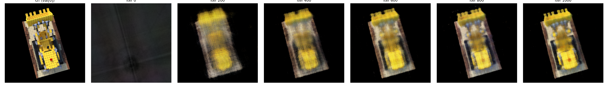
  </a>
  <p style="font-size:0.9em;margin-top:6px;">
    Part 2.5.3 — NeRF optimization on Lego: predicted novel view across iterations (ground truth + it = 0, 200, 400, 600, 800, 1000).
  </p>
</div>

<p>
At iteration 0 the prediction is noisy and blurry, with almost no recognizable structure.
By iterations 200–400, the coarse geometry and colors of the Lego appear.
By iterations 600–1000, fine details sharpen and the view becomes visually close to the ground truth.
This satisfies the “training progression visualization with predicted images across iterations” requirement.
</p>

### Part 2.5.4: PSNR Curve on the Validation Set

<p>
For validation, I use 6 held-out views <code>images_val[0:6]</code>.
Every <code>EVAL_EVERY</code> iterations I:
</p>

<ol>
  <li>Render these 6 views with the current model.</li>
  <li>Compute MSE and PSNR per view.</li>
  <li>Average PSNR across the 6 images and log the result.</li>
</ol>

<p>
I then plot validation PSNR vs iteration.
</p>

<div style="text-align:center;">
  <a href="figures/2.5.4.png" data-lightbox="part2-lego-psnr" data-title="Part 2.5.4 — Lego validation PSNR curve">
    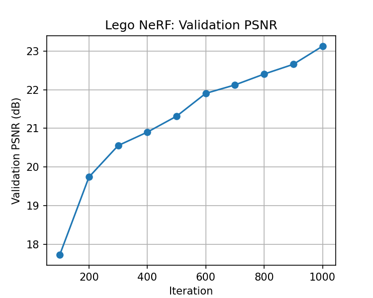
  </a>
  <p style="font-size:0.9em;margin-top:6px;">
    Part 2.5.4 — NeRF on Lego: validation PSNR over training iterations (6 held-out views).
  </p>
</div>

<p>
The curve shows a rapid PSNR increase in early iterations and a slower, steady improvement later.
With 1000 iterations and this configuration, the model reaches validation PSNR above
23&nbsp;dB, consistent with the staff reference.
This satisfies the “PSNR curve on the validation set” requirement.
</p>

### Part 2.5.5: Spherical Rendering Video of the Lego

<p>
Finally, I evaluate the trained NeRF on a set of test camera poses
<code>c2ws_test</code> provided in the starter code.
These poses form a smooth spherical trajectory around the Lego object.
</p>

<p>
To create the video:
</p>

<ol>
  <li>
    For each test camera pose <strong>c2w</strong> in <code>c2ws_test</code>,
    call
    <code>render_image(nerf, c2w, K_t, H, W, n_samples = N_SAMPLES, near = NEAR, far = FAR)</code>.
  </li>
  <li>
    Collect all rendered frames into a list and save them as a GIF or MP4
    (e.g., <code>"lego_spin.gif"</code>).
  </li>
</ol>

<div style="text-align:center;">
  <a href="figures/2.5.5.gif" data-lightbox="part2-lego-video" data-title="Part 2.5.5 — Spherical Lego spin video (RGB frames)">
    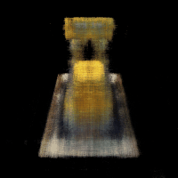
  </a>
  <p style="font-size:0.9em;margin-top:6px;">
    Part 2.5.5 — Rendered novel views of the Lego along a spherical test camera trajectory (video preview frame).
  </p>
</div>

<p>
This video satisfies the “Spherical rendering video of the Lego using provided test cameras” deliverable.
</p>

## Part 2.6: Training with My Own Data

<p>
In this part I train a NeRF on my own calibrated dataset from Part 0: a small toy figure.
The dataset contains 23 training images and 5 validation images captured on a phone, along
with camera intrinsics and extrinsics recovered in Part 0 and saved as
<code>out/dataset.npz</code>.
</p>

### Dataset and preprocessing

<p>
I load <code>out/dataset.npz</code>, which contains
<code>images_train</code>, <code>c2ws_train</code>, <code>images_val</code>, <code>c2ws_val</code>,
<code>c2ws_test</code>, and <code>focal</code>.
The original training images are high resolution, with shape
\((23, 4283, 5711, 3)\).
</p>

<p>
To make NeRF training feasible:
</p>

<ul>
  <li>
    I downsample the images to a smaller resolution while preserving the aspect ratio.
  </li>
  <li>
    I rescale the intrinsic matrix \(K\) by the same factor (scaling both focal length
    and principal point).
  </li>
</ul>

<p>
I then build a <code>RaysData</code> object exactly as in the Lego case:
</p>

<ul>
  <li>
    For each pixel in each training image I precompute \((\text{rays\_o}, \text{rays\_d})\)
    using <code>pixel_to_ray</code> and store the corresponding RGB color.
  </li>
  <li>
    <code>sample_rays(N_RAYS)</code> returns random rays across all training views.
  </li>
</ul>

### Code and hyperparameter changes

<p>
Compared to the Lego experiment (Part 2.5), the main changes are:
</p>

<p><strong>Near/Far range</strong></p>

<ul>
  <li>
    Lego used <code>NEAR = 2.0</code>, <code>FAR = 6.0</code> (synthetic scene with unit scale).
  </li>
  <li>
    For my real object, the geometry is much closer to the camera, so I use
    <code>NEAR = 0.02</code>, <code>FAR = 0.5</code>, tuned by trial and error so that the toy
    sits comfortably inside the sampling frustum.
  </li>
</ul>

<p><strong>Sampling and iterations</strong></p>

<ul>
  <li>
    Final configuration for my object:
    <ul>
      <li><code>N_ITERS = 10000</code></li>
      <li><code>N_RAYS = 10000</code> per iteration</li>
      <li><code>N_SAMPLES = 64</code> samples per ray</li>
    </ul>
  </li>
  <li>
    I first experimented with fewer samples (e.g., 32) to debug the pipeline, then
    increased to 64 for the final run to improve quality.
  </li>
</ul>

<p><strong>Learning rate</strong></p>

<ul>
  <li>
    I use Adam with learning rate \(1 \times 10^{-3}\) for my dataset.
  </li>
  <li>
    This learning rate gives reasonably fast convergence without severe instability:
    PSNR and loss decrease smoothly overall, with some expected oscillations on the
    validation set.
  </li>
</ul>

<p><strong>Network architecture</strong></p>

<ul>
  <li>
    I reuse the same NeRF architecture from Part&nbsp;2.4 and Part&nbsp;2.5:
    <ul>
      <li>Position positional encoding: max frequency \(L_x = 10\)</li>
      <li>Direction positional encoding: max frequency \(L_d = 4\)</li>
      <li>8-layer trunk MLP (width 256, ReLU) with a skip connection at layer 4</li>
      <li>Density head: linear + ReLU</li>
      <li>Color head: 2 layers + Sigmoid</li>
    </ul>
  </li>
</ul>

<p>
In addition, I added more logging hooks (training PSNR, validation PSNR, intermediate
renders) to better inspect training behavior on this more challenging real-world data.
</p>

{% include infocard.html title="Part 2.6 Setup — Differences from Lego" content="1. **Real-world scale**：near/far range is much smaller (0.02–0.5) because the toy is physically close to the camera.<br>2. **More optimization steps**：10k iterations with more rays per batch are needed to fit the higher-resolution, noisier real data.<br>3. **Same NeRF backbone**：the network and positional encodings are identical to the Lego NeRF, isolating the effect of data and hyperparameters.<br><strong>Summary</strong>：Only the sampling ranges and training schedule change; the NeRF architecture itself remains the same." %}

---

### Training dynamics: loss and PSNR curves

<p>
During training on my toy dataset, for each iteration I record:
</p>

<ul>
  <li>The training loss (MSE) on the sampled rays.</li>
  <li>The corresponding training PSNR derived from that loss.</li>
  <li>
    The validation PSNR, computed periodically on the validation set by rendering the
    validation views and comparing to ground truth.
  </li>
</ul>

<p>
These curves help diagnose overfitting and stability:
</p>

<ul>
  <li>Training loss steadily decreases over 10k iterations.</li>
  <li>Training PSNR increases correspondingly.</li>
  <li>
    Validation PSNR rises more slowly and exhibits small oscillations due to the
    limited number of validation views and the difficulty of the real data.
  </li>
</ul>

<div style="text-align:center;">
  <a href="figures/2.6-2.png" data-lightbox="part2.6-curves" data-title="Part 2.6 — Training loss over 10k iterations on the Toy dataset">
    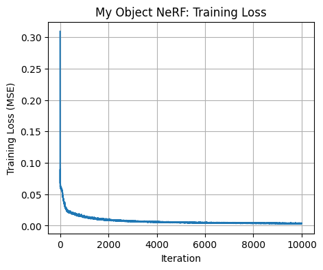
  </a>
  <p style="font-size:0.9em;margin-top:6px;">
    Training loss (MSE) over 10k iterations on my Toy dataset.
  </p>
</div>

<div style="text-align:center; margin-top:18px;">
  <a href="figures/2.6-3.png" data-lightbox="part2.6-curves" data-title="Part 2.6 — Training PSNR vs iteration for the Toy dataset">
    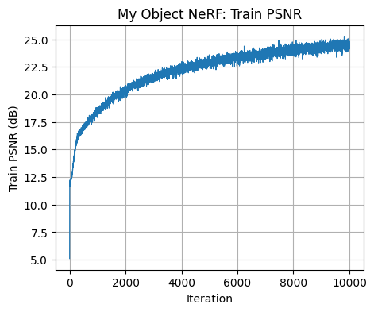
  </a>
  <p style="font-size:0.9em;margin-top:6px;">
    Training PSNR computed from the batch loss during NeRF training.
  </p>
</div>

<div style="text-align:center; margin-top:18px;">
  <a href="figures/2.6-4.png" data-lightbox="part2.6-curves" data-title="Part 2.6 — Validation PSNR vs iteration for the Toy dataset">
    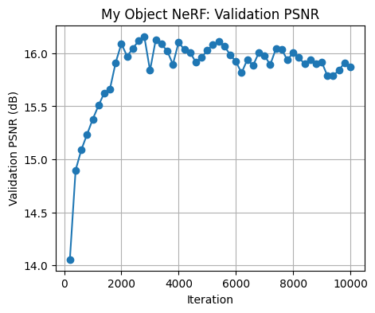
  </a>
  <p style="font-size:0.9em;margin-top:6px;">
    Validation PSNR on held-out views for the Toy dataset.
  </p>
</div>

---

### Intermediate renders of the scene during training

<p>
To visualize how the NeRF progressively learns the geometry and appearance of my object,
I periodically render a fixed validation camera (for example, <code>my_val[0]</code>) at several
iterations, including iteration 0 before training:
</p>

<ul>
  <li>Example snapshot iterations: 0 (untrained), 500, 2000, 5000, 10000.</li>
  <li>Early iterations: the object is very blurry and barely recognizable.</li>
  <li>Mid-stage (around 2k–5k): the overall shape and dominant colors of the toy become clear.</li>
  <li>
    Late stage (near 10k): fine details (texture, edges, shading) are sharpened, and the render
    becomes visually close to the original photos.
  </li>
</ul>

<div style="text-align:center;">
  <a href="figures/2.6-1.png" data-lightbox="part2.6-renders" data-title="Part 2.6 — Intermediate renders on my_val[0] over iterations">
    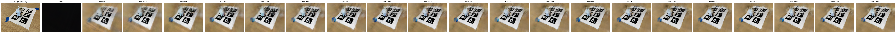
  </a>
  <p style="font-size:0.9em;margin-top:6px;">
    Intermediate renders of the Toy scene during NeRF training. Ground truth on the left, then predictions at increasing iterations.
  </p>
</div>

<p>
These snapshots are the “intermediate renders of the scene during training” required in the
project deliverables.
</p>

---

### GIF of camera circling my object

<p>
Finally, I generate a GIF that shows a camera orbiting around the object, producing novel
views that were not part of the training set.
Unlike the Lego case (which uses the provided <strong>c2ws_test</strong>), here I need to
synthesize my own camera path.
</p>

<p>
I use a helper <code>look_at_origin(pos)</code>:
</p>

<ul>
  <li>Input: a 3D camera position <code>pos</code>.</li>
  <li>
    Output: a camera-to-world matrix that looks from <code>pos</code> towards the origin.
    It constructs an orthonormal basis (right, up, forward) and fills a \(4 \times 4\)
    transform matrix.
  </li>
</ul>

<p>
To create a smooth circular orbit:
</p>

<ol>
  <li>
    Start from one of my training camera positions,
    <code>START_POS = my_c2ws_train[0, :3, 3]</code>.
  </li>
  <li>
    Adjust its horizontal radius so the camera is not too close and is roughly eye-level
    with the toy:
    enlarge the \(x\)–\(y\) radius while keeping the height (the \(z\) coordinate) fixed,
    so the viewing angle to the object is around \(30^\circ\)–\(40^\circ\).
  </li>
  <li>
    Compute a base extrinsic matrix
    <p>\[
      \mathrm{base\_c2w} = \mathrm{look\_at\_origin}(\mathrm{START\_POS}).
    \]</p>
  </li>
  <li>
    For each angle \( \phi \in [0^\circ, 360^\circ) \), apply a rotation around the vertical axis:
    <p>\[
      \mathrm{c2w}_\phi = R_y(\phi)\,\mathrm{base\_c2w},
    \]</p>
    which moves the camera along a horizontal circle while always looking at the origin.
  </li>
  <li>
    For each \(\text{c2w}_\phi\), call
    <code>render_image(nerf, c2w_phi, K_my_t, H_my, W_my, near=NEAR_MY, far=FAR_MY)</code>
    and save the rendered frame.
  </li>
  <li>
    Stack all frames into a GIF (for example, <code>"my_object_spin.gif"</code>) using
    <code>imageio.mimsave</code>.
  </li>
</ol>

<p>
The resulting GIF shows the toy from all sides, standing upright and viewed from a roughly
horizontal orbit, qualitatively demonstrating that the NeRF has learned a consistent 3D
representation.
</p>

<div style="text-align:center;">
  <a href="figures/2.6-5.gif" data-lightbox="part2.6-gif" data-title="Part 2.6 — Camera orbit around Toy (GIF preview)">
    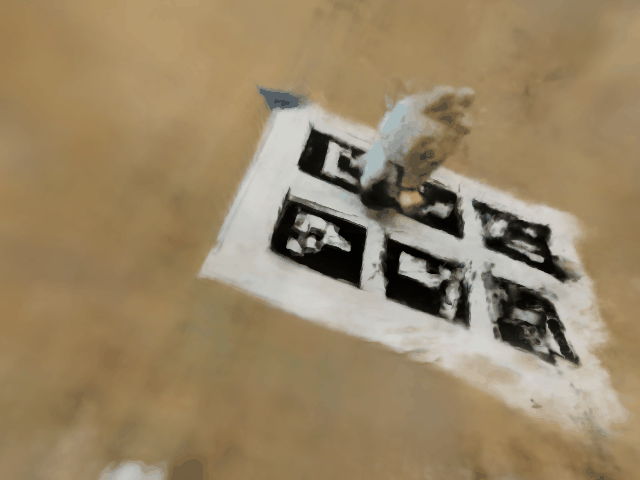
  </a>
  <p style="font-size:0.9em;margin-top:6px;">
    Novel-view synthesis on my Toy dataset: camera circling the object using synthesized test poses.
  </p>
</div>

## Bells & Whistles — Depth Map Video for the Lego Scene

### Implementation overview

<p>
For the bells &amp; whistles requirement I extended my NeRF renderer to also output a
<strong>depth map</strong> for each pixel, and then rendered a depth-map video along the provided
Lego test trajectory.
</p>

<p><strong>1. Depth from volume rendering.</strong></p>

<p>
In Part&nbsp;2.5 I already implemented the standard NeRF color compositing:
</p>

<p>
\[
\alpha_i = 1 - \exp(-\sigma_i \,\Delta t), \quad
T_i = \prod_{j < i} (1 - \alpha_j), \quad
w_i = T_i \alpha_i, \quad
C = \sum_i w_i c_i.
\]
</p>

<p>
For the depth map I reuse the same weights \(w_i\) and compute the
<strong>expected depth along the ray</strong>:
</p>

<p>
\[
D = \sum_i w_i t_i,
\]
</p>

<p>
where \(t_i \in [\mathrm{near}, \mathrm{far}]\) is the sampled distance of the \(i\)-th
point along that ray. This requires a small change to the renderer:
instead of returning only RGB, my function <code>volrend_with_depth</code> returns both
<code>(colors, depths)</code>.
</p>

<p><strong>2. Per-frame RGB + depth rendering.</strong></p>

<p>
I wrote a helper
<code>render_image_with_depth(nerf, c2w, K_t, H, W, ...)</code> that:
</p>

<ul>
  <li>builds all rays for a given camera pose <strong>c2w</strong> (same as in Part&nbsp;2.5),</li>
  <li>samples 3D points along each ray and runs them through the NeRF network,</li>
  <li>
    calls <code>volrend_with_depth</code> to obtain an <strong>RGB image</strong> and a
    <strong>per-pixel depth map</strong> of shape \((H, W)\).
  </li>
</ul>

<p><strong>3. Depth visualization.</strong></p>

<p>
Depth values lie roughly in the physical range
\([ \mathrm{NEAR}, \mathrm{FAR} ] = [2.0, 6.0]\).
For visualization I:
</p>

<ul>
  <li>
    normalize them to \([0, 1]\) using
    <p>\[
    d_{\mathrm{norm}} = \frac{D - \mathrm{NEAR}}{\mathrm{FAR} - \mathrm{NEAR}},
    \]</p>
  </li>
  <li>invert the colormap so that <strong>closer points look brighter</strong> and farther points darker,</li>
  <li>convert the result to an 8-bit grayscale image (or apply a simple colormap) to get a clean depth-map frame.</li>
</ul>

<p><strong>4. Depth-map video construction.</strong></p>

<p>
Finally, I loop over all test camera poses <code>c2ws_test</code> (same trajectory as the RGB
Lego spin):
</p>

<ul>
  <li>for each pose, I render both <strong>RGB</strong> and <strong>depth</strong>,</li>
  <li>
    I concatenate them horizontally so the left half is the RGB render and the right
    half is the depth map,
  </li>
  <li>
    I append the frames to a list and use
    <code>imageio.mimsave(..., fps=15)</code> to export a GIF.
  </li>
</ul>

<p>
The NeRF model and training hyperparameters are identical to Part&nbsp;2.5;
only the <strong>rendering pipeline</strong> is extended to accumulate depth.
</p>

### Results

<div style="text-align:center;">
  <a href="figures/2.7.gif" data-lightbox="lego-depth" data-title="Part 2.7 — RGB + depth map video for Lego NeRF">
    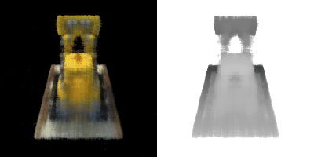
  </a>
  <p style="font-size:0.9em;margin-top:6px;">
    Spherical rendering of the Lego NeRF. Left: RGB rendering from the trained NeRF;
    right: corresponding depth map where closer geometry appears brighter.
  </p>
</div>