# Part A.0: Setup

In this part of the project, I generated my own prompt embeddings and used them to produce the first set of DeepFloyd IF images.

I will reuse `prompt_embeds_dict` in all later parts of this project so that sampling results are consistent and reproducible.

**1. I created several prompts and generated embeddings**

I designed a set of creative text prompts and submitted them to the HuggingFace prompt-encoder cluster. The cluster returned their 4096-dimensional embeddings, which I saved into a Python dictionary for later sampling.

The example prompts I used include:

* `a high quality photo of a futuristic night market in Tokyo, glowing neon signs, rain-soaked streets, cinematic lighting`
* `an oil painting of a quiet sunflower field at sunset, warm golden tones, visible brush strokes, impressionist style`
* `a lithograph of an ancient dragon wrapped around a crumbling castle, intricate linework, black and white`
* `a high quality photo of a corgi astronaut floating inside a spaceship, soft studio lighting, ultra-detailed`
* `a pencil sketch of a Victorian-era clockmaker’s workshop, cluttered tools, fine shading, hand-drawn texture`
* `a high quality photo of a glass underwater city with colorful coral towers and fish swimming through, dreamy atmosphere`

Each of these prompts is stored as a key in `prompt_embeds_dict`, with a corresponding 4096-D embedding tensor as the value.

**2. I selected three prompts and generated DeepFloyd IF images**

From the full set of prompts, I selected three to visualize with the DeepFloyd IF sampling pipeline. For each chosen prompt, I:

1. Loaded its embedding from `prompt_embeds_dict`.
2. Ran stage-1 and stage-2 of the IF model using that embedding.
3. Used two different values of `num_inference_steps` where applicable (20 steps and 100 steps).
4. Displayed the caption and the resulting images.


<p style="text-align:center; font-size: 0.95em; margin: 8px 0 4px;">DeepFloyd IF — Prompt Results Overview</p>

<div style="max-width: 1200px; margin: 10px auto;">
  <div style="display:flex; justify-content:center; gap:20px; flex-wrap:nowrap;">

    <!-- Prompt 0 — 20 steps -->
    <div style="width: calc((100% - 60px)/4);">
      <a href="figures/prompt0_steps20.png" data-lightbox="p0to2" data-title="Prompt 0 — 20 steps">
        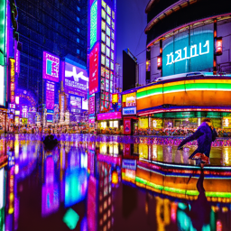
      </a>
      <p style="font-size:0.8em; margin-top:4px; text-align:center;">P0 — 20 steps</p>
    </div>

    <!-- Prompt 0 — 100 steps -->
    <div style="width: calc((100% - 60px)/4);">
      <a href="figures/prompt0_steps100.png" data-lightbox="p0to2" data-title="Prompt 0 — 100 steps">
        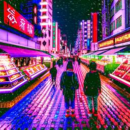
      </a>
      <p style="font-size:0.8em; margin-top:4px; text-align:center;">P0 — 100 steps</p>
    </div>

    <!-- Prompt 1 — 20 steps -->
    <div style="width: calc((100% - 60px)/4);">
      <a href="figures/prompt1_steps20.png" data-lightbox="p0to2" data-title="Prompt 1 — 20 steps">
        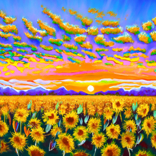
      </a>
      <p style="font-size:0.8em; margin-top:4px; text-align:center;">P1 — 20 steps</p>
    </div>

    <!-- Prompt 2 — 20 steps -->
    <div style="width: calc((100% - 60px)/4);">
      <a href="figures/prompt2_steps20.png" data-lightbox="p0to2" data-title="Prompt 2 — 20 steps">
        
      </a>
      <p style="font-size:0.8em; margin-top:4px; text-align:center;">P2 — 20 steps</p>
    </div>

  </div>
</div>


From these visualizations, I observed that increasing the number of sampling steps (for example, from 20 to 100) generally:

* Improves sharpness.
* Adds more fine details (textures, small objects, and lighting).
* Produces images that align more closely with the text description.

**3. I fixed and reported my random seed**

For reproducibility across all later experiments in this project, I fixed the random seed to a single value and used it consistently whenever I sampled from the model:

* **Seed = 100**

By using the same seed and the same prompt embeddings, I can reliably reproduce the same DeepFloyd IF outputs later when I revisit this notebook.


# Part A.1: Sampling Loops

## Part 1.1 Implementing the Forward Process

In this section, I implemented the **forward diffusion process**, which takes a clean image and progressively adds noise according to the predefined noise schedule of the DeepFloyd diffusion model.

The forward process is defined as:

<p>
\[
x_t = \sqrt{\alpha_{cumprod, t}}\, x_0 + \sqrt{1 - \alpha_{cumprod, t}}\, \epsilon
\]
</p>

where:

- \\( x_0 \\) is the clean image,
- \\( x_t \\) is the noisy image at timestep \\( t \\),
- \\( \epsilon \sim N(0, I) \\),
- \\( \alpha_{cumprod, t} \\) controls how much information from the original image is retained.

When \\( t = 0 \\), the image is perfectly clean. As \\( t \\) increases, the image becomes progressively more corrupted by noise.

To test my implementation, I downloaded the Campanile image, resized it to \\( 64 \times 64 \\), and applied the forward process using the provided `alphas_cumprod` schedule.

---

### Deliverables

### (1) Implementing the `forward(im, t)` function

This function computes the noisy version of the input image according to the diffusion forward equation. It correctly handles the scaling of the clean image and the addition of Gaussian noise.

<div class="highlight code-wrapper" markdown="1">

```python
def forward(im, t):
    """
    Args:
        im : torch tensor of size (1, 3, 64, 64) representing the clean image
        t  : integer timestep

    Returns:
        im_noisy : torch tensor of size (1, 3, 64, 64) representing the noisy image at timestep t
    """
    with torch.no_grad():
        # ===== your code here! =====

        # Get alpha_bar at timestep t and reshape for broadcasting
        alpha_bar = alphas_cumprod[t].to(im.device)
        alpha_bar = alpha_bar.view(1, 1, 1, 1)

        # Sample standard Gaussian noise
        noise = torch.randn_like(im)

        # Forward diffusion: mix clean image and noise
        im_noisy = torch.sqrt(alpha_bar) * im + torch.sqrt(1.0 - alpha_bar) * noise

        # ===== end of code =====
    return im_noisy
```

</div>

### (2) Displaying the Campanile at different noise levels

After running the forward process at different timesteps, I obtained the following results. As expected, the image becomes increasingly noisy as \( t \) increases:

* Original clean image: `figures/campanile.jpg`
* Noisy at \( t = 250 \): `figures/campanile_t250.png`
* Noisy at \( t = 500 \): `figures/campanile_t500.png`
* Noisy at \( t = 750 \): `figures/campanile_t750.png`

Below, all four images are displayed **in one row**:

<div style="max-width: 1200px; margin: 10px auto;">
  <div style="display:flex; justify-content:center; gap:20px; flex-wrap:nowrap;">

<!-- Original Campanile -->
<div style="width: calc((100% - 60px)/4);">
  <a href="figures/campanile.jpg" data-lightbox="campanile_forward" data-title="Campanile — clean image">
    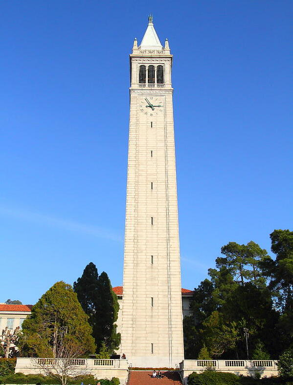
  </a>
  <p style="font-size:0.8em; margin-top:4px; text-align:center;">Clean (t = 0)</p>
</div>

<!-- t = 250 -->
<div style="width: calc((100% - 60px)/4);">
  <a href="figures/campanile_t250.png" data-lightbox="campanile_forward" data-title="Campanile — t = 250">
    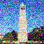
  </a>
  <p style="font-size:0.8em; margin-top:4px; text-align:center;">t = 250</p>
</div>

<!-- t = 500 -->
<div style="width: calc((100% - 60px)/4);">
  <a href="figures/campanile_t500.png" data-lightbox="campanile_forward" data-title="Campanile — t = 500">
    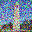
  </a>
  <p style="font-size:0.8em; margin-top:4px; text-align:center;">t = 500</p>
</div>

<!-- t = 750 -->
<div style="width: calc((100% - 60px)/4);">
  <a href="figures/campanile_t750.png" data-lightbox="campanile_forward" data-title="Campanile — t = 750">
    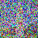
  </a>
  <p style="font-size:0.8em; margin-top:4px; text-align:center;">t = 750</p>
</div>

  </div>
</div>

These images clearly show the progressive corruption:

* At **t = 250**, the Campanile is still recognizable.
* At **t = 500**, much of the structure is lost.
* At **t = 750**, the output resembles nearly pure Gaussian noise.


## Part 1.2 Classical Denoising

In this section, I tried to denoise the noisy Campanile images using a classical Gaussian blur filter. Starting from the noisy images at timesteps \\( t \\in \\{250, 500, 750\\} \\), I applied Gaussian smoothing with different kernel sizes and standard deviations \\( \sigma \\), tuning them by hand to get the best-looking results I could.

As expected, purely classical methods struggle on this task: while the blur can suppress some of the high-frequency noise, it also destroys important structures such as edges and textures, so the images still look very degraded compared to the original clean Campanile.

<div class="highlight code-wrapper" markdown="1">

```python
# ===== your code here! ====

# We will:
# 1) Take noisy images at timesteps [250, 500, 750] using forward()
# 2) Apply Gaussian blur with several parameter choices
# 3) Automatically pick the "best" blur by lowest MSE w.r.t. the clean image
# 4) Show (noisy, gaussian-denoised) side by side for each timestep

from torchvision.transforms.functional import gaussian_blur

ts = [250, 500, 750]

# Candidate Gaussian blur settings to try
# kernel_size must be odd; sigma controls blur strength
blur_candidates = [
    (3, 0.5),
    (5, 0.5),
    (5, 1.0),
    (7, 1.0),
    (9, 1.5),
    (11, 2.0),
]

noisy_list = []
best_denoised_list = []
best_params_list = []

with torch.no_grad():
    for t in ts:
        # Create noisy image
        noisy = forward(test_im, t)  # (1,3,64,64), in [-1,1]
        noisy_list.append(noisy)

        # Search for best Gaussian blur parameters by MSE to clean image
        best_mse = float("inf")
        best_denoised = None
        best_params = None

        for k, s in blur_candidates:
            denoised = gaussian_blur(noisy, kernel_size=[k, k], sigma=[s, s])
            mse = torch.mean((denoised - test_im) ** 2).item()

            if mse < best_mse:
                best_mse = mse
                best_denoised = denoised
                best_params = (k, s)

        best_denoised_list.append(best_denoised)
        best_params_list.append(best_params)

# Prepare side-by-side visualization:
# For each t, show [noisy, best_gaussian]
vis_images = []
vis_titles = []

for i, t in enumerate(ts):
    noisy = noisy_list[i]
    denoised = best_denoised_list[i]
    k, s = best_params_list[i]

    # Convert to HWC and [0,1] for display
    noisy_hwc = (noisy[0].permute(1,2,0).cpu() / 2. + 0.5).clamp(0,1)
    denoised_hwc = (denoised[0].permute(1,2,0).cpu() / 2. + 0.5).clamp(0,1)

    vis_images += [noisy_hwc, denoised_hwc]
    vis_titles += [f"t={t} noisy", f"t={t} gaussian (k={k}, sigma={s})"]

media.show_images(vis_images, titles=vis_titles, columns=2)

# ===== end of code ====

```
</div>

---

### Deliverables

### **Gaussian-denoised versions of the three noisy Campanile images**

I started from the three noisy images produced in Part 1.1 and saved them as:

<div style="max-width: 1200px; margin: 10px auto;">
  <div style="display:flex; justify-content:center; gap:20px; flex-wrap:nowrap;">

    <!-- noisy t250 -->
    <div style="width: calc((100% - 40px)/3);">
      <a href="figures/noisy_t250.png" data-lightbox="classical_denoise" data-title="Noisy t=250">
        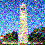
      </a>
      <p style="font-size:0.8em; text-align:center; margin-top:4px;">noisy t = 250</p>
    </div>

    <!-- noisy t500 -->
    <div style="width: calc((100% - 40px)/3);">
      <a href="figures/noisy_t500.png" data-lightbox="classical_denoise" data-title="Noisy t=500">
        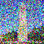
      </a>
      <p style="font-size:0.8em; text-align:center; margin-top:4px;">noisy t = 500</p>
    </div>

    <!-- noisy t750 -->
    <div style="width: calc((100% - 40px)/3);">
      <a href="figures/noisy_t750.png" data-lightbox="classical_denoise" data-title="Noisy t=750">
        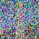
      </a>
      <p style="font-size:0.8em; text-align:center; margin-top:4px;">noisy t = 750</p>
    </div>

  </div>
</div>

Then I applied Gaussian blur and saved my best denoised results as:

<div style="max-width: 1200px; margin: 10px auto; margin-top:20px;">
  <div style="display:flex; justify-content:center; gap:20px; flex-wrap:nowrap;">

    <!-- gaussian t250 -->
    <div style="width: calc((100% - 40px)/3);">
      <a href="figures/gaussian_t250_k7_sigma1.0.png" data-lightbox="classical_denoise" data-title="Gaussian t=250 (k7, sigma1.0)">
        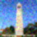
      </a>
      <p style="font-size:0.8em; text-align:center; margin-top:4px;">Gaussian t = 250</p>
    </div>

    <!-- gaussian t500 -->
    <div style="width: calc((100% - 40px)/3);">
      <a href="figures/gaussian_t500_k9_sigma1.5.png" data-lightbox="classical_denoise" data-title="Gaussian t=500 (k9, sigma1.5)">
        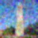
      </a>
      <p style="font-size:0.8em; text-align:center; margin-top:4px;">Gaussian t = 500</p>
    </div>

    <!-- gaussian t750 -->
    <div style="width: calc((100% - 40px)/3);">
      <a href="figures/gaussian_t750_k11_sigma2.0.png" data-lightbox="classical_denoise" data-title="Gaussian t=750 (k11, sigma2.0)">
        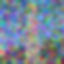
      </a>
      <p style="font-size:0.8em; text-align:center; margin-top:4px;">Gaussian t = 750</p>
    </div>

  </div>
</div>

From top to bottom, each column shows one timestep: the noisy image on the first row and my best Gaussian-denoised version directly below it.


## Part 1.3 One-Step Denoising

In this section, I used the pretrained DeepFloyd diffusion model to perform one-step denoising on the noisy Campanile images at timesteps t = 250, 500, 750.

The denoiser is the network `stage_1.unet`, a UNet trained on a very large dataset of (x_t, t) image–noise pairs. Given a noisy image x_t, a timestep t, and a text-conditioning embedding, the UNet predicts the noise component \( \hat{\epsilon}_\theta \\)(x_t, t, prompt). Using this prediction, I can form an estimate of the original clean image:

<p>
\[
\hat{x}_0 = \frac{x_t - \sqrt{1 - \alpha_{cumprod, t}}\, \hat{\epsilon}_\theta}{\sqrt{\alpha_{cumprod, t}}}
\]
</p>

For this part, I used the provided prompt embedding for “a high quality photo” as the text condition.

Starting from the clean Campanile image, I:

1. Used my `forward(im, t)` function to create noisy images at t = 250, 500, 750.
2. Passed each noisy image (and its timestep) through `stage_1.unet` together with the “a high quality photo” embedding to estimate the noise.
3. Removed the predicted noise using the equation above to obtain a one-step estimate of the original image.
4. Saved the original, noisy, and denoised images for each timestep.

---

### Deliverables

For each of the three timesteps t = 250, 500, 750, I visualize the noisy and one-step denoised images.

<div style="max-width: 1200px; margin: 10px auto;">
  <!-- Row 1: noisy images -->
  <div style="display:flex; justify-content:center; gap:20px; flex-wrap:nowrap;">

    <div style="width: calc((100% - 40px)/3);">
      <a href="figures/t250_noisy.png" data-lightbox="onestep_denoise" data-title="Noisy Campanile at t = 250">
        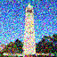
      </a>
      <p style="font-size:0.8em; text-align:center; margin-top:4px;">Noisy Campanile at t = 250</p>
    </div>

    <div style="width: calc((100% - 40px)/3);">
      <a href="figures/t500_noisy.png" data-lightbox="onestep_denoise" data-title="Noisy Campanile at t = 500">
        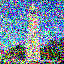
      </a>
      <p style="font-size:0.8em; text-align:center; margin-top:4px;">Noisy Campanile at t = 500</p>
    </div>

    <div style="width: calc((100% - 40px)/3);">
      <a href="figures/t750_noisy.png" data-lightbox="onestep_denoise" data-title="Noisy Campanile at t = 750">
        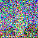
      </a>
      <p style="font-size:0.8em; text-align:center; margin-top:4px;">Noisy Campanile at t = 750</p>
    </div>

  </div>

  <!-- Row 2: one-step denoised images -->
  <div style="display:flex; justify-content:center; gap:20px; flex-wrap:nowrap; margin-top:20px;">

    <div style="width: calc((100% - 40px)/3);">
      <a href="figures/t250_denoised.png" data-lightbox="onestep_denoise" data-title="One-Step Denoised Campanile at t = 250">
        
      </a>
      <p style="font-size:0.8em; text-align:center; margin-top:4px;">One-Step Denoised Campanile at t = 250</p>
    </div>

    <div style="width: calc((100% - 40px)/3);">
      <a href="figures/t500_denoised.png" data-lightbox="onestep_denoise" data-title="One-Step Denoised Campanile at t = 500">
        
      </a>
      <p style="font-size:0.8em; text-align:center; margin-top:4px;">One-Step Denoised Campanile at t = 500</p>
    </div>

    <div style="width: calc((100% - 40px)/3);">
      <a href="figures/t750_denoised.png" data-lightbox="onestep_denoise" data-title="One-Step Denoised Campanile at t = 750">
        
      </a>
      <p style="font-size:0.8em; text-align:center; margin-top:4px;">One-Step Denoised Campanile at t = 750</p>
    </div>

  </div>
</div>


## Part 1.4 Iterative Denoising

In the previous section, I used a single denoising step from the pretrained DeepFloyd UNet to estimate the clean image from a noisy input. While this already worked better than classical Gaussian blurring, the results degraded significantly as the noise level increased. Diffusion models, however, are designed to denoise iteratively, gradually reducing noise across multiple timesteps rather than all at once.

In this part, I implemented a simplified iterative denoising loop. Instead of using all 1000 DDPM timesteps—which would be expensive to run—I constructed a strided timestep schedule, allowing the model to skip many intermediate steps while still producing high-quality results.

I built a list of timesteps starting at 990 and decreasing with a stride of 30, ending at 0. These timesteps were then passed to `stage_1.scheduler.set_timesteps()`. At each step, I used the predicted clean image \\( \hat{x}_0 \\), the noise coefficients, and the supplied `add_variance` function to compute the next, slightly-less-noisy image until reaching timestep 0.

I then applied this iterative process to a Campanile image that I noised to timestep \\( t = 690 \\) (\\( i\_start = 10 \\)).

---

<div class="highlight code-wrapper" markdown="1">

```python
# Make timesteps. Must be list of ints satisfying:
# - monotonically decreasing
# - ends at 0
# - begins close to or at 999

# create `strided_timesteps`, a list of timesteps, from 990 to 0 in steps of 30
# ===== your code here! =====

# create list: 990, 960, 930, ..., 0
strided_timesteps = list(range(990, -1, -30))

# ===== end of code =====


stage_1.scheduler.set_timesteps(timesteps=strided_timesteps)    # Need this b/c variance computation

def add_variance(predicted_variance, t, image):
  '''
  Args:
    predicted_variance : (1, 3, 64, 64) tensor, last three channels of the UNet output
    t: scale tensor indicating timestep
    image : (1, 3, 64, 64) tensor, noisy image

  Returns:
    (1, 3, 64, 64) tensor, image with the correct amount of variance added
  '''
  # Add learned variance
  variance = stage_1.scheduler._get_variance(t, predicted_variance=predicted_variance)
  variance_noise = torch.randn_like(image)
  variance = torch.exp(0.5 * variance) * variance_noise
  return image + variance


def iterative_denoise(im_noisy, i_start, prompt_embeds, timesteps, display=True):
  image = im_noisy

  # --- FIX: move prompt embeds to the same device/dtype as the UNet ---
  prompt_embeds = prompt_embeds.half().to(image.device)

  with torch.no_grad():
    for i in range(i_start, len(timesteps) - 1):
      # Get timesteps
      t = timesteps[i]
      prev_t = timesteps[i+1]

      # get `alpha_cumprod` and `alpha_cumprod_prev` for timestep t from `alphas_cumprod`
      # compute `alpha`
      # compute `beta`
      # ===== your code here! =====

      alpha_cumprod_t = alphas_cumprod[t].to(image.device, dtype=image.dtype)
      alpha_cumprod_prev = alphas_cumprod[prev_t].to(image.device, dtype=image.dtype)

      alpha = alpha_cumprod_t / alpha_cumprod_prev
      beta = 1.0 - alpha

      alpha_cumprod_t = alpha_cumprod_t.view(1,1,1,1)
      alpha_cumprod_prev = alpha_cumprod_prev.view(1,1,1,1)
      alpha = alpha.view(1,1,1,1)
      beta = beta.view(1,1,1,1)

      # ==== end of code ====

      # Get noise estimate
      model_output = stage_1.unet(
          image,
          t,
          encoder_hidden_states=prompt_embeds,
          return_dict=False
      )[0]

      # Split estimate into noise and variance estimate
      noise_est, predicted_variance = torch.split(model_output, image.shape[1], dim=1)

      # compute `pred_prev_image` (x_{t'}), the DDPM estimate for the image at the
      # next timestep, which is slightly less noisy. Use the equation 3.
      # This is the core of DDPM
      # ===== your code here! =====

      # Estimate x0 using the standard DDPM inversion:
      x0_pred = (image - torch.sqrt(1 - alpha_cumprod_t) * noise_est) / torch.sqrt(alpha_cumprod_t)

      # Equation 3 terms
      c1 = (torch.sqrt(alpha_cumprod_prev) * beta) / (1 - alpha_cumprod_t)
      c2 = (torch.sqrt(alpha) * (1 - alpha_cumprod_prev)) / (1 - alpha_cumprod_t)

      pred_prev_image = c1 * x0_pred + c2 * image

      # Add predicted variance
      pred_prev_image = add_variance(predicted_variance, t, pred_prev_image)
      pred_prev_image = pred_prev_image.to(dtype=image.dtype)

      # ==== end of code ====

      image = pred_prev_image

      if display and (i - i_start) % 5 == 0:
        disp = (image[0].permute(1,2,0).detach().cpu() / 2. + 0.5).clamp(0,1)
        media.show_image(
            disp,
            title=f"iter step {i - i_start:02d}: t={t} -> t'={prev_t}"
        )

    clean = image.cpu().detach().numpy()

  return clean

# Please use this prompt embedding
prompt_embeds = prompt_embeds_dict["a high quality photo"]

# Add noise
i_start = 10
t = strided_timesteps[i_start]
im_noisy = forward(test_im, t).half().to(device)

# Denoise
clean = iterative_denoise(im_noisy,
                          i_start=i_start,
                          prompt_embeds=prompt_embeds,
                          timesteps=strided_timesteps)


# Compute the one step estimate of the clean image. Feel free to copy and paste
# code from part 1.3. Store the image into `clean_one_step`
# ===== your code here! =====

with torch.no_grad():
    alpha_bar = alphas_cumprod[t].view(1,1,1,1)
    noise_est = stage_1.unet(
        im_noisy,
        t,
        encoder_hidden_states=prompt_embeds.half().cuda(),
        return_dict=False
    )[0][:, :3].cpu()

    clean_one_step = (im_noisy.cpu() - torch.sqrt(1 - alpha_bar) * noise_est) / torch.sqrt(alpha_bar)
    clean_one_step = clean_one_step.clamp(-1, 1)

# ===== end of code =====


# Compute the gaussian blurred noisy image, using kernel_size=5 and sigma=2.
# Feel free to copy code from part 1.2. Store the image as `blur_filtered`
# Show results
# ===== your code here! =====

from torchvision.transforms.functional import gaussian_blur

blur_filtered = gaussian_blur(im_noisy.cpu(), kernel_size=[5,5], sigma=[2,2])
blur_filtered = blur_filtered.clamp(-1,1)

# ===== end of code =====
```

</div>

---

### Deliverables

### 1. Noisy image at t = 690

I first added noise to the clean Campanile using my `forward()` function to reach timestep `strided_timesteps[10]`:

<div style="text-align:center; max-width: 400px; margin: 10px auto;">
  <a href="figures/noisy_t690.png" data-lightbox="iterative_denoise" data-title="Noisy Campanile at t = 690">
    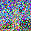
  </a>
  <p style="font-size:0.85em; margin-top:6px;">Noisy Campanile at t = 690</p>
</div>

### 2. Iterative denoising loop (show every 5 steps)

During iterative denoising, I saved every 5th frame to illustrate the gradual removal of noise.

Please display these in one row, showing the image becoming progressively cleaner.

<div style="max-width: 1200px; margin: 10px auto;">
  <div style="display:flex; justify-content:center; gap:16px; flex-wrap:nowrap;">

<div style="width: calc((100% - 64px)/5);">
  <a href="figures/frame_step00_t690.png" data-lightbox="iterative_frames" data-title="iter step 00: t = 690">
    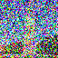
  </a>
  <p style="font-size:0.75em; text-align:center; margin-top:4px;">step 00, t = 690</p>
</div>

<div style="width: calc((100% - 64px)/5);">
  <a href="figures/frame_step05_t540.png" data-lightbox="iterative_frames" data-title="iter step 05: t = 540">
    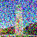
  </a>
  <p style="font-size:0.75em; text-align:center; margin-top:4px;">step 05, t = 540</p>
</div>

<div style="width: calc((100% - 64px)/5);">
  <a href="figures/frame_step10_t390.png" data-lightbox="iterative_frames" data-title="iter step 10: t = 390">
    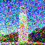
  </a>
  <p style="font-size:0.75em; text-align:center; margin-top:4px;">step 10, t = 390</p>
</div>

<div style="width: calc((100% - 64px)/5);">
  <a href="figures/frame_step15_t240.png" data-lightbox="iterative_frames" data-title="iter step 15: t = 240">
    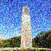
  </a>
  <p style="font-size:0.75em; text-align:center; margin-top:4px;">step 15, t = 240</p>
</div>

<div style="width: calc((100% - 64px)/5);">
  <a href="figures/frame_step20_t90.png" data-lightbox="iterative_frames" data-title="iter step 20: t = 90">
    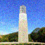
  </a>
  <p style="font-size:0.75em; text-align:center; margin-top:4px;">step 20, t = 90</p>
</div>

  </div>
</div>

### 3. Final iterative denoised result

At the end of the loop, I obtained the final predicted clean image:

<div style="text-align:center; max-width: 400px; margin: 10px auto;">
  <a href="figures/iterative_final.png" data-lightbox="iterative_denoise" data-title="Final iterative denoised result">
    
  </a>
  <p style="font-size:0.85em; margin-top:6px;">Final iterative denoised result</p>
</div>

### 4. Comparison with one-step denoising and Gaussian blur

To highlight the advantages of iterative denoising, I compared:

<div style="max-width: 1100px; margin: 10px auto;">
  <div style="display:flex; justify-content:center; gap:20px; flex-wrap:nowrap;">

<div style="width: calc((100% - 40px)/3);">
  <a href="figures/gaussian_blur.png" data-lightbox="denoise_compare" data-title="Gaussian blur denoising">
    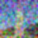
  </a>
  <p style="font-size:0.8em; text-align:center; margin-top:4px;">Gaussian blur</p>
</div>

<div style="width: calc((100% - 40px)/3);">
  <a href="figures/one_step.png" data-lightbox="denoise_compare" data-title="One-step denoising">
    
  </a>
  <p style="font-size:0.8em; text-align:center; margin-top:4px;">One-step denoising</p>
</div>

<div style="width: calc((100% - 40px)/3);">
  <a href="figures/iterative_final.png" data-lightbox="denoise_compare" data-title="Iterative denoising (final)">
    
  </a>
  <p style="font-size:0.8em; text-align:center; margin-top:4px;">Iterative denoising</p>
</div>

  </div>
</div>

## Part 1.5 Diffusion Model Sampling

In the previous parts, I used the diffusion model to denoise images with known noise levels. In this section, I used the same iterative denoising procedure to generate images completely from scratch.

Instead of starting from a partially noised image, I initialized the process with pure Gaussian noise, set \( i\_start = 0 \\), and ran `iterative_denoise()` all the way down to timestep 0. Because the denoiser is conditioned on the prompt embedding “a high quality photo,” the iterative process gradually transforms random noise into a coherent natural-looking image.

This is the fundamental sampling procedure of diffusion models: start with noise → repeatedly denoise → produce a realistic sample.

### Deliverables

### Five sampled images (prompt: “a high quality photo”)

Below are the five images I generated from pure noise using the iterative sampling process. 

<div style="max-width: 1200px; margin: 10px auto;">
  <div style="display:flex; justify-content:center; gap:16px; flex-wrap:nowrap;">

<div style="width: calc((100% - 64px)/5);">
  <a href="figures/sample_0.png" data-lightbox="sampling_1_5" data-title="Sample 0 — a high quality photo">
    
  </a>
  <p style="font-size:0.75em; text-align:center; margin-top:4px;">sample_0</p>
</div>

<div style="width: calc((100% - 64px)/5);">
  <a href="figures/sample_1.png" data-lightbox="sampling_1_5" data-title="Sample 1 — a high quality photo">
    
  </a>
  <p style="font-size:0.75em; text-align:center; margin-top:4px;">sample_1</p>
</div>

<div style="width: calc((100% - 64px)/5);">
  <a href="figures/sample_2.png" data-lightbox="sampling_1_5" data-title="Sample 2 — a high quality photo">
    
  </a>
  <p style="font-size:0.75em; text-align:center; margin-top:4px;">sample_2</p>
</div>

<div style="width: calc((100% - 64px)/5);">
  <a href="figures/sample_3.png" data-lightbox="sampling_1_5" data-title="Sample 3 — a high quality photo">
    
  </a>
  <p style="font-size:0.75em; text-align:center; margin-top:4px;">sample_3</p>
</div>

<div style="width: calc((100% - 64px)/5);">
  <a href="figures/sample_4.png" data-lightbox="sampling_1_5" data-title="Sample 4 — a high quality photo">
    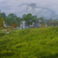
  </a>
  <p style="font-size:0.75em; text-align:center; margin-top:4px;">sample_4</p>
</div>

  </div>
</div>


## Part 1.6 Classifier-Free Guidance (CFG)

In Part 1.5, the images sampled from pure noise often looked weak or partially non-sensical. In this section, I improved the sample quality using **Classifier-Free Guidance (CFG)**.

In CFG, the denoiser predicts **two** noise estimates at every step:

- A **conditional** estimate \\( \epsilon_{cond} \\) using the text prompt embedding (for example, “a high quality photo”)
- An **unconditional** estimate \\( \epsilon_{uncond} \\) using the **empty** prompt embedding `""`

These are combined as:

<p>
\[
\epsilon_{cfg} = \epsilon_{uncond} + s \cdot (\epsilon_{cond} - \epsilon_{uncond})
\]
</p>

where \\( s \\) is the **CFG scale**.

- \\( s = 0 \\): purely unconditional generation  
- \\( s = 1 \\): normal conditional denoising  
- \\( s > 1 \\): stronger guidance toward the prompt (higher quality, lower diversity)

I implemented an `iterative_denoise_cfg` function that mirrors `iterative_denoise`, but at each denoising step it computes both conditional and unconditional noise, blends them using the CFG formula above, and then uses \\( \epsilon_{cfg} \\) in the update rule.

For unconditional guidance, I explicitly used the **empty prompt `""`** as required.

<div class="highlight code-wrapper" markdown="1">

```python
# The conditional prompt embedding
prompt_embeds = prompt_embeds_dict['a high quality photo']

# The unconditional prompt embedding
uncond_prompt_embeds = prompt_embeds_dict['']


def iterative_denoise_cfg(im_noisy, i_start, prompt_embeds, uncond_prompt_embeds, timesteps, scale=7, display=True):
  image = im_noisy

  prompt_embeds = prompt_embeds.to(image.device, dtype=image.dtype)
  uncond_prompt_embeds = uncond_prompt_embeds.to(image.device, dtype=image.dtype)

  with torch.no_grad():
    for i in range(i_start, len(timesteps) - 1):
      # Get timesteps
      t = timesteps[i]
      prev_t = timesteps[i+1]

      # Get `alpha_cumprod`, `alpha_cumprod_prev`, `alpha`, `beta`
      # ===== your code here! =====

      # Make sure alpha values are on the same device/dtype as the image
      alpha_cumprod_t = alphas_cumprod[t].to(image.device, dtype=image.dtype)
      alpha_cumprod_prev = alphas_cumprod[prev_t].to(image.device, dtype=image.dtype)

      alpha = alpha_cumprod_t / alpha_cumprod_prev
      beta = 1.0 - alpha

      # Reshape for broadcasting
      alpha_cumprod_t = alpha_cumprod_t.view(1, 1, 1, 1)
      alpha_cumprod_prev = alpha_cumprod_prev.view(1, 1, 1, 1)
      alpha = alpha.view(1, 1, 1, 1)
      beta = beta.view(1, 1, 1, 1)

      # ==== end of code ====

      # Get cond noise estimate
      model_output = stage_1.unet(
          image,
          t,
          encoder_hidden_states=prompt_embeds,
          return_dict=False
      )[0]

      # Get uncond noise estimate
      uncond_model_output = stage_1.unet(
          image,
          t,
          encoder_hidden_states=uncond_prompt_embeds,
          return_dict=False
      )[0]

      # Split estimate into noise and variance estimate
      noise_est, predicted_variance = torch.split(model_output, image.shape[1], dim=1)
      uncond_noise_est, _ = torch.split(uncond_model_output, image.shape[1], dim=1)

      # Compute the CFG noise estimate based on equation 4
      #   eps_cfg = eps_u + scale * (eps_c - eps_u)
      # ===== your code here! =====

      noise_est_cfg = uncond_noise_est + scale * (noise_est - uncond_noise_est)

      # ==== end of code ====


      # Get `pred_prev_image`, the next less noisy image.
      # Use the same DDPM update as in 1.4, but with noise_est_cfg
      # ===== your code here! =====

      # Predict x0 from x_t and the CFG noise estimate
      x0_pred = (image - torch.sqrt(1 - alpha_cumprod_t) * noise_est_cfg) / torch.sqrt(alpha_cumprod_t)

      # DDPM coefficients (equation 3)
      c1 = (torch.sqrt(alpha_cumprod_prev) * beta) / (1 - alpha_cumprod_t)
      c2 = (torch.sqrt(alpha) * (1 - alpha_cumprod_prev)) / (1 - alpha_cumprod_t)

      # Compute x_{t'}
      pred_prev_image = c1 * x0_pred + c2 * image

      # Add variance using the conditional predicted_variance
      pred_prev_image = add_variance(predicted_variance, t, pred_prev_image)

      # ==== end of code ====

      image = pred_prev_image

      # (Optional) visualize every 5th step
      if display and (i - i_start) % 5 == 0:
        disp = (image[0].permute(1, 2, 0).detach().cpu() / 2. + 0.5).clamp(0, 1)
        media.show_image(disp, title=f"CFG iter {i - i_start:02d}: t={t} -> t'={prev_t}")

    clean = image.cpu().detach().numpy()

  return clean
```

</div>

---

### Deliverables

### **Five CFG-guided samples for “a high quality photo”**

Starting from pure Gaussian noise, I ran `iterative_denoise_cfg` with the text prompt **“a high quality photo”** and a fixed CFG scale. I generated five different images (using different noise seeds or batch sampling).

These are displayed in one row, directly comparable to the non-CFG samples.

<div style="max-width: 1200px; margin: 10px auto;">
  <div style="display:flex; justify-content:center; gap:16px; flex-wrap:nowrap;">

<div style="width: calc((100% - 64px)/5);">
  <a href="figures/cfg_sample_0.png" data-lightbox="cfg_sampling_1_6" data-title="CFG sample 0 — a high quality photo">
    
  </a>
  <p style="font-size:0.75em; text-align:center; margin-top:4px;">cfg_sample_0</p>
</div>

<div style="width: calc((100% - 64px)/5);">
  <a href="figures/cfg_sample_1.png" data-lightbox="cfg_sampling_1_6" data-title="CFG sample 1 — a high quality photo">
    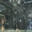
  </a>
  <p style="font-size:0.75em; text-align:center; margin-top:4px;">cfg_sample_1</p>
</div>

<div style="width: calc((100% - 64px)/5);">
  <a href="figures/cfg_sample_2.png" data-lightbox="cfg_sampling_1_6" data-title="CFG sample 2 — a high quality photo">
    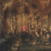
  </a>
  <p style="font-size:0.75em; text-align:center; margin-top:4px;">cfg_sample_2</p>
</div>

<div style="width: calc((100% - 64px)/5);">
  <a href="figures/cfg_sample_3.png" data-lightbox="cfg_sampling_1_6" data-title="CFG sample 3 — a high quality photo">
    
  </a>
  <p style="font-size:0.75em; text-align:center; margin-top:4px;">cfg_sample_3</p>
</div>

<div style="width: calc((100% - 64px)/5);">
  <a href="figures/cfg_sample_4.png" data-lightbox="cfg_sampling_1_6" data-title="CFG sample 4 — a high quality photo">
    
  </a>
  <p style="font-size:0.75em; text-align:center; margin-top:4px;">cfg_sample_4</p>
</div>

  </div>
</div>


## Part 1.7 Image-to-image Translation

From this section onward, I use **classifier-free guidance (CFG)** for all sampling.

Here, I treat diffusion as an image-to-image translation tool: I start from a real image, add noise to it using the forward process, and then run **`iterative_denoise_cfg`** to “pull” the noisy image back onto the natural image manifold. The more noise I add (that is, the larger the starting timestep), the stronger the edit.

Technically, this follows the SDEdit idea:

1. Take a real image.
2. Run the forward diffusion process up to a chosen timestep.
3. Run CFG-guided reverse diffusion starting from that noisy image.

For conditioning, I used the same text prompt as before:

> **Prompt:** “a high quality photo”

---

### Edits of the Campanile image

I first applied this procedure to the original Campanile image.

For each starting index ( i \in {1, 3, 5, 7, 10, 20} \), I:

* Noised the Campanile to the corresponding timestep.
* Ran `iterative_denoise_cfg` from that timestep back to 0.
* Collected the resulting edited image.

You can see that small noise (low start index) yields subtle edits, while larger noise levels produce more dramatic changes in texture and background, but still keep the overall Campanile structure.

<div style="max-width: 1100px; margin: 10px auto; text-align:center;">
  <a href="figures/part1_7_campanile_summary.png" data-lightbox="p1_7" data-title="Campanile edits — start indices 1, 3, 5, 7, 10, 20">
    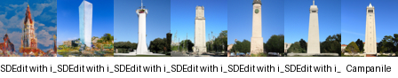
  </a>
  <p style="font-size:0.85em; margin-top:6px;">
    Campanile image-to-image edits (left to right: start = 1, 3, 5, 7, 10, 20).
  </p>
</div>

---

### Edits of my own test images

I repeated the exact same procedure for **two of my own test images**, again using the prompt “a high quality photo” and the same set of starting indices \( [1, 3, 5, 7, 10, 20] \).

The results are summarized in the following strips:

* First custom image: `figures/part1_7_1_myImage_summary.png`
* Second custom image: `figures/part1_7_1_myImage_2_summary.png`

Each strip shows the progression of edits as the starting noise level increases.

<div style="max-width: 1100px; margin: 10px auto; text-align:center;">
  <a href="figures/part1_7_1.7_1_summary.png" data-lightbox="p1_7_custom" data-title="Custom image 1 — CFG edits">
    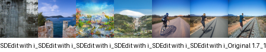
  </a>
  <p style="font-size:0.85em; margin-top:6px;">
    Custom image 1 — image-to-image edits across increasing starting noise levels.
  </p>
</div>

<div style="max-width: 1100px; margin: 10px auto; text-align:center;">
  <a href="figures/part1_7_1_myImage_2_summary.png" data-lightbox="p1_7_custom" data-title="Custom image 2 — CFG edits">
    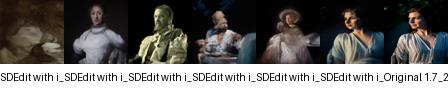
  </a>
  <p style="font-size:0.85em; margin-top:6px;">
    Custom image 2 — image-to-image edits across increasing starting noise levels.
  </p>
</div>


## Part 1.7.1 Editing Hand-Drawn and Web Images

In this subsection, I applied the same CFG-based image-to-image translation procedure to non-realistic inputs. The goal is to start from sketches or other stylized images and “pull” them onto the natural image manifold using diffusion.

For all experiments, I:

- Used the forward diffusion process to add noise to the input image.
- Chose starting indices corresponding to timesteps \([1, 3, 5, 7, 10, 20]\).
- Ran `iterative_denoise_cfg` with the text prompt **“a high quality photo”** to bring the noisy image back to a realistic photo-like version.

This follows the same SDEdit-style pipeline as in Part 1.7, but now the inputs are web images and hand-drawn sketches.

---

### Web image edit

I first downloaded a non-photorealistic image from the web and applied the procedure above for timesteps ([1, 3, 5, 7, 10, 20]).
The resulting edits are summarized in:

* `figures/part1_7_1_web_summary.png`

<div style="max-width: 1100px; margin: 10px auto; text-align:center;">
  <a href="figures/part1_7_1_web_summary.png" data-lightbox="p1_7_1" data-title="Web image CFG edits — start = 1, 3, 5, 7, 10, 20">
    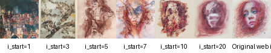
  </a>
  <p style="font-size:0.85em; margin-top:6px;">Web image CFG edits (left → right: start = 1, 3, 5, 7, 10, 20)</p>
</div>

---

### Hand-drawn image edits

Next, I created two hand-drawn images and processed each of them with the same noise levels ([1, 3, 5, 7, 10, 20]) using `iterative_denoise_cfg`.

The results are summarized in the following strips:

* Hand-drawn image 1: `figures/part1_7_1_myImage_summary.png`
* Hand-drawn image 2: `figures/part1_7_1_myImage_2_summary.png`

Each strip shows how the model gradually turns a rough drawing into a more realistic photo-like image as the starting noise level increases.

<div style="max-width: 1100px; margin: 10px auto; text-align:center;">
  <a href="figures/part1_7_1_myImage_summary.png" data-lightbox="p1_7_1_custom" data-title="Hand-drawn image 1 — CFG edits">
    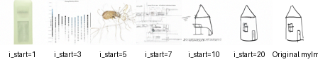
  </a>
  <p style="font-size:0.85em; margin-top:6px;">Hand-drawn image 1 — CFG edits for starting indices 1–20.</p>
</div>

<div style="max-width: 1100px; margin: 10px auto; text-align:center;">
  <a href="figures/part1_7_1_myImage_2_summary.png" data-lightbox="p1_7_1_custom" data-title="Hand-drawn image 2 — CFG edits">
    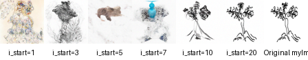
  </a>
  <p style="font-size:0.85em; margin-top:6px;">Hand-drawn image 2 — CFG edits for starting indices 1–20.</p>
</div>


## Part 1.7.2 Inpainting

In this subsection, I extended the CFG-based diffusion pipeline to perform **inpainting**, following the RePaint idea.  
Given an input image \\( x_0 \\) and a binary mask \\( M \\), the goal is to keep the original content where \\( M = 0 \\) and synthesize new content where \\( M = 1 \\).

During each step of the iterative denoising loop, after computing a CFG-guided candidate image at timestep \\( t \\), I:

1. Compute the predicted image at timestep \\( t \\) using CFG denoising.  
2. Re-inject the **noised version of the original image** outside the mask so that only the masked region can change.

This enforces:

- **Outside mask (M = 0):** pixels stay faithful to the original with appropriate noise.  
- **Inside mask (M = 1):** diffusion is free to hallucinate new content.

<div class="highlight code-wrapper" markdown="1">

```python
def inpaint(original_image, mask, prompt_embeds, uncond_prompt_embeds,
            timesteps, scale=7, display=True):
  """
  DDPM + CFG inpainting.

  Args:
    original_image: clean image x_0, shape (1, 3, 64, 64), range [-1, 1] (CPU)
    mask: binary mask, same shape as original_image.
          mask = 1 -> region to edit (free to change)
          mask = 0 -> region to keep (must match original_image)
    prompt_embeds: conditional prompt embedding
    uncond_prompt_embeds: unconditional ("" ) prompt embedding
    timesteps: list of decreasing timesteps, e.g. strided_timesteps
    scale: CFG scale gamma
    display: if True, optionally show intermediate steps

  Returns:
    clean: numpy array (1, 3, 64, 64), final inpainted image.
  """

  # Start from pure noise
  image = torch.randn_like(original_image).to(device).half()

  mask_local = mask.to(device=image.device, dtype=image.dtype)
  prompt_embeds_local = prompt_embeds.to(image.device, dtype=image.dtype)
  uncond_prompt_embeds_local = uncond_prompt_embeds.to(image.device, dtype=image.dtype)

  with torch.no_grad():
    for i in range(len(timesteps) - 1):
      t = timesteps[i]
      prev_t = timesteps[i + 1]

      alpha_cumprod_t = alphas_cumprod[t].to(image.device, dtype=image.dtype)
      alpha_cumprod_prev = alphas_cumprod[prev_t].to(image.device, dtype=image.dtype)

      alpha = alpha_cumprod_t / alpha_cumprod_prev
      beta = 1.0 - alpha

      alpha_cumprod_t = alpha_cumprod_t.view(1, 1, 1, 1)
      alpha_cumprod_prev = alpha_cumprod_prev.view(1, 1, 1, 1)
      alpha = alpha.view(1, 1, 1, 1)
      beta = beta.view(1, 1, 1, 1)

      # Conditional noise estimate
      model_output = stage_1.unet(
          image, t, encoder_hidden_states=prompt_embeds_local, return_dict=False
      )[0]

      # Unconditional
      uncond_model_output = stage_1.unet(
          image, t, encoder_hidden_states=uncond_prompt_embeds_local, return_dict=False
      )[0]

      noise_est, predicted_variance = torch.split(model_output, image.shape[1], 1)
      uncond_noise_est, _ = torch.split(uncond_model_output, image.shape[1], 1)

      # CFG
      noise_est_cfg = uncond_noise_est + scale * (noise_est - uncond_noise_est)

      # Predict x0
      x0_pred = (image - torch.sqrt(1.0 - alpha_cumprod_t) * noise_est_cfg) / torch.sqrt(alpha_cumprod_t)

      # DDPM update
      c1 = (torch.sqrt(alpha_cumprod_prev) * beta) / (1.0 - alpha_cumprod_t)
      c2 = (torch.sqrt(alpha) * (1.0 - alpha_cumprod_prev)) / (1.0 - alpha_cumprod_t)
      pred_prev_image = c1 * x0_pred + c2 * image

      # Add learned variance
      pred_prev_image = add_variance(predicted_variance, t, pred_prev_image)

      # --- Inpainting step ---
      orig_noisy = forward(original_image, prev_t).to(image.device, dtype=image.dtype)

      # Preserve outside mask, update inside mask
      image = mask_local * pred_prev_image + (1.0 - mask_local) * orig_noisy

      if display and (i % 10 == 0):
        disp = (image[0].detach().cpu().permute(1, 2, 0) / 2 + 0.5).clamp(0, 1)
        media.show_image(disp, title=f"Inpaint step i={i}, t={t}")

    clean = image.cpu().detach().numpy()
  return clean
```

</div>

---

### Campanile inpainting

For the Campanile example, I created a mask that covers the top of the tower and applied the inpainting procedure.

<div class="highlight code-wrapper" markdown="1">

```python
# Conditional and unconditional embeddings
prompt_embeds = prompt_embeds_dict["a high quality photo"]
uncond_prompt_embeds = prompt_embeds_dict[""]

# Run inpainting
campanile_inpaint = inpaint(
    original_image=test_im,
    mask=mask,
    prompt_embeds=prompt_embeds,
    uncond_prompt_embeds=uncond_prompt_embeds,
    timesteps=strided_timesteps,
    scale=7,
    display=False
)

# 4-panel grid: original, mask, hole, inpainted
media.show_images({
    "Campanile": test_im[0].permute(1,2,0) / 2 + 0.5,
    "Mask": mask.cpu()[0].permute(1,2,0),
    "Hole to Fill": (test_im * mask.cpu())[0].permute(1,2,0) / 2 + 0.5,
    "Campanile Inpainted": campanile_inpaint[0].transpose(1,2,0) / 2 + 0.5,
})
```

</div>

<div style="max-width: 1100px; margin: 10px auto; text-align:center;">
  <a href="figures/part1_7_2_campanile_summary.png" data-lightbox="p1_7_2" data-title="Campanile inpainting summary">
    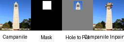
  </a>
  <p style="font-size:0.85em; margin-top:6px;">Campanile inpainting — original → mask → inpainted</p>
</div>

---


### Inpainting on my own images

I repeated the same method on two additional images of my choice, designing a different binary mask for each and letting the model fill in the masked regions.

Each strip shows original image → mask → inpainted output in a single row.

<div style="max-width: 1100px; margin: 10px auto; text-align:center;">
  <a href="figures/part1_7_2_image1_summary.png" data-lightbox="p1_7_2_custom" data-title="Inpainting — image 1 summary">
    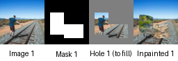
  </a>
  <p style="font-size:0.85em; margin-top:6px;">Inpainting result — image 1</p>
</div>

<div style="max-width: 1100px; margin: 10px auto; text-align:center;">
  <a href="figures/part1_7_2_image2_summary.png" data-lightbox="p1_7_2_custom" data-title="Inpainting — image 2 summary">
    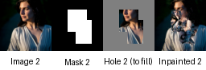
  </a>
  <p style="font-size:0.85em; margin-top:6px;">Inpainting result — image 2</p>
</div>


## Part 1.7.3 Text-Conditional Image-to-Image Translation

In this section, I extended the SDEdit-style image-to-image translation pipeline by adding **text conditioning**.  
Instead of using the neutral prompt “a high quality photo,” I guide the denoising process with a custom prompt, allowing the model to stylize or semantically transform the output toward a chosen concept.

The procedure is identical to Part 1.7:

1. Start from a real image.  
2. Add noise using the forward process to a chosen timestep \\([1, 3, 5, 7, 10, 20]\\).  
3. Run `iterative_denoise_cfg` using my chosen text prompt embedding.

With strong CFG, the model not only reconstructs the clean structure but also injects stylistic and semantic changes aligned with the prompt.  
Low noise levels preserve identity; higher noise levels produce more dramatic transformations.

<div class="highlight code-wrapper" markdown="1">

```python
# Example: Text-guided SDEdit using CFG

# Replace with your chosen text prompt, e.g. "night market style Campanile"
custom_prompt = "YOUR_PROMPT_HERE"

prompt_embeds = prompt_embeds_dict[custom_prompt]
uncond_prompt_embeds = prompt_embeds_dict[""]

start_indices = [1, 3, 5, 7, 10, 20]

edited_results = []

with torch.no_grad():
    for i_start in start_indices:
        t = strided_timesteps[i_start]

        # Add noise to the clean image
        im_noisy = forward(test_im, t).half().to(device)

        # CFG-guided reverse diffusion with the custom prompt
        clean_cfg = iterative_denoise_cfg(
            im_noisy,
            i_start=i_start,
            prompt_embeds=prompt_embeds,
            uncond_prompt_embeds=uncond_prompt_embeds,
            timesteps=strided_timesteps,
            scale=7,
            display=False,
        )

        edited_results.append(clean_cfg)
```

</div>

---

### Campanile edits with text conditioning

I applied this method to the Campanile image using my chosen text prompt and generated edits at noise levels
([1, 3, 5, 7, 10, 20]).

<div style="max-width: 1100px; margin: 10px auto; text-align:center;">
  <a href="figures/part1_7_3_campanile_summary.png" data-lightbox="p1_7_3" data-title="Campanile — text-conditioned edits">
    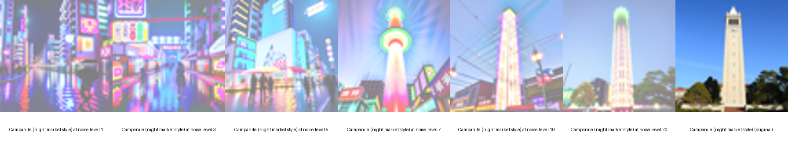
  </a>
  <p style="font-size:0.85em; margin-top:6px;">
    Text-conditioned Campanile edits (left → right: start = 1, 3, 5, 7, 10, 20).
  </p>
</div>

---

### Text-guided edits on my own images

I repeated the same procedure for two additional images using the same text prompt and the same noise levels.

Each strip shows a smooth progression from lightly edited (low noise) to heavily stylized (high noise).

<div style="max-width: 1100px; margin: 10px auto; text-align:center;">
  <a href="figures/part1_7_3_image1_summary.png" data-lightbox="p1_7_3_custom" data-title="Image 1 — text-guided SDEdit">
    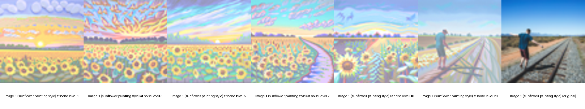
  </a>
  <p style="font-size:0.85em; margin-top:6px;">Image 1 — text-conditioned edits</p>
</div>

<div style="max-width: 1100px; margin: 10px auto; text-align:center;">
  <a href="figures/part1_7_3_image2_summary.png" data-lightbox="p1_7_3_custom" data-title="Image 2 — text-guided SDEdit">
    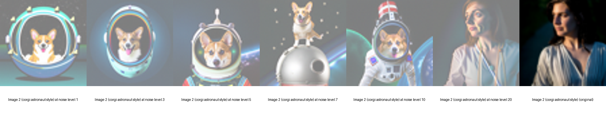
  </a>
  <p style="font-size:0.85em; margin-top:6px;">Image 2 — text-conditioned edits</p>
</div>


## Part 1.8 Visual Anagrams

In this part, I implemented **visual anagrams** using diffusion models—images that change semantic meaning when flipped vertically.  
The idea is to guide the same image using **two different text prompts**, one for the upright orientation and one for the upside-down orientation.  
During sampling, both prompts jointly influence the image trajectory.

At each denoising step:

1. Denoise the current image \( x_t \\) with the upright prompt → \( \epsilon_1 \\)  
2. Flip \( x_t \\) vertically, denoise with the flipped prompt → \( \epsilon_2 \\)  
3. Flip \( \epsilon_2 \\) back upright  
4. Average the two noise estimates and use this to compute the DDPM update  

This ensures that the final image satisfies:

- Upright view → aligns with prompt 1  
- Upside-down view → aligns with prompt 2  

<div class="highlight code-wrapper" markdown="1">

```python
def make_flip_illusion(image,
                       i_start,
                       prompt_embeds,          # (p1_embed, p2_embed)
                       uncond_prompt_embeds,
                       timesteps,
                       scale=7,
                       display=True):
  """
  Visual-anagram sampling loop.
  Returns: (upright_image, flipped_image) in [0,1] numpy arrays
  """
  p1_emb, p2_emb = prompt_embeds

  image = image.to(device).half()
  p1_emb = p1_emb.to(device).half()
  p2_emb = p2_emb.to(device).half()
  uncond_prompt_embeds = uncond_prompt_embeds.to(device).half()

  with torch.no_grad():
    for i in range(i_start, len(timesteps) - 1):
      t = timesteps[i]
      prev_t = timesteps[i + 1]

      alpha_cumprod_t = alphas_cumprod[t].to(device).to(image.dtype)
      alpha_cumprod_prev = alphas_cumprod[prev_t].to(device).to(image.dtype)

      alpha = alpha_cumprod_t / alpha_cumprod_prev
      beta = 1.0 - alpha

      alpha_cumprod_t = alpha_cumprod_t.view(1,1,1,1)
      alpha_cumprod_prev = alpha_cumprod_prev.view(1,1,1,1)
      alpha = alpha.view(1,1,1,1)
      beta = beta.view(1,1,1,1)

      # ----- Branch 1: upright -----
      model_output_cond1 = stage_1.unet(image, t, encoder_hidden_states=p1_emb, return_dict=False)[0]
      model_output_uncond1 = stage_1.unet(image, t, encoder_hidden_states=uncond_prompt_embeds, return_dict=False)[0]

      noise_cond1, predicted_variance = torch.split(model_output_cond1, image.shape[1], 1)
      noise_uncond1, _ = torch.split(model_output_uncond1, image.shape[1], 1)

      eps1 = noise_uncond1 + scale * (noise_cond1 - noise_uncond1)

      # ----- Branch 2: flipped -----
      image_flipped = torch.flip(image, dims=[2])

      model_output_cond2 = stage_1.unet(image_flipped, t, encoder_hidden_states=p2_emb, return_dict=False)[0]
      model_output_uncond2 = stage_1.unet(image_flipped, t, encoder_hidden_states=uncond_prompt_embeds, return_dict=False)[0]

      noise_cond2, _ = torch.split(model_output_cond2, image.shape[1], 1)
      noise_uncond2, _ = torch.split(model_output_uncond2, image.shape[1], 1)

      eps2_flipped = noise_uncond2 + scale * (noise_cond2 - noise_uncond2)
      eps2 = torch.flip(eps2_flipped, dims=[2])  # flip back

      # ----- Combine -----
      eps = (eps1 + eps2) / 2.0

      # Predict x0
      x0_pred = (image - torch.sqrt(1 - alpha_cumprod_t) * eps) / torch.sqrt(alpha_cumprod_t)

      # DDPM update
      c1 = (torch.sqrt(alpha_cumprod_prev) * beta) / (1 - alpha_cumprod_t)
      c2 = (torch.sqrt(alpha) * (1 - alpha_cumprod_prev)) / (1 - alpha_cumprod_t)
      pred_prev_image = c1 * x0_pred + c2 * image

      pred_prev_image = add_variance(predicted_variance, t, pred_prev_image)
      image = pred_prev_image

      if display and ((i - i_start) % 10 == 0):
        vis = (image[0].permute(1,2,0).detach().cpu().float() / 2 + 0.5).clamp(0,1)
        media.show_image(vis, title=f"visual anagram step {i}")

    upright = (image[0].permute(1,2,0).detach().cpu().float() / 2 + 0.5).clamp(0,1).numpy()
    flipped = (torch.flip(image, dims=[2])[0].permute(1,2,0).detach().cpu().float() / 2 + 0.5).clamp(0,1).numpy()

  return upright, flipped
```

</div>

---

### Illusion 1

For my first illusion, I combined the prompts:

* **Upright:** “night market”
* **Upside-down:** “underwater city”

<div style="max-width: 900px; margin: 14px auto;">
  <div style="display:flex; justify-content:center; gap:20px;">

<div style="width:45%;">
  <a href="figures/part1_8_illusion1_upright_nightmarket.png" data-lightbox="illu1" data-title="Upright — night market">
    
  </a>
  <p style="text-align:center; font-size:0.85em; margin-top:6px;">Upright — night market</p>
</div>

<div style="width:45%;">
  <a href="figures/part1_8_illusion1_flipped_underwater_city.png" data-lightbox="illu1" data-title="Flipped — underwater city">
    
  </a>
  <p style="text-align:center; font-size:0.85em; margin-top:6px;">Flipped — underwater city</p>
</div>
  </div>
</div>

---

### Illusion 2

For the second illusion, I used:

* **Upright:** “dragon castle”
* **Upside-down:** “clockmaker”


<div style="max-width: 900px; margin: 14px auto;">
  <div style="display:flex; justify-content:center; gap:20px;">

<div style="width:45%;">
  <a href="figures/part1_8_illusion2_upright_dragon_castle.png" data-lightbox="illu2" data-title="Upright — dragon castle">
    
  </a>
  <p style="text-align:center; font-size:0.85em; margin-top:6px;">Upright — dragon castle</p>
</div>

<div style="width:45%;">
  <a href="figures/part1_8_illusion2_flipped_clockmaker.png" data-lightbox="illu2" data-title="Flipped — clockmaker">
    
  </a>
  <p style="text-align:center; font-size:0.85em; margin-top:6px;">Flipped — clockmaker</p>
</div>
  </div>
</div>


## Part 1.9 Hybrid Images

In this final part of Part 1, I implemented **Factorized Diffusion** to generate hybrid images—images whose interpretation depends on viewing scale, similar to the classic hybrid images from Project 2. Instead of blending two images, I blended **two noise estimates** predicted by the diffusion model.

At each denoising step, I computed:

1. A noise estimate \\( \epsilon_1 \\) using prompt embedding \\( p_1 \\).  
2. A noise estimate \\( \epsilon_2 \\) using prompt embedding \\( p_2 \\).  
3. A low-pass version of \\( \epsilon_1 \\) using a Gaussian blur (kernel size 33, sigma = 2).  
4. A high-pass version of \\( \epsilon_2 \\) by subtracting its low-pass component.  
5. A combined hybrid estimate:

<p>
\[
\epsilon_{hybrid} = LowPass(\epsilon_1) + HighPass(\epsilon_2)
\]
</p>

6. Used \\( \epsilon_{hybrid} \\) in the DDPM reverse step to update the latent image.

I wrapped this into a `make_hybrids` function that performs the factorized denoising loop and returns the final hybrid.

<div class="highlight code-wrapper" markdown="1">

```python
from torchvision.transforms.functional import gaussian_blur
import numpy as np
from PIL import Image
import os

def make_hybrids(image,
                 i_start,
                 prompt_embeds,          # tuple: (p1_embed, p2_embed)
                 uncond_prompt_embeds,   # unconditional "" embedding
                 timesteps,
                 scale=7,
                 display=True):
  """
  Hybrid image sampling loop using Factorized Diffusion.

  At each denoising step t, we:
    - Estimate noise with prompt p1  -> eps1 (via CFG)
    - Estimate noise with prompt p2  -> eps2 (via CFG)
    - Take low frequencies of eps1 and high frequencies of eps2:
          eps = lowpass(eps1) + highpass(eps2)
    - Use eps as the final noise estimate in the DDPM update.

  Args:
    image: (1, 3, 64, 64) tensor, usually Gaussian noise x_T.
    i_start: integer index into timesteps to start denoising from.
    prompt_embeds: (p1_embed, p2_embed) conditional prompt embeddings.
    uncond_prompt_embeds: unconditional text embedding "" for CFG.
    timesteps: list of monotonically decreasing timesteps (e.g. strided_timesteps).
    scale: CFG guidance scale gamma.
    display: if True, optionally show intermediate results.

  Returns:
    hybrid: numpy array (64, 64, 3) in [0, 1], final hybrid image.
  """

  # Unpack prompt embeddings
  p1_emb, p2_emb = prompt_embeds

  # Move everything to the correct device / dtype
  image = image.to(device).half()
  p1_emb = p1_emb.to(device).half()
  p2_emb = p2_emb.to(device).half()
  uncond_prompt_embeds = uncond_prompt_embeds.to(device).half()

  with torch.no_grad():
    for i in range(i_start, len(timesteps) - 1):
      # Current and next timesteps
      t = timesteps[i]
      prev_t = timesteps[i + 1]

      # Get alpha_bar_t, alpha_bar_prev, alpha_t, beta_t from alphas_cumprod
      alpha_cumprod_t = alphas_cumprod[t].to(device).to(image.dtype)
      alpha_cumprod_prev = alphas_cumprod[prev_t].to(device).to(image.dtype)

      alpha = alpha_cumprod_t / alpha_cumprod_prev
      beta = 1.0 - alpha

      alpha_cumprod_t = alpha_cumprod_t.view(1, 1, 1, 1)
      alpha_cumprod_prev = alpha_cumprod_prev.view(1, 1, 1, 1)
      alpha = alpha.view(1, 1, 1, 1)
      beta = beta.view(1, 1, 1, 1)

      # -------------------------------------------------
      # 1) CFG noise estimate for prompt p1 (low frequency part)
      # -------------------------------------------------
      model_output_cond1 = stage_1.unet(
          image,
          t,
          encoder_hidden_states=p1_emb,
          return_dict=False
      )[0]

      model_output_uncond1 = stage_1.unet(
          image,
          t,
          encoder_hidden_states=uncond_prompt_embeds,
          return_dict=False
      )[0]

      noise_cond1, predicted_variance = torch.split(
          model_output_cond1, image.shape[1], dim=1
      )
      noise_uncond1, _ = torch.split(
          model_output_uncond1, image.shape[1], dim=1
      )

      eps1 = noise_uncond1 + scale * (noise_cond1 - noise_uncond1)

      # -------------------------------------------------
      # 2) CFG noise estimate for prompt p2 (high frequency part)
      # -------------------------------------------------
      model_output_cond2 = stage_1.unet(
          image,
          t,
          encoder_hidden_states=p2_emb,
          return_dict=False
      )[0]

      model_output_uncond2 = stage_1.unet(
          image,
          t,
          encoder_hidden_states=uncond_prompt_embeds,
          return_dict=False
      )[0]

      noise_cond2, _ = torch.split(
          model_output_cond2, image.shape[1], dim=1
      )
      noise_uncond2, _ = torch.split(
          model_output_uncond2, image.shape[1], dim=1
      )

      eps2 = noise_uncond2 + scale * (noise_cond2 - noise_uncond2)

      # -------------------------------------------------
      # 3) Factorize in frequency: lowpass(eps1) + highpass(eps2)
      # -------------------------------------------------
      eps1_f = eps1.float()
      eps2_f = eps2.float()

      # Low-pass both eps1 and eps2
      eps1_low = gaussian_blur(
          eps1_f,
          kernel_size=[33, 33],
          sigma=[2.0, 2.0]
      )
      eps2_low = gaussian_blur(
          eps2_f,
          kernel_size=[33, 33],
          sigma=[2.0, 2.0]
      )

      # High-pass for eps2
      eps2_high = eps2_f - eps2_low

      # Combined noise: low frequency from p1, high frequency from p2
      eps_combined = eps1_low + eps2_high

      # Cast back to the same dtype as the image (half)
      eps_combined = eps_combined.to(image.dtype)

      # -------------------------------------------------
      # 4) DDPM update step using the combined noise
      # -------------------------------------------------
      x0_pred = (image - torch.sqrt(1.0 - alpha_cumprod_t) * eps_combined) / torch.sqrt(alpha_cumprod_t)

      c1 = (torch.sqrt(alpha_cumprod_prev) * beta) / (1.0 - alpha_cumprod_t)
      c2 = (torch.sqrt(alpha) * (1.0 - alpha_cumprod_prev)) / (1.0 - alpha_cumprod_t)
      pred_prev_image = c1 * x0_pred + c2 * image

      # Add learned variance
      pred_prev_image = add_variance(predicted_variance, t, pred_prev_image)

      image = pred_prev_image

      if display and ((i - i_start) % 10 == 0):
        vis = (image[0].permute(1, 2, 0).detach().cpu().float() / 2. + 0.5).clamp(0, 1)
        media.show_image(vis, title=f"hybrid image, step {i}")

    # Final hybrid in [0, 1]
    hybrid = (image[0].permute(1, 2, 0).detach().cpu().float() / 2. + 0.5).clamp(0, 1).numpy()

  return hybrid
```

</div>

---

### Hybrid Image 1

For my first hybrid, I blended prompts related to **night markets** (low frequencies) and **underwater themes** (high frequencies).
The resulting hybrid is:

* `figures/part1_9_hybrid1_nightmarket_underwater.png`

<div style="max-width: 400px; margin: 12px auto; text-align:center;">
  <a href="figures/part1_9_hybrid1_nightmarket_underwater.png" data-lightbox="p1_9" data-title="Hybrid 1 — night market (low freq) + underwater (high freq)">
    
  </a>
  <p style="font-size:0.85em; margin-top:6px;">
    Hybrid Image 1 — low-frequency night market + high-frequency underwater structure.
  </p>
</div>

---

### Hybrid Image 2

For my second hybrid, I combined prompts involving a **dragon castle** (low frequencies) and a **clockmaker** (high frequencies).

<div style="max-width: 400px; margin: 12px auto; text-align:center;">
  <a href="figures/part1_9_hybrid2_dragon_clockmaker.png" data-lightbox="p1_9" data-title="Hybrid 2 — dragon castle (low freq) + clockmaker (high freq)">
    
  </a>
  <p style="font-size:0.85em; margin-top:6px;">
    Hybrid Image 2 — low-frequency dragon castle + high-frequency clockmaker details.
  </p>
</div>


## Part 2: Bells & Whistles

### 2.1 More Visual Anagrams

In Part 1.8, I created visual anagrams using **180° rotation**, where an image aligns with one prompt when upright and a different prompt when flipped upside down.

Here, I implemented **two additional anagram transformations**, inspired by the *Visual Anagrams* paper.  
Each transformation produces a pair of images whose meaning changes when the image undergoes a geometric or color transformation.

---

### Transformation 1 — 90° Rotation

In my first experiment, I created anagrams that change meaning when rotated **90 degrees**.

The procedure mirrors the original visual anagram sampling:

- Upright orientation → guided by prompt A  
- 90° rotated orientation → guided by prompt B  
- At each timestep:
  - Denoise upright image  
  - Rotate image by 90°, denoise with prompt B  
  - Rotate the noise estimate back  
  - Average both noise estimates  

<div style="max-width: 900px; margin: 14px auto;">
  <div style="display:flex; justify-content:center; gap:20px;">

    <div style="width:45%;">
      <a href="figures/anagram1_normal.png" data-lightbox="anagram1" data-title="Upright View — Transformation 1">
        
      </a>
      <p style="text-align:center; font-size:0.85em;">Upright (Prompt A)</p>
    </div>

    <div style="width:45%;">
      <a href="figures/anagram1_rotated90.png" data-lightbox="anagram1" data-title="Rotated 90° View — Transformation 1">
        
      </a>
      <p style="text-align:center; font-size:0.85em;">Rotated 90° (Prompt B)</p>
    </div>

  </div>
</div>

---

### Transformation 2 — Color Inversion Symmetry

For the second transformation, I built visual anagrams based on **color inversion symmetry**.

- Upright orientation → guided by prompt A  
- Color-inverted orientation → guided by prompt B  

Instead of rotating or flipping the latent image, I:

- Inverted pixel values before denoising with prompt B  
- Inverted the predicted noise back  
- Averaged the two noise estimates  

<div style="max-width: 900px; margin: 14px auto;">
  <div style="display:flex; justify-content:center; gap:20px;">

    <div style="width:45%;">
      <a href="figures/anagram2_normal.png" data-lightbox="anagram2" data-title="Upright View — Transformation 2">
        
      </a>
      <p style="text-align:center; font-size:0.85em;">Upright (Prompt A)</p>
    </div>

    <div style="width:45%;">
      <a href="figures/anagram2_color_inverted.png" data-lightbox="anagram2" data-title="Color-Inverted View — Transformation 2">
        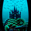
      </a>
      <p style="text-align:center; font-size:0.85em;">Color-Inverted (Prompt B)</p>
    </div>

  </div>
</div>

---

### 2.2 Designing a Course Logo

For the logo design portion, I created a stylized logo using **text-conditioned image-to-image translation**.

I started with the base logo. Then I applied the forward-diffusion + CFG-guided denoising pipeline, using a creative text prompt such as  
**“underwater city aesthetic”**.

This process preserves the overall structure of the original logo while shifting textures and colors toward the target style.

My final stylized logo is:

<div style="max-width: 900px; margin: 14px auto;">
  <div style="display:flex; justify-content:center; gap:20px;">

    <div style="width:45%;">
      <a href="figures/base_logo.png" data-lightbox="logo" data-title="Original Base Logo">
        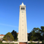
      </a>
      <p style="text-align:center; font-size:0.85em;">Base Logo</p>
    </div>

    <div style="width:45%;">
      <a href="figures/logo_underwater_city_i7.png" data-lightbox="logo" data-title="Stylized Logo">
        
      </a>
      <p style="text-align:center; font-size:0.85em;">Stylized Logo</p>
    </div>

  </div>
</div>

# PART B.1 Training a Single-Step Denoising UNet

## PART 1.1 Implementing the UNet

In Part 1.1, the objective is to construct a **simple single-step denoising UNet**.

Given a noisy image **z**, the network **Dθ(z)** should predict the clean image **x**.

The training loss is the L2 reconstruction loss:

<p>
\[
L = \mathbb{E}\_{z,x}\,\|D\_{\theta}(z) - x\|^2
\]
</p>

To implement this denoiser, we build a **lightweight UNet**, which performs:

* **Downsampling** to capture coarse spatial features
* **Upsampling** to reconstruct high-resolution details
* **Skip connections** to preserve fine structure

---

### **Building Blocks**

The project provides several simple operations used to assemble the full UNet:

### **Simple operations**

* **Conv** → keeps spatial resolution, changes channels
* **DownConv** → halves height and width
* **UpConv** → doubles height and width
* **Flatten** → converts a 7×7 feature map into a 1×1 vector
* **Unflatten** → expands a 1×1 vector back to 7×7
* **Concat** → channel-wise concatenation for skip connections

Conv + BatchNorm + GELU are grouped into:

### **Composed operations**

* **ConvBlock**
* **DownBlock**
* **UpBlock**

---

### **Resulting UNet**

By combining these components, we obtain a compact UNet that:

* takes a noisy input image
* processes it through downsampling and upsampling paths
* uses skip connections to preserve detail
* outputs a cleaned version of the image

This network will later serve as the **backbone denoiser** in the diffusion model pipeline used throughout the rest of the assignment.


## **Part 1.2: Using the UNet to Train a Denoiser**

In this section, I used the UNet implemented in **Part 1.1** to train a simple **one-step denoiser**.

The goal is to train a model **\\( D_\theta \\)** that maps a noisy image **( z )** back to its clean version **( x )**.

The optimization objective is the same L2 reconstruction loss:

<p>
\[
L = \mathbb{E}\_{z, x}\,\| D\_{\theta}(z) - x \|^{2}.
\]
</p>

---

### **Gaussian Noising Process**

To create training pairs **((z, x))**, I applied the Gaussian corruption process:

<p>
\[
z = x + \sigma \,\epsilon,
\qquad
\epsilon \sim \mathcal{N}(0, I),
\]
</p>

where a larger **\\( \sigma \\)** produces a noisier image.

I visualized the effect of noise using a clean MNIST digit across:

<p>
\[
\sigma \in [0.0,\; 0.2,\; 0.4,\; 0.5,\; 0.6,\; 0.8,\; 1.0].
\]
</p>

---

### **Noising Process Visualization**

This figure shows how the clean digit becomes progressively corrupted as **\\( \sigma \\)** increases:

<div style="text-align: center; margin-top: 12px;">
  <a href="figures/noising_process.png" data-lightbox="noising" data-title="Gaussian Noising Process">
    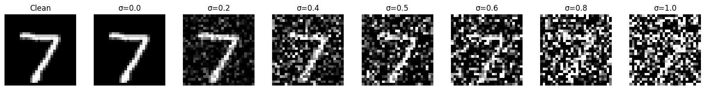
  </a>
  <p style="font-size: 0.9em; margin-top: 6px;">
    Visualization of Gaussian noise added at different noise levels (\( \sigma \)).
  </p>
</div>


## **Part 1.2.1 – Training**

In this section, I trained the UNet denoiser from **Part 1.1** to map noisy MNIST images back to their clean versions.

The training objective is:

<p>
\[
\min_{\theta}\; \mathbb{E}_{x,\epsilon}\, \big\| D_{\theta}(x + \sigma\epsilon) - x \big\|^{2},
\]
</p>

where the noise level is fixed at **(\sigma = 0.5)**.

---

### **Training Setup**

* **Dataset:** MNIST training split, loaded with `torchvision.datasets.MNIST`.
* **Batch size:** 256
* **Noise:** For each batch, fresh Gaussian noise is added so the model sees new noisy samples every epoch.
* **Model:** UNet from Part 1.1 with hidden dimension **(D = 128)**.
* **Optimizer:** Adam with learning rate **(1\times 10^{-4})**.
* **Epochs:** 5

Throughout training, I logged the **training loss curve** and evaluated the model on the MNIST test set at the end of **epoch 1** and **epoch 5**.

---

### **Training Loss Curve**

Below is the plot of the loss over training iterations:

<div style="text-align: center; margin-top: 12px;">
  <a href="figures/training_loss.png" data-lightbox="training" data-title="Training Loss Curve">
    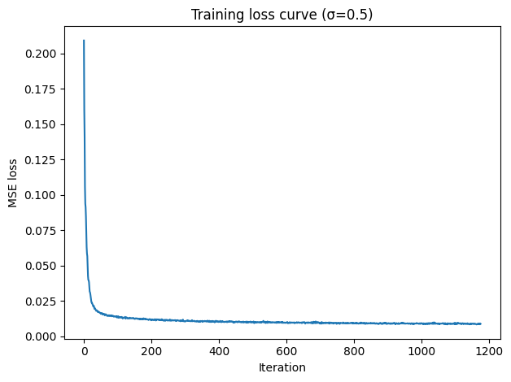
  </a>
  <p style="font-size: 0.9em; margin-top: 6px;">Training loss over 5 epochs.</p>
</div>

---

### **Sample Denoising Results**

To inspect how well the denoiser performs, I evaluated it on MNIST test images at the end of epoch 1 and epoch 5.

Each visualization shows:

* The **clean input**
* The **noisy input** (\\(\sigma = 0.5\\))
* The **denoised output** from the UNet

---

### **After 1 Epoch**

<div style="text-align: center; margin-top: 12px;">
  <a href="figures/denoising_epoch_1.png" data-lightbox="denoise1" data-title="Denoising Results After Epoch 1">
    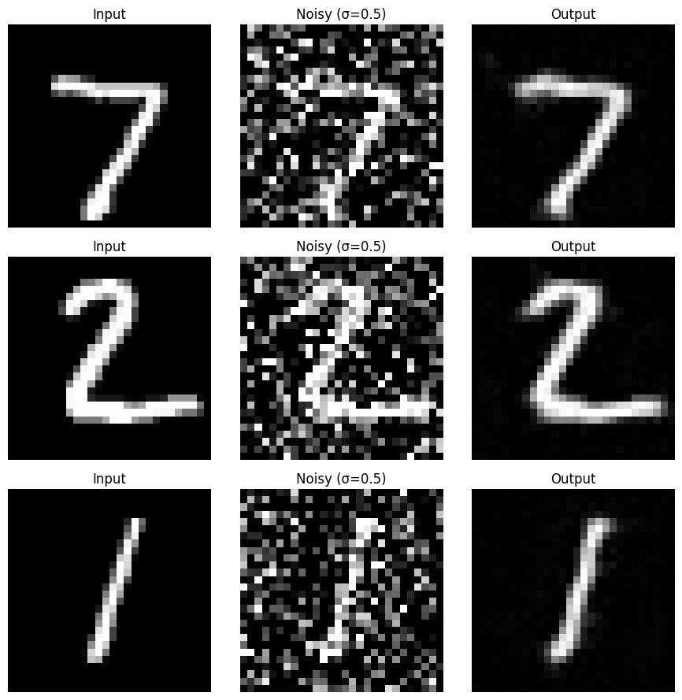
  </a>
  <p style="font-size: 0.9em; margin-top: 6px;">
    Denoising results after 1 epoch.
  </p>
</div>

---

### **After 5 Epochs**

<div style="text-align: center; margin-top: 12px;">
  <a href="figures/denoising_epoch_5.png" data-lightbox="denoise5" data-title="Denoising Results After Epoch 5">
    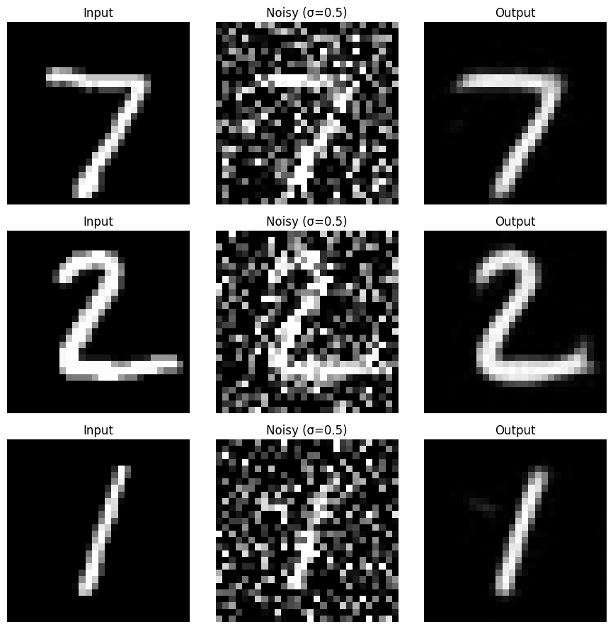
  </a>
  <p style="font-size: 0.9em; margin-top: 6px;">
    Denoising results after 5 epochs.
  </p>
</div>

---

As expected, the denoiser performs significantly better after five epochs—producing **sharper digit reconstructions** and removing much of the injected Gaussian noise.


## **Part 1.2.2 — Out-of-Distribution (OOD) Noise Testing**

Although the denoiser was trained only at **(\sigma = 0.5)**, I evaluated it on a broad range of unseen noise levels:

<p>
\[
\sigma \in \{0.0,\; 0.2,\; 0.4,\; 0.5,\; 0.6,\; 0.8,\; 1.0\}.
\]
</p>

The goal is to test how well the UNet generalizes beyond the noise distribution it was trained on and to observe degradation patterns when the noise level shifts.

---

### **OOD Denoising Results**

<div style="text-align: center; margin-top: 12px;">
  <a href="figures/ood_denoising.png" data-lightbox="ood" data-title="Out-of-Distribution Denoising Results Across Various Noise Levels">
    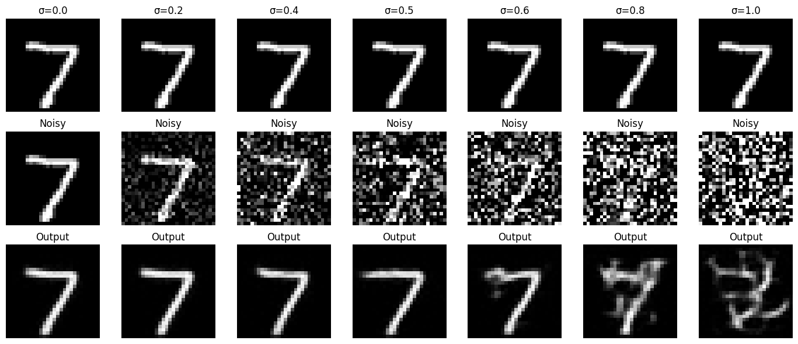
  </a>
  <p style="font-size: 0.9em; margin-top: 6px;">
    OOD denoising performance for noise levels outside the training distribution.
  </p>
</div>

---

### **Observations**

* For **moderate deviations** from training noise (e.g., \\(\sigma = 0.4\\) or \\(\sigma = 0.6)\\), the model remains reasonably stable and produces recognizable digits.
* For **very low noise** \\((\sigma = 0.0)–(0.2)\\), the model tends to “over-denoise,” removing useful structure and introducing artifacts—reflecting its bias toward the training noise level.
* For **very high noise** \\((\sigma = 0.8)–(1.0)\\), the input digits become nearly unrecognizable, and the denoiser struggles as expected.

Overall, the behavior is consistent with expectations for a **single-noise-level denoiser**: good interpolation near the training noise, but limited extrapolation power far outside it.

## **Part 1.2.3 — Denoising Pure Noise**

In this subsection, I turned denoising into a **purely generative task**.
Instead of adding Gaussian noise to real MNIST digits, I:

* Sampled **pure Gaussian noise**
  (\epsilon \sim \mathcal{N}(0, I))
  as the input (z),
* Trained the same UNet denoiser (D_{\theta}) to map this noise back to a clean MNIST image (x),
* Optimized the reconstruction loss:

<p>
\[
\mathcal{L} = \mathbb{E}_{x,\epsilon}\; \big\| D_{\theta}(\epsilon) - x \big\|^{2},
\]
</p>

* Trained for **5 epochs**, logging the loss throughout training.

Because the input noise (\epsilon) is **independent** of the target digit (x), the optimal solution is to output something like the **mean MNIST digit distribution**.
In practice, the UNet learns to output digit-like shapes even when given pure noise, effectively behaving as a very crude **implicit generator**.

---

### **Training Dynamics**

The training loss decreases smoothly as the network learns a deterministic mapping from noise to digit-like outputs.

<div style="text-align: center; margin-top: 12px;">
  <a href="figures/pure_noise_training_loss.png" data-lightbox="pure-noise" data-title="Training Loss Curve for Pure-Noise Denoising">
    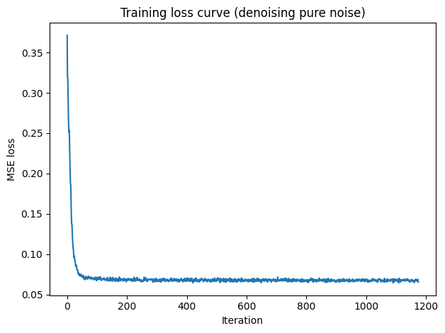
  </a>
  <p style="font-size: 0.9em; margin-top: 6px;">
    Training loss for the pure-noise denoiser over 5 epochs. The loss steadily decreases as the UNet learns to map random Gaussian noise to typical MNIST digit patterns.
  </p>
</div>

---

### **Generated Samples (Epoch 1 vs Epoch 5)**

### **After 1 Epoch**

<div style="text-align: center; margin-top: 12px;">
  <a href="figures/pure_noise_samples_epoch_1.png" data-lightbox="pure-noise" data-title="Pure-Noise Denoising Samples After 1 Epoch">
    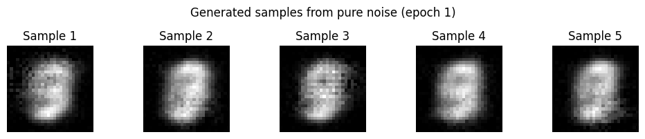
  </a>
  <p style="font-size: 0.9em; margin-top: 6px;">
    Outputs after 1 epoch. The generated images are still blurry and only loosely resemble digits.
  </p>
</div>

---

### **After 5 Epochs**

<div style="text-align: center; margin-top: 18px;">
  <a href="figures/pure_noise_samples_epoch_5.png" data-lightbox="pure-noise" data-title="Pure-Noise Denoising Samples After 5 Epochs">
    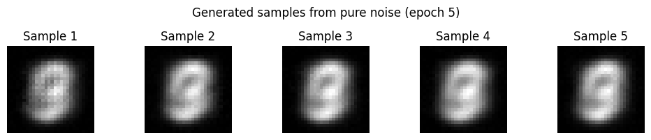
  </a>
  <p style="font-size: 0.9em; margin-top: 6px;">
    Outputs after 5 epochs. Even though the inputs are pure Gaussian noise, the UNet now consistently produces sharp digit-like images (0–9), showing that it has memorized the overall MNIST digit manifold.
  </p>
</div>

---

### **Observation**

As training progresses, the denoised outputs increasingly resemble real MNIST digits—even though the inputs are pure noise.
This occurs because the model is forced to **explain noise** by projecting it onto the space of typical training images.
Thus, the denoiser effectively behaves as a **mode-collapsed generator**, predicting common digit structures regardless of the input noise sample.


# **Part B.2 — Training a Flow Matching Model**

In Part 2, I transitioned from **one-step denoising** to **iterative denoising** by training a UNet to predict the **flow field** that moves an image from pure noise (x_0) to a clean image (x_1).

Instead of predicting a denoised image directly, the model learns the **velocity** along the linear interpolation curve:

<p>\[
x_t = (1 - t)\,x_0 \;+\; t\,x_1, \qquad t \in [0,1],
\]</p>

where the **true flow** is simply the difference between the clean and noisy endpoints:

<p>\[
u(x_t, t) = x_1 - x_0.
\]</p>

The goal is to teach a UNet (u_\theta(x_t, t)) to approximate this ideal velocity.
Thus, the training loss is:

<p>\[
\mathcal{L} = \mathbb{E}\,\big\| (x_1 - x_0) \;-\; u_\theta(x_t, t) \big\|^2 .
\]</p>

Once the model learns this flow, it can be **integrated iteratively** to move a noisy sample toward a clean image—forming the basis of flow-matching generative sampling.

---

## **Part 2.1 — Adding Time Conditioning to the UNet**

To enable flow matching, the UNet must know **where** it is along the interpolation trajectory.
Therefore, I extended the Part-1 UNet to include **explicit time conditioning**.

### **What was modified**

I injected a time embedding into **two key UNet pathways**:

1. **After the Flatten → FCBlock → Unflatten path**
2. **After the UpBlock path just before the final feature fusion**

This required adding a new module, **FCBlock**, which turns the scalar time input into a channel-wise modulation vector.

---

### **How the conditioning works**

The scalar time (t) (already in ([0,1])) is passed through two fully-connected blocks:

<p>\[
t_1 = \text{FCBlock}_1(t), \qquad  
t_2 = \text{FCBlock}_2(t).
\]</p>

These outputs modulate internal UNet activations:

<p>\[
\text{unflattened} = \text{unflattened} \odot t_1,
\qquad
\text{up}_1 = \text{up}_1 \odot t_2,
\]</p>

where (\odot) denotes channel-wise multiplication.

This gives the UNet the ability to behave differently depending on the denoising stage:

* **Early timesteps**:
  The model expects highly noisy input and focuses on coarse global corrections.
* **Late timesteps**:
  The model refines details as the sample approaches the clean target.


## **Part 2.2 — Training the Time-Conditioned UNet**

After implementing the time-conditioned UNet in Part 2.1, I trained it to learn the **flow field**
(,u_\theta(x_t, t),) that moves points along the interpolation path from pure noise toward a clean MNIST digit.

During each training iteration, I follow Algorithm B.1 from the handout:

1. Sample a clean MNIST image \\(x_1\\)
2. Sample pure Gaussian noise \\(x_0 \sim \mathcal{N}(0, I)\\)
3. Draw a random timestep \\(t \sim \text{Uniform}(0,1)\\)
4. Construct the interpolated point

<p>\[
x_t = (1 - t)\,x_0 + t\,x_1 ,
\]</p>

5. Train the UNet to predict the true flow vector

<p>\[
x_1 - x_0 .
\]</p>

Thus, the objective is to minimize:

<p>\[
\mathcal{L} = 
\mathbb{E}\,\big\| (x_1 - x_0)\;-\;u_\theta(x_t, t) \big\|^2 .
\]</p>

This teaches the model how to move an image slightly forward along the “cleaning trajectory,” enabling multi-step sampling later.

---

### **Training Setup**

**Objective:**
Learn the flow at timestep (t) given the interpolated noisy input \\(x_t\\).

**Dataset:**
MNIST (training split), batch size **64**.

**Model:**
My time-conditioned UNet from Part 2.1 with hidden dimension **64**.
The scalar timestep (t\in [0,1]) is embedded via two FCBlocks and injected at two internal points in the UNet.

**Optimizer:**
Adam with learning rate

<p>\[
\text{LR} = 1\times 10^{-2}.
\]</p>

**Scheduler:**
An exponential decay scheduler:

<p>\[
\gamma = 0.1^{1  \text{num_epochs}},
\]</p>

stepped once per epoch.

This setup trains the network to learn a **smooth, continuous flow** from noise to MNIST digits.

---

### **Training Curve**

<div style="text-align: center; margin-top: 10px;">
  <a href="figures/time_unet_training_loss.png" data-lightbox="time-unet" data-title="Training loss curve for the time-conditioned UNet">
    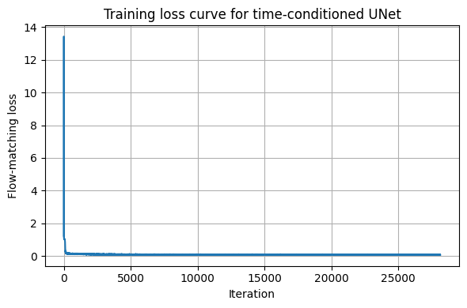
  </a>
  <p style="font-size: 0.9em; margin-top: 6px;">
    Loss curve for the time-conditioned UNet. The monotonically decreasing trend shows that the network successfully learns the flow field.
  </p>
</div>

## **Part 2.3 — Sampling from the Time-Conditioned UNet**

After training the flow-matching UNet, I used it to **generate MNIST-like images** by integrating the learned flow field **backwards from pure noise**.

Following Algorithm B.2 from the handout, sampling begins with:

<p>\[
x_0 \sim \mathcal{N}(0, I),
\]</p>

and iteratively updates the sample via:

<p>\[
x \;\leftarrow\; x \;+\; u_\theta(x, t),
\]</p>

where the timestep (t) decreases linearly from (1 \to 0).
Although this is a simplified sampler (no ODE solvers, no variance schedule, no correction steps), it already produces **recognizable MNIST digits** as training progresses.

---

### **Sampling Across Training Epochs**

To visualize how the learned flow improves over time, I generated samples using models trained for **1, 5, and 10 epochs**.

---

### **Epoch 1**

<div style="text-align:center; margin-top:12px;">
  <a href="figures/time_unet_samples_epoch_1.png" data-lightbox="fm-sample" data-title="Samples generated after 1 training epoch">
    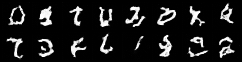
  </a>
  <p style="font-size:0.9em; margin-top:6px;">
    The flow is still weak; generated outputs retain strong noise patterns but faint digit-like structures begin to emerge.
  </p>
</div>

---

### **Epoch 5**

<div style="text-align:center; margin-top:12px;">
  <a href="figures/time_unet_samples_epoch_5.png" data-lightbox="fm-sample" data-title="Samples generated after 5 training epochs">
    
  </a>
  <p style="font-size:0.9em; margin-top:6px;">
    The learned flow field becomes more coherent. Digits gain clearer structure and class identity, though still somewhat distorted.
  </p>
</div>

---

### **Epoch 10**

<div style="text-align:center; margin-top:12px;">
  <a href="figures/time_unet_samples_epoch_10.png" data-lightbox="fm-sample" data-title="Samples generated after 10 training epochs">
    
  </a>
  <p style="font-size:0.9em; margin-top:6px;">
    After 10 epochs, the sampler produces clean, well-formed digits. Despite the simple update rule, the model learns a stable mapping from noise to MNIST-like samples.
  </p>
</div>

---

### **Improved Sampling Variant**

I also experimented with a slightly modified timestep schedule (“better”), which sharpens the digits further:

<div style="text-align:center; margin-top:12px;">
  <a href="figures/time_unet_samples_better.png" data-lightbox="fm-sample" data-title="Improved sampling with custom timestep schedule">
    
  </a>
  <p style="font-size:0.9em; margin-top:6px;">
    A smoother decay of the timestep improves integration stability, producing sharper and more consistent digits.
  </p>
</div>

---

### **Summary**

Even with this lightweight flow-matching setup:

* The time-conditioned UNet learns to **map pure noise to MNIST-like digits**.
* Sample quality improves steadily as the flow field becomes more accurate.
* Modified timestep schedules can noticeably enhance sharpness.


## **Part 2.4 — Adding Class-Conditioning to the UNet**

To improve image generation quality and allow **class-controlled sampling**, I extended the time-conditioned UNet by adding **class conditioning**.
Instead of conditioning only on the timestep (t), the model now also receives a **class label**
[
c \in {0,1,\ldots,9},
]
encoded as a one-hot vector.

This modification turns the flow-matching model into a **class-conditional generator** capable of producing digits from specific MNIST classes.

---

### **What Was Changed**

I introduced **two new FCBlocks** to process the class embedding:

* **fc1_t**, **fc2_t** — process the timestep (t)
* **fc1_c**, **fc2_c** — process the class embedding (c)

This means the model now has **four conditioning networks**, each producing a channel-wise modulation vector that scales intermediate UNet features (similar to FiLM conditioning).

---

### **Classifier-Free Guidance Dropout**

To enable **classifier-free guidance (CFG)** during sampling, I added **dropout** to the class embedding:

<p>\[
c \;\leftarrow\;
\begin{cases}
c, & \text{with probability } 0.9, \\
0, & \text{with probability } 0.1,
\end{cases}
\]</p>

i.e., with probability
[
p_{\text{uncond}} = 0.1,
]
the class vector is replaced by **an all-zero vector**, meaning the model receives **no class information**.
This makes it possible to do CFG at test time by forming:

<p>\[
u_\theta^{\text{guided}}(x,t,c)
\;=\;
(1+w)\,u_\theta(x,t,c)
\;-\;
w\,u_\theta(x,t, \text{null}),
\]</p>

where (w) is the guidance scale.

---

### **How Conditioning Is Applied**

Both time and class embeddings are injected at **two locations** in the UNet:

### **1. Before the Unflatten Block**

Here, the flattened vector passes through:

<p>\[
\text{unflattened}
\;\leftarrow\;
\text{unflattened}
\;\odot\;
(\; fc1_t(t) \;+\; fc1_c(c) \;),
\]</p>

modulating the global latent features.

---

### **2. Before the Final UpBlock**

At this stage, spatial features are modulated similarly:

<p>\[
\text{up}_1
\;\leftarrow\;
\text{up}_1
\;\odot\;
(\; fc2_t(t) \;+\; fc2_c(c) \;).
\]</p>

This allows:

* **timestep information** to control how much noise remains
* **class information** to steer the model toward the structure of a particular digit class
* **unconditional dropout** to support CFG sampling

Together, these modifications transform the UNet into a fully **time- and class-aware flow model**.


## **Part 2.6 — Sampling from the Class-Conditioned UNet**

With the class-conditioned UNet trained in **Part 2.5**, I generated MNIST samples using the **class-conditional sampling algorithm (Algorithm B.4)**.
During sampling, I applied **classifier-free guidance (CFG)** with scale:

<p>\[
\gamma = 5.0,
\]</p>

which strengthens the influence of the class label and yields sharper digits.

Sampling begins from pure Gaussian noise:

<p>\[
x_0 \sim \mathcal{N}(0, I),
\]</p>

and updates the image over decreasing timesteps (t), using a combination of:

* The **conditional flow**
  \\[
  u_\theta(x, t, c)
  \\]
* The **unconditional flow**
  \\[
  u_\theta(x, t, 0)
  \\]
* The **guided flow**

  <p>\[
  u
  \;=\;
  u_{\text{uncond}}
  \;+\;
  \gamma\,\big( u_{\text{cond}} - u_{\text{uncond}} \big),
  \]</p>

which steers the sample toward the desired class while preserving sample diversity.

---

### **Sampling Across Training Epochs**

I generated **four samples per class (0–9)** using models trained for **1, 5, and 10 epochs**.

---

### **Epoch 1**

<div style="text-align:center; margin-top:12px;">
  <a href="figures/class_unet_samples_epoch_1.png" data-lightbox="class-fm" data-title="Class-conditional samples at epoch 1">
    
  </a>
  <p style="font-size:0.9em; margin-top:6px;">
    Even after 1 epoch, digits begin to appear thanks to class conditioning, though shapes remain inconsistent and noisy.
  </p>
</div>

---

### **Epoch 5**

<div style="text-align:center; margin-top:12px;">
  <a href="figures/class_unet_samples_epoch_5.png" data-lightbox="class-fm" data-title="Class-conditional samples at epoch 5">
    
  </a>
  <p style="font-size:0.9em; margin-top:6px;">
    Shapes stabilize and digits become significantly clearer. Some distortions remain, but class identity is much more reliable.
  </p>
</div>

---

### **Epoch 10**

<div style="text-align:center; margin-top:12px;">
  <a href="figures/class_unet_samples_epoch_10.png" data-lightbox="class-fm" data-title="Class-conditional samples at epoch 10">
    
  </a>
  <p style="font-size:0.9em; margin-top:6px;">
    High-quality, sharp, and well-formed digits across all classes. Classifier-free guidance with \(\gamma = 5\) gives strong class control without sacrificing visual quality.
  </p>
</div>

---

### **Effect of Removing the Learning Rate Scheduler**

The assignment also recommends trying the training **without the exponential LR scheduler**.
I retrained the model using a fixed learning rate and observed:

* Slightly **slower convergence**
* **Similar final quality**
* Classifier-free guidance still works extremely well

This suggests the scheduler mainly accelerates early training rather than affecting the final generative capability.

<div style="text-align:center; margin-top:12px;">
  <a href="figures/time_unet_samples_better.png" data-lightbox="class-fm" data-title="Sampling without LR scheduler">
    
  </a>
  <p style="font-size:0.9em; margin-top:6px;">
    Sampling results from the version trained without an LR scheduler. Quality remains comparable, confirming training robustness.
  </p>
</div>